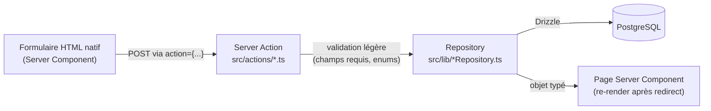

# Architecture — Atlas (`apps/web`)

Ce document décrit l'architecture **réellement construite** au moment de sa rédaction (2026-08-11),
vérifiée directement dans le code — pas la vision produit du `README.md` racine, pas les ADR de
cible non encore construites. Voir `docs/AI_HANDOFF.md` pour la liste explicite de ce qu'il ne
faut pas supposer exister.

## Architecture actuelle vs cible historique

Les ADR 001 à 006 (`docs/adr/`) ont été écrites tôt et décrivent en partie une **cible**, pas
l'état construit à ce jour. Pour éviter toute confusion (humaine ou pour un agent IA reprenant le
projet), voici l'écart exact entre ce que ces ADR annoncent et ce qui existe réellement :

| ADR | Annonce | Réalité vérifiée (2026-08-11) |
|---|---|---|
| 001 — Monorepo | `apps/` (web, api, worker), `packages/` | Turborepo + pnpm workspaces bien en place, mais **seul `apps/web/` existe**. Pas de `apps/api/`, pas de `apps/worker/`, pas de `packages/`. |
| 002 — Frontend | Next.js + TypeScript, Tailwind, Shadcn/ui | **Conforme** : Next.js 16 (App Router), TypeScript strict, Tailwind 4. Composants UI maison (`src/components/ui/`), pas de Shadcn/ui installé. |
| 003 — Backend | API Python/FastAPI + PostgreSQL séparée, worker IA | **PostgreSQL est bien utilisé, mais directement depuis `apps/web`** (Drizzle) — aucune API Python, aucun worker. ADR-006 documente explicitement ce choix transitoire. |
| 004 — Stratégie IA | SDK LLM (Anthropic), Human-in-the-Loop, 3 phases progressives | **Aucune dépendance LLM dans le code** (vérifié : `package.json` + recherche exhaustive dans `src/`). Toutes les fonctionnalités actuelles sont des règles déterministes (voir ADR-008). |
| 005 — Intégrations | Connecteurs isolés dans `apps/worker/connectors/` | Un seul connecteur existe (Google Calendar, lecture seule), directement dans `apps/web/src/lib/google/` — pas de dossier `connectors/`, pas d'interface `Connector` générique. |
| 006 — Memory Architecture | Mémoire contextuelle générique, mono-conseiller, Drizzle | **Conforme à l'implémentation réelle** — c'est la première ADR qui décrit fidèlement le code construit, et elle reste la référence pour la mémoire de matching. |

**Conclusion pratique** : tout ce qui suit dans ce document décrit du code qui existe et fonctionne
aujourd'hui. Quand une ADR de cible (003/004/005) est citée ailleurs dans le projet, elle décrit
une direction, pas un composant déployé.

## Stack technique réelle

- **Framework** : Next.js 16 (App Router, Server Components, Server Actions), React 19.
- **Langage** : TypeScript strict (`tsconfig.json` : `"strict": true`).
- **Base de données** : PostgreSQL, accédée via Drizzle ORM (`drizzle-orm` + `postgres` en driver).
  Migrations SQL commitées dans `src/db/migrations/` — voir `docs/DATA_MODEL.md`.
- **Styling** : Tailwind CSS 4.
- **Tests** : Vitest (`vitest run`), tests purs + tests d'intégration Postgres réelle (pas de
  mock de la base de données dans les tests repository).
- **Gestion de monorepo** : Turborepo + pnpm workspaces (racine du repo), mais un seul workspace
  applicatif actif (`apps/web`).

## Organisation des dossiers (`apps/web/src/`)

```
src/
├── app/            Pages (Server Components) et routes API — App Router
│   ├── api/auth/google/   3 route handlers OAuth (login, callback, logout)
│   ├── biens/, clients/, taches/, visites/, prospects-vendeurs/   pages par domaine
│   └── page.tsx    Accueil ("Aujourd'hui")
├── actions/        Server Actions ("use server") — minces, voir ADR-007
├── lib/            Logique applicative : repositories (IO Postgres), moteurs de règles
│   │               purs, clients de services externes, moteur de matching
│   ├── google/     OAuth + Google Calendar
│   ├── matching/   Résolution rendez-vous → bien/acquéreur
│   ├── pointsAttention/, pointsForts/   moteurs de règles déterministes
│   └── geocodage/, transports/, ecoles/, commerces/, patrimoine/, marche/, araconter/
│                   clients de services externes (voir plus bas)
├── components/     Composants React (ui/, layout/, aujourd-hui/, bien/, visite/)
├── types/          Types TypeScript partagés (un fichier par domaine)
├── data/           Données mockées (mode démo) — voir `docs/DEMO_VS_REAL.md`
└── db/             `schema.ts` (Drizzle), `client.ts` (connexion), `migrations/`
```

Règle observée dans tout le code : **seuls les fichiers `src/lib/*Repository.ts` (+
`contexteRepository.ts`) importent `@/db/*`.** Voir ADR-007.

## Flux général : UI → Server Action → Repository → PostgreSQL



Exemple concret : `src/app/biens/[id]/page.tsx` rend un `<form action={ajouterNoteBienAction}>`
→ `src/actions/ajouterNoteBien.ts` valide que `contenu` n'est pas vide après `trim()` → appelle
`ajouterNoteBien()` de `src/lib/noteBienRepository.ts` → insertion Postgres → `redirect()` vers la
même page, qui refait `listerNotesPourBien()` et affiche la note immédiatement.

## Mocks ↔ données réelles — règle fondamentale

**Un mock et une donnée réelle ne sont jamais mélangés dans une même liste retournée à l'UI.**
Chaque repository qui a un équivalent mock (`listerBiens`, `listerClients`, `listerTaches`)
applique la même règle : s'il existe au moins une ligne réelle en base pour ce catalogue, **toutes**
les lignes mockées sont ignorées pour ce catalogue — jamais une fusion. Le détail complet (quand
la bascule se déclenche, ce qui reste mock-only) est dans `docs/DEMO_VS_REAL.md`.

## Matching : rendez-vous → bien/acquéreur

`src/lib/matching/index.ts` (`construireContexte`) transforme un `RendezVous` (mock ou Google
Calendar) en `ContexteRendezVous` : un bien, un acquéreur et un type métier candidats, chacun avec
un score de confiance, par des règles déterministes sur le titre/lieu de l'événement (aucune IA —
voir ADR-008). Détail des règles et des seuils dans `docs/BUSINESS_RULES.md`.

## Mémoire contextuelle du matching

Recalculer le matching à chaque affichage serait à la fois coûteux et incapable de retenir une
correction humaine. `memoire_contextuelle` (table Postgres, voir `docs/DATA_MODEL.md`) retient,
par élément externe (aujourd'hui uniquement des événements Google Calendar), la dernière
résolution — avec une priorité stricte **validation humaine > cache inchangé > recalcul** décrite
en détail dans ADR-006 et `docs/BUSINESS_RULES.md`. Seuls les rendez-vous Google Calendar
(id préfixé `gcal-`) passent par cette mémoire ; les rendez-vous mockés portent déjà leur bien/
acquéreur en dur et n'en ont pas besoin.

## Google Calendar

Connecteur unique, lecture seule (`scope: calendar.events.readonly`), OAuth 2.0 standard. Le
refresh token est chiffré (AES-256-GCM) et stocké dans `connexions_google` (une seule ligne
possible — produit mono-conseiller, ADR-006) : plus aucun secret Google ne transite par le
navigateur. `getAgendaSemaine()` (`src/lib/google/agendaSource.ts`) lit une fenêtre glissante de
7 jours à venir et retourne l'une de trois sources : `google_calendar`, `demo` (pas de connexion),
`demo_erreur` (connexion cassée) — jamais un mélange silencieux des deux. Flux complet dans
`docs/FLOWS.md`.

## Préparation de visite

`src/app/visites/[id]/preparer/page.tsx` assemble, pour un rendez-vous donné dont le bien et
l'acquéreur sont résolus avec suffisamment de confiance :
- points d'attention et points forts (règles déterministes, `docs/BUSINESS_RULES.md`) ;
- enrichissements géographiques réels (transports, écoles, commerces, patrimoine, marché — voir
  ci-dessous), uniquement si le géocodage de l'adresse est jugé fiable ;
- la **mémoire du dossier** : comptes rendus de visite précédents avec ce même acquéreur sur ce
  même bien, notes récentes du bien, tâches ouvertes (bien + acquéreur fusionnées), historique
  récent — uniquement des faits déjà enregistrés par le conseiller, jamais résumés ;
- un formulaire de compte rendu après la visite, qui alimente à son tour l'historique du bien.

Détail du parcours complet dans `docs/FLOWS.md`.

## Services externes réellement utilisés

| Service | Rôle | Authentification |
|---|---|---|
| Google Calendar API | Lecture des rendez-vous | OAuth 2.0 (voir ci-dessus) |
| IGN Géoplateforme (BAN) | Géocodage de l'adresse du bien | Aucune |
| PRIM / Navitia (Île-de-France Mobilités) | Arrêts de transport à proximité | Clé API (`PRIM_API_KEY`) |
| Vélib' Métropole (GBFS) | Stations Vélib' à proximité | Aucune |
| Annuaire de l'Éducation Nationale | Écoles/collèges/lycées à proximité | Aucune |
| Overpass API (OpenStreetMap) | Commerces/services à proximité | Aucune (User-Agent requis) |
| Base Mérimée (data.gouv.fr) | Monuments historiques à proximité | Aucune |
| DVF (Cerema, API préprod) | Transactions immobilières comparables | Aucune |

Tous ces clients sont *best-effort* : un échec réseau ou une absence de résultat retourne
`undefined`, jamais une exception non gérée, jamais une donnée de repli inventée. Seule
`PRIM_API_KEY` est une variable d'environnement liée à ces services externes — voir
`apps/web/README.md` pour la liste complète des variables et `apps/web/.env.local.example` pour
leurs noms exacts (jamais de valeurs commitées).

## Pour aller plus loin

- Schéma complet des tables : `docs/DATA_MODEL.md`
- Règles métier détaillées (entrée → condition → résultat → provenance) : `docs/BUSINESS_RULES.md`
- Parcours utilisateur complets avec diagrammes : `docs/FLOWS.md`
- Mode démo vs réel, comportement des ids mockés : `docs/DEMO_VS_REAL.md`
- Décisions architecturales détaillées : `docs/adr/`
- Limites connues et code mort identifié : `docs/KNOWN_LIMITATIONS.md`
