# Modèle de données — Atlas (`apps/web`)

Généré depuis `apps/web/src/db/schema.ts` et les migrations réellement présentes dans
`apps/web/src/db/migrations/` (`0000` à `0017`, vérifiées le 2026-08-13). **Le SQL des migrations
fait foi du schéma physique, pas la définition Drizzle** (principe posé par ADR-006) — en cas de
doute, se référer au fichier `.sql` correspondant.

Convention transversale essentielle, développée dans ADR-009 : **`NULL` signifie "information
inconnue"**, jamais "non" ni "zéro". Pour un booléen optionnel (`ascenseur`, `parking`,
`accessibilite_requise`, `necessite_parking`, `necessite_exterieur`), `false` est une valeur à
part entière signifiant *explicitement connue comme négative* — pas une valeur par défaut.

## Diagramme entité-relation

```mermaid
erDiagram
    biens ||--o{ notes_bien : "bien_id (FK)"
    biens ||--o{ comptes_rendus_visite : "bien_id (FK)"
    biens ||--o{ documents_bien : "bien_id (FK)"
    biens ||--o{ offres : "bien_id (FK)"
    acquereurs ||--o{ offres : "acquereur_id (FK)"
    biens ||--o{ compromis : "bien_id (FK)"
    acquereurs ||--o{ compromis : "acquereur_id (FK)"
    offres |o--o{ compromis : "offre_id (FK, nullable)"
    compromis ||--o| remuneration : "compromis_id (FK, unique)"
    dossier_fiscal ||--o{ profil_fiscal : "dossier_fiscal_id (FK)"
    dossier_fiscal ||--o{ historique_amorcage : "dossier_fiscal_id (FK)"
    dossier_fiscal ||--o{ rfr_foyer : "dossier_fiscal_id (FK)"
    acquereurs ||--o{ comptes_rendus_visite : "acquereur_id (FK)"
    biens |o--o{ taches : "bien_id (FK, nullable)"
    acquereurs |o--o{ taches : "acquereur_id (FK, nullable)"
    prospects_vendeurs |o--o{ taches : "prospect_vendeur_id (FK, nullable)"
    comptes_rendus_visite |o--o{ taches : "visite_id (FK, nullable)"
    offres |o--o{ taches : "offre_id (FK, nullable)"
    compromis |o--o{ taches : "compromis_id (FK, nullable)"
    remuneration |o--o{ taches : "remuneration_id (FK, nullable)"
    biens ||..o{ memoire_contextuelle : "bien_id (text, sans FK)"
    acquereurs ||..o{ memoire_contextuelle : "client_id (text, sans FK)"

    connexions_google {
        text id PK "toujours 'default'"
        text refresh_token_chiffre
        text scope
        timestamptz cree_le
        timestamptz modifie_le
    }
    memoire_contextuelle {
        uuid id PK
        text source
        text type_element
        text identifiant_externe
        text bien_id "nullable, pas de FK"
        text client_id "nullable, pas de FK"
        text type_metier
        real overall_confidence
        text statut_validation
        text empreinte_contenu
        timestamptz cree_le
        timestamptz modifie_le
    }
    biens {
        uuid id PK
        text reference
        text titre
        text type
        text adresse
        text ville
        text code_postal
        real surface
        integer pieces
        integer prix
        text statut_mandat
        date date_mandat
        text_array caracteristiques
        text description
        integer etage "nullable"
        boolean ascenseur "nullable"
        boolean parking "nullable"
        text exterieur "nullable"
        timestamptz cree_le
        timestamptz modifie_le
        timestamptz archive_le "nullable, ADR-012"
        timestamptz offre_en_cours_le "nullable, ADR-014"
        timestamptz compromis_signe_le "nullable, ADR-014"
    }
    acquereurs {
        uuid id PK
        text prenom
        text nom
        text email
        text telephone
        integer budget_min
        integer budget_max
        text_array criteres
        text stade_projet
        text notes
        date date_premiere_contact
        integer pieces_min "nullable"
        real surface_min "nullable"
        boolean accessibilite_requise "nullable"
        boolean necessite_parking "nullable"
        boolean necessite_exterieur "nullable"
        timestamptz cree_le
        timestamptz modifie_le
        timestamptz archive_le "nullable, ADR-012"
    }
    taches {
        uuid id PK
        text titre
        text contexte "nullable"
        text type
        text priorite
        date echeance "nullable"
        text origine
        text origine_code "nullable"
        uuid bien_id FK "nullable, au plus une cible (CHECK)"
        uuid acquereur_id FK "nullable"
        uuid prospect_vendeur_id FK "nullable"
        uuid visite_id FK "nullable"
        uuid offre_id FK "nullable"
        uuid compromis_id FK "nullable"
        uuid remuneration_id FK "nullable"
        timestamptz cree_le
        timestamptz terminee_le "nullable"
        timestamptz annulee_le "nullable"
    }
    notes_bien {
        uuid id PK
        uuid bien_id FK
        text contenu
        timestamptz cree_le
    }
    comptes_rendus_visite {
        uuid id PK
        uuid bien_id FK
        uuid acquereur_id FK
        date date_visite
        text retour
        text interet
        text prochaine_etape "nullable"
        timestamptz cree_le
    }
    documents_bien {
        uuid id PK
        uuid bien_id FK
        text nom
        text categorie
        text nom_fichier_original
        text cle_stockage "opaque, généré serveur — ADR-013"
        integer taille_octets
        text type_mime
        timestamptz cree_le
    }
    offres {
        uuid id PK
        uuid bien_id FK
        uuid acquereur_id FK
        integer montant
        date date_offre
        text statut "ADR-015, mutable"
        date date_validite "nullable"
        timestamptz cree_le
    }
    compromis {
        uuid id PK
        uuid bien_id FK
        uuid acquereur_id FK
        uuid offre_id "FK nullable, ON DELETE SET NULL"
        integer prix_convenu
        date date_signature
        date date_acte "nullable, prévue"
        date date_acte_reelle "nullable, ADR-017, constatée"
        text statut "ADR-016, mutable"
        timestamptz cree_le
    }
    remuneration {
        uuid id PK
        uuid compromis_id "FK unique, ON DELETE CASCADE"
        integer montant_honoraires_total_centimes "nullable"
        integer montant_remuneration_conseiller_centimes
        date date_encaissement_prevue "nullable, prévue"
        date date_encaissement_reelle "nullable, ADR-021, constatée, figée une fois posée"
        timestamptz cree_le
        timestamptz modifie_le "nullable"
    }
    dossier_fiscal {
        text id PK "toujours 'default', ADR-023"
        timestamptz cree_le
    }
    profil_fiscal {
        uuid id PK
        text dossier_fiscal_id FK
        date date_debut_validite "append-only, pas d'ordre imposé"
        text nature_activite
        date date_debut_activite
        text regime_fiscal "'inconnu' possible"
        text regime_comptable "nullable, découplé de la TVA"
        text regime_tva "'inconnu' possible"
        boolean option_debits "nullable"
        text periodicite_urssaf "'inconnu' possible"
        boolean option_versement_liberatoire "nullable"
        boolean acre_actif "nullable"
        date acre_date_debut "nullable"
        date acre_date_fin "nullable"
        text affiliation_retraite "'inconnu' possible"
        timestamptz cree_le
    }
    historique_amorcage {
        uuid id PK
        text dossier_fiscal_id FK
        integer annee
        integer montant_encaisse_centimes "absence de ligne = inconnu, jamais 0"
        date date_fin_couverture "anti-double-comptage"
        timestamptz cree_le
        timestamptz modifie_le "nullable"
    }
    rfr_foyer {
        uuid id PK
        text dossier_fiscal_id FK
        integer annee_rfr
        integer rfr_foyer_centimes
        integer nombre_parts_centiemes "entier exact, 1,5 part = 150"
        timestamptz cree_le
        timestamptz modifie_le "nullable"
    }
    regle_fiscale {
        uuid id PK
        text code
        text categorie_activite
        integer valeur "entier exact, unite fixe la représentation"
        text unite "centimes / points_base / jours"
        date date_debut_validite "intervalle [début, fin["
        date date_fin_validite "nullable, exclue"
        text source_libelle
        text source_url
        date date_publication_source "nullable"
        text statut_verification
        timestamptz cree_le
    }
```



## `connexions_google`

**Rôle** : fait serveur unique — le conseiller est-il connecté à Google Calendar, et avec quel
refresh token (chiffré). Table à une seule ligne possible (`id` fixé à `"default"`), pas de notion
d'utilisateur/session — voir ADR-006.

| Colonne | Type | Nullable | Notes |
|---|---|---|---|
| `id` | text (PK) | non | valeur unique possible : `"default"` |
| `refresh_token_chiffre` | text | non | AES-256-GCM, voir `lib/google/connexion.ts` |
| `scope` | text | non | scope OAuth accordé par Google |
| `cree_le` / `modifie_le` | timestamptz | non | `defaultNow()` |

Pas de contrainte `CHECK`. Aucune FK. Relation fonctionnelle : consultée par
`getAgendaSemaine()` avant même de décider d'utiliser les mocks (voir `docs/DEMO_VS_REAL.md`).

## `memoire_contextuelle`

**Rôle** : mémoire générique de la correspondance métier (bien/acquéreur/type) qu'Atlas retient
pour un élément externe donné — aujourd'hui uniquement des événements Google Calendar
(`source = "google_calendar"`), conçue pour accueillir d'autres connecteurs sans nouvelle table
(ADR-006).

| Colonne | Type | Nullable | Notes |
|---|---|---|---|
| `id` | uuid (PK) | non | `defaultRandom()` |
| `source` | text | non | ex. `"google_calendar"` |
| `type_element` | text | non | ex. `"evenement"` |
| `identifiant_externe` | text | non | id de l'événement source (`gcal-...`) |
| `bien_id` / `client_id` | text | oui | référence texte, **pas de FK** — voir ADR-010 |
| `type_metier` | text | non | défaut `"autre"` |
| `confidence_bien` / `confidence_client` / `confidence_type` | real | oui | sous-scores |
| `overall_confidence` | real | non | confiance globale calculée |
| `statut_validation` | text | non | défaut `"auto"` |
| `empreinte_contenu` | text | oui | SHA-256 des champs utilisés par le matching |
| `cree_le` / `modifie_le` | timestamptz | non | |

**Contrainte unique** : `(source, identifiant_externe)` — une seule ligne par élément externe.

**Contraintes `CHECK`** :
- `type_metier IN ('visite','estimation','appel','signature','prospection','autre')`
- `statut_validation IN ('auto','confirme','corrige','ignore')`

Relation fonctionnelle : lue/écrite exclusivement par `src/lib/contexteRepository.ts`. Détail du
mécanisme de priorité (validation humaine > cache > moteur) dans `docs/BUSINESS_RULES.md` et
ADR-006.

## `biens`

**Rôle** : premier bien réel persisté (au-delà des mocks `data/biens.ts`). Colonnes structurelles
optionnelles nullables sans défaut (ADR-009).

| Colonne | Type | Nullable | Notes |
|---|---|---|---|
| `id` | uuid (PK) | non | |
| `reference`, `titre`, `adresse`, `ville`, `code_postal` | text | non | |
| `type` | text | non | `CHECK` |
| `surface` | real | non | |
| `pieces` | integer | non | |
| `prix` | integer | non | |
| `statut_mandat` | text | non | défaut `"actif"`, `CHECK` |
| `date_mandat` | date | non | |
| `caracteristiques` | text[] | non | défaut `[]` |
| `description` | text | non | défaut `""` |
| `etage` | integer | **oui** | inconnu = NULL, jamais 0 |
| `ascenseur`, `parking` | boolean | **oui** | inconnu = NULL, jamais false |
| `exterieur` | text | **oui** | `CHECK` si non NULL |
| `cree_le` / `modifie_le` | timestamptz | non | `cree_le` alimente l'historique dérivé (`docs/BUSINESS_RULES.md`) |
| `archive_le` | timestamptz | **oui** | `NULL` = actif, sinon date d'archivage — ADR-012, aucun défaut |
| `offre_en_cours_le` | timestamptz | **oui** | jalon commercial — ADR-014, aucun défaut |
| `compromis_signe_le` | timestamptz | **oui** | jalon commercial — ADR-014, peut être posé sans `offre_en_cours_le` (compromis marqué directement) |
| `nom_copropriete` | text | **oui** | ADR-029 — déclaratif, pas d'entité `copropriete` dédiée en V1 (voir ADR-029, point 7) |
| `charge_honoraires` | text | **oui** | ADR-029 — `CHECK`, condition du mandat, connue avant toute offre/tout compromis (jamais dupliquée sur `compromis`) |

**Contraintes `CHECK`** :
- `type IN ('appartement','maison','studio','loft','local_commercial')`
- `statut_mandat IN ('actif','suspendu','expire')`
- `exterieur IS NULL OR exterieur IN ('aucun','balcon','terrasse','jardin')`
- `charge_honoraires IS NULL OR charge_honoraires IN ('vendeur','acquereur')` — V1 volontairement
  binaire, aucune répartition réelle modélisée (ADR-029)

Relation fonctionnelle : référencé par FK réelle depuis `notes_bien`, `comptes_rendus_visite` et
`taches` (ADR-028) ; référencé par id texte (sans FK) depuis `memoire_contextuelle` (ADR-010).
`listerBiens()` exclut les lignes où `archive_le` est non NULL ; `getBienById()` les résout
toujours — voir `docs/DEMO_VS_REAL.md`. `offre_en_cours_le`/`compromis_signe_le` ne filtrent rien :
aucun statut commercial stocké, dérivé en lecture par `deriverStatutCommercial()`
(`src/lib/statutCommercialBien.ts`) — voir ADR-014.

`etage`/`ascenseur`/`parking`/`exterieur`/`pieces`/`surface`/`prix` sont les champs lus par le
moteur de compatibilité déterministe bien × acquéreur (`src/lib/compatibilite/`, ADR-034), en plus
de `pointsAttention`/`pointsForts` (ADR-034 en réutilise désormais les mêmes fonctions de critère
pour les règles qui se recouvrent).

## `acquereurs`

**Rôle** : premier acquéreur réel persisté (au-delà des mocks `data/clients.ts`). Mêmes principes
que `biens`.

| Colonne | Type | Nullable | Notes |
|---|---|---|---|
| `id` | uuid (PK) | non | |
| `prenom`, `nom`, `email`, `telephone` | text | non | |
| `budget_min`, `budget_max` | integer | non | |
| `criteres` | text[] | non | défaut `[]` |
| `stade_projet` | text | non | défaut `"decouverte"`, `CHECK` |
| `notes` | text | non | défaut `""` — texte libre, **distinct** de la table `notes_bien` |
| `date_premiere_contact` | date | non | |
| `pieces_min` | integer | **oui** | |
| `surface_min` | real | **oui** | |
| `accessibilite_requise`, `necessite_parking`, `necessite_exterieur` | boolean | **oui** | inconnu = NULL — besoin fonctionnel immobilier uniquement (`accessibilite_requise`), jamais une donnée de santé |
| `cree_le` / `modifie_le` | timestamptz | non | |
| `archive_le` | timestamptz | **oui** | `NULL` = actif, sinon date d'archivage — ADR-012, aucun défaut |

**Contrainte `CHECK`** : `stade_projet IN ('decouverte','recherche_active','offre','compromis','acte')`.

`listerClients()` exclut les lignes où `archive_le` est non NULL ; `getClientById()` les résout
toujours — voir `docs/DEMO_VS_REAL.md`.

Relation fonctionnelle : référencé par FK réelle depuis `comptes_rendus_visite` et `taches`
(ADR-028) ; par id texte (sans FK) depuis `memoire_contextuelle`.

`pieces_min`/`surface_min`/`accessibilite_requise`/`necessite_parking`/`necessite_exterieur` (ADR-009)
et `budget_max` sont les champs lus par le moteur de compatibilité déterministe
(`src/lib/compatibilite/`, ADR-034) — `budget_min`, lui, n'a volontairement aucune sémantique dans
ce moteur (voir `docs/BUSINESS_RULES.md`). Aucune nouvelle colonne introduite par ADR-034.

## `taches`

**Rôle** : moteur de tâches générique (ADR-028) — remplace l'ancienne table `actions`. Contrairement
à `actions`, l'intégrité référentielle est réelle : sept colonnes FK nullables dédiées (une par
cible réellement supportée), jamais un couple `objetType`/`objetId` polymorphe (voir ADR-010, qui ne
couvre plus ce cas depuis ADR-028). Une tâche sans aucune cible reste valide (tâche générale).

| Colonne | Type | Nullable | Notes |
|---|---|---|---|
| `id` | uuid (PK) | non | |
| `titre` | text | non | |
| `contexte` | text | oui | |
| `type` | text | non | défaut `"autre"`, `CHECK` |
| `priorite` | text | non | défaut `"normale"`, `CHECK` |
| `echeance` | date | oui | absence affichée "Sans échéance", jamais confondue avec `en_attente` |
| `origine` | text | non | défaut `"manuelle"`, `CHECK IN ('manuelle','automatique')` — `'automatique'` réservé, aucun code actuel ne l'utilise |
| `origine_code` | text | oui | identifiant machine stable pour de futures règles automatiques — jamais du texte d'affichage |
| `bien_id` | uuid (FK → `biens.id`, `ON DELETE CASCADE`) | oui | |
| `acquereur_id` | uuid (FK → `acquereurs.id`, `ON DELETE CASCADE`) | oui | |
| `prospect_vendeur_id` | uuid (FK → `prospects_vendeurs.id`, `ON DELETE CASCADE`) | oui | |
| `visite_id` | uuid (FK → `comptes_rendus_visite.id`, `ON DELETE CASCADE`) | oui | |
| `offre_id` | uuid (FK → `offres.id`, `ON DELETE CASCADE`) | oui | |
| `compromis_id` | uuid (FK → `compromis.id`, `ON DELETE CASCADE`) | oui | |
| `remuneration_id` | uuid (FK → `remuneration.id`, `ON DELETE CASCADE`) | oui | |
| `cree_le` | timestamptz | non | |
| `terminee_le` | timestamptz | oui | posée atomiquement (gel concurrent) par `terminerTache()` |
| `annulee_le` | timestamptz | oui | posée atomiquement (gel concurrent) par `annulerTache()`, mutuellement exclusive avec `terminee_le` |

**Contraintes `CHECK`** :
- `type IN ('appel','email','message','document','relance','autre')`
- `priorite IN ('haute','normale','basse')`
- `origine IN ('manuelle','automatique')`
- `taches_une_seule_cible_check` — somme des sept indicatrices de présence (`bien_id` non NULL, etc.)
  `<= 1` : au plus une cible à la fois, jamais "exactement une" (une tâche générale reste valide),
  jamais "au moins une".

Statut jamais stocké : dérivé de `terminee_le`/`annulee_le` à la lecture (`deriverStatutTache`,
`src/types/tache.ts`), même principe que `biens.offre_en_cours_le`/`compromis_signe_le` (ADR-014).
`StatutTache` inclut une valeur `'en_attente'` **réservée**, jamais dérivée aujourd'hui — préparée
pour une future vraie notion métier d'attente (client/notaire/document), à ne pas confondre avec
l'absence d'échéance.

Relation fonctionnelle : priorisée par `lib/tachePriority.ts` (voir `docs/BUSINESS_RULES.md`) ;
alimente l'historique dérivé du bien (`lib/historiqueBien.ts`) via `cree_le`/`terminee_le`/
`annulee_le`. Terminer une tâche rattachée à un `prospect_vendeur_id` peut optionnellement
enregistrer dans le même geste une vraie interaction via le mécanisme ADR-027
(`notes_prospect_vendeur` + `dernier_contact_le`) — jamais automatique, jamais pour les autres
cibles.

## `notes_bien`

**Rôle** : notes libres sur un bien réel, append-only (ADR-011). Distincte de `acquereurs.notes`
(qui est un champ texte simple, sans historique).

| Colonne | Type | Nullable | Notes |
|---|---|---|---|
| `id` | uuid (PK) | non | |
| `bien_id` | uuid (FK → `biens.id`, `ON DELETE CASCADE`) | non | vraie FK — voir ADR-010 |
| `contenu` | text | non | texte libre, jamais analysé par un moteur (ADR-008) |
| `cree_le` | timestamptz | non | |

Pas de `modifie_le` (ADR-011). Aucune contrainte `CHECK`.

## `comptes_rendus_visite`

**Rôle** : compte rendu structuré après une visite, append-only (ADR-011), table dédiée plutôt
qu'une variante de `notes_bien` (justification complète dans ADR-011).

| Colonne | Type | Nullable | Notes |
|---|---|---|---|
| `id` | uuid (PK) | non | |
| `bien_id` | uuid (FK → `biens.id`, cascade) | non | |
| `acquereur_id` | uuid (FK → `acquereurs.id`, cascade) | non | |
| `date_visite` | date | non | date réelle de la visite — **distincte** de `cree_le` |
| `retour` | text | non | texte libre, jamais analysé (ADR-008) |
| `interet` | text | non | défaut `"inconnu"`, `CHECK` |
| `prochaine_etape` | text | oui | texte libre, ne génère jamais d'action automatiquement |
| `cree_le` | timestamptz | non | instant de saisie |

**Contrainte `CHECK`** : `interet IN ('interesse','a_reflechir','pas_interesse','inconnu')`.

Relation fonctionnelle : alimente l'historique dérivé du bien (`"Visite effectuée — {label}"`,
jamais le texte de `retour`) et la "Mémoire du dossier" de la page de préparation, filtrée sur le
couple `(bien_id, acquereur_id)` exact — voir `docs/BUSINESS_RULES.md`.

## `documents_bien`

**Rôle** : documents réels attachés à un bien (mandat, diagnostics, plans, compromis...). Depuis
ADR-029, sépare explicitement le **fichier** (immuable, ADR-013 — jamais de ré-upload) des
**métadonnées de classement/rattachement** (corrigibles sans toucher au fichier).

| Colonne | Type | Nullable | Notes |
|---|---|---|---|
| `id` | uuid (PK) | non | |
| `bien_id` | uuid (FK → `biens.id`, `ON DELETE CASCADE`) | non | vraie FK — corrigible (ADR-029, retour terrain : documents mélangés entre dossiers) |
| `nom` | text | non | libellé saisi par le conseiller — corrigible |
| `categorie` | text | non | défaut `"autre"`, `CHECK` — corrigible |
| `nom_fichier_original` | text | non | nom du fichier tel qu'uploadé — **immuable**, jamais utilisé comme chemin physique |
| `cle_stockage` | text | non | identifiant opaque généré côté serveur (ADR-013), **immuable** |
| `taille_octets` | integer | non | **immuable** |
| `type_mime` | text | non | liste blanche applicative : `application/pdf`, `image/jpeg`, `image/png` — **immuable** |
| `cree_le` | timestamptz | non | date d'upload — **immuable**, distincte de `date_document` |
| `type_document` | text | **oui** | ADR-029 — vocabulaire produit fermé (`src/types/documentBien.ts`, `TYPES_DOCUMENT`), `CHECK`, non exhaustif juridiquement |
| `type_document_detail` | text | **oui** | ADR-029 — texte libre, pertinent seulement si `type_document = 'autre'` |
| `date_document` | date | **oui** | ADR-029 — date du document lui-même (émission/réalisation), distincte de `cree_le` |
| `date_fin_validite` | date | **oui** | ADR-029 — pertinent pour les diagnostics ; aucune durée légale calculée, uniquement saisie manuelle |
| `compromis_id` | uuid (FK → `compromis.id`, `ON DELETE SET NULL`) | **oui** | ADR-029 — rattachement cumulable, cohérence avec `bien_id` vérifiée en Server Action (jamais en `CHECK`) |
| `acquereur_id` | uuid (FK → `acquereurs.id`, `ON DELETE SET NULL`) | **oui** | ADR-029 — idem, cohérence avec le compromis rattaché si présent |
| `prospect_vendeur_id` | uuid (FK → `prospects_vendeurs.id`, `ON DELETE SET NULL`) | **oui** | ADR-029 — cohérence avec `bien_id` (doit être le vendeur ayant converti ce bien) |
| `copropriete_declaree` | text | **oui** | ADR-029 — déclaratif, terrain de comparaison humaine future avec `biens.nom_copropriete` |
| `adresse_declaree` | text | **oui** | ADR-029 — idem, comparaison future avec `biens.adresse` |
| `provenance` | text | **oui** | ADR-029 — texte libre, vocabulaire non figé |
| `etat_verification` | text | non | ADR-029 — défaut `"non_verifie"`, `CHECK` (`non_verifie`/`confirme`/`a_verifier`/`rejete`) — état du **classement**, distinct de l'état de contrôle d'une exigence de checklist |
| `modifie_le` | timestamptz | **oui** | ADR-029 — posé uniquement par une correction de classement, jamais par un upload |

**Contraintes `CHECK`** :
- `categorie IN ('mandat','diagnostic','copropriete','technique','commercial','compromis','autre')`
- `type_document IS NULL OR type_document IN (...)` — 28 valeurs, voir `TYPES_DOCUMENT`
- `etat_verification IN ('non_verifie','confirme','a_verifier','rejete')`

`ON DELETE CASCADE` sur `bien_id` nettoie la ligne si un bien était supprimé, mais **ne nettoie
jamais le fichier physique associé** — aucune fonction de suppression n'existe aujourd'hui, voir
ADR-013. `compromis_id`/`acquereur_id`/`prospect_vendeur_id` en `ON DELETE SET NULL` (jamais
cascade) : un document reste consultable même si la cible d'un rattachement disparaissait.

Relation fonctionnelle : lue par `listerDocumentsPourBien()`/`getDocumentBienById()`
(`src/lib/documentBienRepository.ts`), écrite par `ajouterDocumentBienAction`, corrigée par
`corrigerClassementDocumentBienAction` (remplacement complet, jamais un patch partiel — même
contrat que `remuneration`, ADR-021), servie en lecture par le Route Handler `/api/documents/[id]`.
Cohérence des rattachements vérifiée par
`validerCoherenceRattachementsDocument` (`src/lib/documents/coherenceRattachementDocument.ts`) —
des FK valides séparément ne suffisent pas (ADR-029). Moteur de checklist dérivé :
`src/lib/documents/checklistDossier.ts` (`calculerChecklistDossier`).

## `offres`

**Rôle** : offre d'achat structurée sur un bien — bien, acquéreur, montant, date, statut, date de
validité optionnelle, date de décision et motif de perte (ADR-020). Voir ADR-015 et ADR-020.

| Colonne | Type | Nullable | Notes |
|---|---|---|---|
| `id` | uuid (PK) | non | |
| `bien_id` | uuid (FK → `biens.id`, `ON DELETE CASCADE`) | non | vraie FK — voir ADR-010 |
| `acquereur_id` | uuid (FK → `acquereurs.id`, `ON DELETE CASCADE`) | non | vraie FK |
| `montant` | integer | non | immuable après création |
| `date_offre` | date | non | immuable après création |
| `statut` | text | non | défaut `"en_cours"`, `CHECK` — seul champ mutable avec `date_decision`/`motif_perte` (`UPDATE` atomique, ADR-015/ADR-020) |
| `date_validite` | date | **oui** | optionnel |
| `date_decision` | date | **oui** | posée atomiquement avec `statut` pour les 3 transitions finales (`acceptee`/`refusee`/`retiree`, ADR-020) ; `NULL` sur les lignes créées avant cette fonctionnalité, aucun backfill |
| `motif_perte` | text | **oui** | `CHECK` sur la valeur (vocabulaire `MotifPerte`) uniquement, jamais sur son obligation ; obligatoire pour `refusee`/`retiree`, toujours `NULL` pour `acceptee` — appliqué côté Server Action (type discriminé `TransitionFinaleOffre`) |
| `cree_le` | timestamptz | non | |

**Contrainte `CHECK`** : `statut IN ('en_cours','acceptee','refusee','retiree')` ;
`motif_perte IS NULL OR motif_perte IN (...)` (les 7 valeurs de `MotifPerte`, voir plus bas).
Transitions autorisées (`en_cours` → une valeur finale, jamais l'inverse), et l'obligation
conditionnelle de `date_decision`/`motif_perte` selon le statut, sont validées côté Server Action,
jamais en `CHECK` SQL — une contrainte corrélée au statut casserait les lignes historiques sans
date ni motif (aucun backfill, ADR-020).

Pas de `modifie_le` distinct — seuls `statut`/`date_decision`/`motif_perte` changent après
création, en place. Relation fonctionnelle : lue par
`listerOffresPourBien()`/`listerOffresPourAcquereur()`/`getOffreById()`
(`src/lib/offreRepository.ts`), écrite par `ajouterOffreAction`/`changerStatutOffreAction`
(`src/actions/offre.ts`, qui construit un `TransitionFinaleOffre` — type discriminé rendant
`motif_perte` renseigné pour `acceptee` irreprésentable à la compilation). Créer une offre pose
aussi `biens.offreEnCoursLe` (couplage unidirectionnel, ADR-015) ; changer son statut ne modifie
jamais `offreEnCoursLe`/`compromisSigneLe`.

## `compromis`

**Rôle** : compromis de vente structuré — bien, acquéreur, prix convenu, date de signature, date
d'acte prévue optionnelle, date d'acte réelle, date d'annulation et motif d'annulation (ADR-020),
statut, lien optionnel vers l'offre acceptée d'origine. Voir ADR-016, ADR-017 et ADR-020.

| Colonne | Type | Nullable | Notes |
|---|---|---|---|
| `id` | uuid (PK) | non | |
| `bien_id` | uuid (FK → `biens.id`, `ON DELETE CASCADE`) | non | vraie FK |
| `acquereur_id` | uuid (FK → `acquereurs.id`, `ON DELETE CASCADE`) | non | vraie FK |
| `offre_id` | uuid (FK → `offres.id`, `ON DELETE SET NULL`) | **oui** | optionnel — un compromis peut être marqué directement sans offre structurée préalable |
| `prix_convenu` | integer | non | immuable après création |
| `date_signature` | date | non | immuable après création |
| `date_acte` | date | **oui** | **prévue**, saisie à la création, jamais modifiée ensuite (ADR-017) |
| `date_acte_reelle` | date | **oui** | **constatée**, posée uniquement au passage à `realise`, atomiquement avec le statut — jamais fusionnée avec `date_acte` (ADR-017) |
| `date_annulation` | date | **oui** | posée atomiquement avec `statut = 'annule'` uniquement (ADR-020) ; jamais touchée par `realise` ; `NULL` sur les lignes créées avant cette fonctionnalité, aucun backfill |
| `motif_annulation` | text | **oui** | `CHECK` sur la valeur (vocabulaire `MotifPerte`) uniquement ; obligatoire pour `annule`, appliqué côté Server Action |
| `statut` | text | non | défaut `"en_cours"`, `CHECK` — seul champ mutable avec `date_acte_reelle` ou `date_annulation`/`motif_annulation` selon la transition (`UPDATE` atomique, ADR-016/ADR-017/ADR-020) |
| `cree_le` | timestamptz | non | |

**Contrainte `CHECK`** : `statut IN ('en_cours','realise','annule')` ;
`motif_annulation IS NULL OR motif_annulation IN (...)` (mêmes 7 valeurs `MotifPerte` qu'`offres`).
Transitions autorisées (`en_cours` → une valeur finale, jamais l'inverse), cohérence de l'offre
liée (même bien, même acquéreur, statut `acceptee`), obligation de `date_acte_reelle` pour
`realise`, et obligation de `date_annulation`/`motif_annulation` pour `annule` — toutes validées
côté Server Action, pas en `CHECK` SQL (même raison qu'`offres.date_decision`/`motif_perte` :
aucun backfill possible sur une contrainte corrélée au statut). Un seul compromis `en_cours` par
bien à la fois : garde applicative, pas une contrainte SQL d'unicité.

Pas de `modifie_le` distinct. Relation fonctionnelle : lue par
`listerCompromisPourBien()`/`listerCompromisPourAcquereur()`/`getCompromisById()`
(`src/lib/compromisRepository.ts`), écrite par `ajouterCompromisAction` /
`changerStatutCompromisAction` (`src/actions/compromis.ts`, qui appelle
`marquerCompromisAnnule()` pour `annule` et `marquerCompromisRealise()` pour `realise` — deux
fonctions repository distinctes et mutuellement exclusives, chacune posant son statut et ses
champs dédiés dans un seul `UPDATE` atomique). Créer un compromis pose aussi
`biens.compromisSigneLe` (couplage unidirectionnel, ADR-016) ; changer son statut ne le modifie
jamais. `date_acte`/`date_acte_reelle` distinctes délibérément conservées pour permettre plus tard
un suivi de pipeline/délais/CA prévisionnel vs réalisé (ADR-017) — aucun calcul de ce type
n'existe dans cette passe.

## Vocabulaire `MotifPerte` (ADR-020)

Partagé entre `offres.motif_perte` et `compromis.motif_annulation` — un seul type TypeScript
(`src/types/motifPerte.ts`), dérivé d'un unique tableau `as const` (`MOTIFS_PERTE`), source de
vérité unique dupliquée à la main dans les deux `CHECK` SQL (même convention que
`offres_statut_check`/`compromis_statut_check`, qui dupliquent déjà leurs valeurs sans mécanisme de
synchronisation automatique) :

```
financement_refuse | acquereur_se_retire | vendeur_se_retire | desaccord_prix
| juridique_administratif | delai_calendrier | autre
```

Toujours choisi explicitement par le conseiller dans un menu fermé au moment de la transition,
jamais déduit d'un texte libre (`retour` des comptes rendus, notes) ni d'un acteur implicite —
`retiree`/`refusee` ne disent pas par eux-mêmes qui est à l'origine de la perte, seul le motif
choisi fait foi.

## `remuneration`

**Rôle** : rémunération du conseiller sur un compromis, en relation 1:1 stricte (`compromis_id`
`UNIQUE`). Première donnée financière précise d'Atlas — montants stockés en **centimes entiers**,
contrairement à `compromis.prix_convenu`/`offres.montant` qui sont des euros entiers. Voir ADR-021.

| Colonne | Type | Nullable | Notes |
|---|---|---|---|
| `id` | uuid (PK) | non | |
| `compromis_id` | uuid (FK → `compromis.id`, `ON DELETE CASCADE`, `UNIQUE`) | non | vraie FK, 1:1 strict |
| `montant_honoraires_total_centimes` | integer | **oui** | `CHECK` : `NULL` ou `> 0` |
| `montant_remuneration_conseiller_centimes` | integer | non | `CHECK` : `> 0` ; aucune ligne vide, aucune relation automatique avec les honoraires totaux |
| `date_encaissement_prevue` | date | **oui** | **prévue**, corrigible tant que non encaissée |
| `date_encaissement_reelle` | date | **oui** | **constatée**, posée uniquement par la transition d'encaissement dédiée, jamais à la création ; une fois posée, toute la ligne est figée |
| `cree_le` | timestamptz | non | |
| `modifie_le` | timestamptz | **oui** | posé uniquement par une correction avant encaissement |

**Contrainte `CHECK`** : `montant_remuneration_conseiller_centimes > 0` ;
`montant_honoraires_total_centimes IS NULL OR montant_honoraires_total_centimes > 0`. Aucun `CHECK`
inter-colonnes ni inter-tables (même principe qu'`offres`/`compromis`) : la règle "encaissement
uniquement sur un compromis `realise` avec `date_acte_reelle`" et le gel après encaissement sont
entièrement portés par `src/actions/remuneration.ts`.

Pas de `statut` stocké : l'état prévisionnelle / associée à une vente finalisée / encaissée se
déduit à la lecture de `compromis.statut` + `date_encaissement_reelle`
(`deriverEtatRemuneration()`, `src/types/remuneration.ts`), jamais une colonne dupliquée. Relation
fonctionnelle : lue par `listerRemunerationsPourBien()`/`getRemunerationParCompromis()`, écrite par
`enregistrerRemuneration()` (création, `date_encaissement_reelle` exclue par construction du type
`NouvelleRemuneration`), `modifierRemunerationPrevisionnelle()` (remplacement complet, protégé par
`WHERE date_encaissement_reelle IS NULL`) et `marquerRemunerationEncaissee()` (transition atomique
dédiée, même garde) — toutes dans `src/lib/remunerationRepository.ts`, appelées par
`src/actions/remuneration.ts`.

Archivage : contrairement au reste du domaine commercial, l'archivage du bien/acquéreur ne bloque
**que** les nouveaux engagements/corrections sur un compromis encore `en_cours` — il ne bloque
jamais la correction (avant encaissement) ni l'encaissement d'une rémunération sur un compromis déjà
`realise` (voir ADR-021, "Archivage commercial ≠ clôture du suivi financier historique").

## `offre_visites`

**Rôle** : lien explicite many-to-many entre une offre et les visites qui l'ont précédée — jamais
déduit par proximité de date, toujours créé par un geste explicite du conseiller. Voir ADR-019.

| Colonne | Type | Nullable | Notes |
|---|---|---|---|
| `id` | uuid (PK) | non | |
| `offre_id` | uuid (FK → `offres.id`, `ON DELETE CASCADE`) | non | vraie FK |
| `compte_rendu_visite_id` | uuid (FK → `comptes_rendus_visite.id`, `ON DELETE CASCADE`) | non | vraie FK |
| `cree_le` | timestamptz | non | |

**Contrainte `UNIQUE`** : `(offre_id, compte_rendu_visite_id)` — dernier filet de sécurité contre
un doublon, en complément de la validation applicative (même bien, même acquéreur,
`date_visite <= date_offre`, jamais exprimée en `CHECK` SQL puisqu'elle compare deux tables).

Cascade des deux côtés (contrairement à `compromis.offre_id`, en `SET NULL`) : une ligne de
liaison n'a aucun sens indépendamment de l'offre et de la visite qu'elle relie. Table de faits
sans `modifie_le` mais dont les lignes peuvent être supprimées individuellement (correction d'une
erreur de saisie) — seule table du projet où une suppression physique de ligne est un usage normal
plutôt qu'une exception, car le lien n'est pas lui-même un fait métier historique. Relation
fonctionnelle : lue par `listerLiensPourBien()`/`getLienOffreVisiteById()`/`getLienOffreVisite()`,
écrite par `lierVisiteAOffre()`/`retirerLienVisiteOffre()` (`src/lib/offreVisiteRepository.ts`).
Créée soit dans la même transaction que l'offre (`enregistrerOffreAvecLiensEtJalon`,
`src/lib/offreRepository.ts`), soit rétroactivement (`lierVisiteAOffreAction`/`delierVisiteAction`,
`src/actions/offreVisite.ts`).

## Tableau de bord commercial (`dashboardRepository.ts`)

`src/lib/dashboardRepository.ts` (lecture seule, ADR-018/ADR-019/ADR-020/ADR-021/ADR-022) agrège
`compromis`/`offres`/`comptes_rendus_visite`/`biens`/`offre_visites`/`remuneration` existants via
`COUNT`/`SUM`/`AVG`/`GROUP BY` exécutés par Postgres — jamais recalculé en mémoire côté
application. `chargerDelaisPertes()` a été scindée en `chargerDelais()` et `chargerPertes()`
(ADR-020) : les compromis annulés (compteur et volume) ont été déplacés de la première vers la
seconde, sans duplication. `chargerRemuneration()` (ADR-021) ajoute la famille "Rémunération" —
trois montants mutuellement exclusifs en centimes, chacun accompagné d'un compteur de couverture
(nombre de lignes `remuneration` renseignées / population éligible) pour ne jamais laisser une somme
partielle se lire comme un total exhaustif ; règle d'archivage volontairement asymétrique
(prévisionnelle exclut les biens archivés, les deux métriques "vente finalisée" les incluent).
`chargerProjectionAnnuelle()` (ADR-022, scindée de `chargerRemuneration()` même logique qu'ADR-020)
ajoute la vue "année en cours" — encaissé depuis janvier, prévisionnel restant jusqu'au 31/12
(`en_cours` uniquement, jamais fusionné avec finalisé non encaissé), "Encaissement(s) attendu(s)
dépassé(s)" (jamais "retard"), ventilation mensuelle zero-remplie par `generate_series` (deuxième et
dernier usage de SQL brut du fichier, avec `chargerActivite()`). Compteurs de couverture à un
troisième niveau (a en plus une `dateEncaissementPrevue`), composés dans `dashboard/page.tsx` avec
les deux premiers niveaux déjà fournis par `chargerRemuneration()`, jamais dupliqués.
`finaliseNonEncaisseRestantCentimes`/`nombreFinaliseNonEncaisseRestant` (ADR-024) complètent cette
même fonction : symétrique de `encaissementsAttendusDepassesCentimes`, fenêtre inversée (date prévue
entre aujourd'hui et le 31/12 plutôt que dépassée) — consommé par le moteur fiscal
(`src/lib/fiscal/projectionFinAnnee.ts`) sans dupliquer la requête SQL. Voir `docs/BUSINESS_RULES.md`
pour le détail des métriques et ADR-018 pour la règle d'archivage et les métriques écartées ;
ADR-019 pour `offre_visites` et les métriques visite → offre ; ADR-020 pour les motifs/dates de
perte et la famille "Pertes commerciales" ; ADR-021 pour la rémunération ; ADR-022 pour la
projection annuelle ; ADR-024 pour son usage par le moteur fiscal.

## `dossier_fiscal`

**Rôle** : racine du domaine fiscal (ADR-023). Mono-dossier aujourd'hui — table à une seule ligne
(`id = 'default'`), même patron que `connexions_google` (ADR-006) — créée à la demande par
`obtenirDossierFiscalDefaut()`, jamais en migration/seed. `profil_fiscal`, `historique_amorcage` et
`rfr_foyer` référencent cette table plutôt que d'exister isolément : le futur rattachement
conseiller → dossier fiscal sera additif (une colonne sur `dossier_fiscal` seule), sans retoucher
ces trois tables ni leurs contraintes `UNIQUE(dossier_fiscal_id, ...)`.

| Colonne | Type | Nullable | Notes |
|---|---|---|---|
| `id` | text (PK) | non | `DEFAULT 'default'` |
| `cree_le` | timestamptz | non | |

## `profil_fiscal`

**Rôle** : instantané complet du régime fiscal/social du conseiller, historisé, append-only —
jamais un historique champ par champ (les paramètres sont interdépendants : l'option débits n'a de
sens qu'avec un régime TVA donné). Voir ADR-023.

| Colonne | Type | Nullable | Notes |
|---|---|---|---|
| `id` | uuid (PK) | non | |
| `dossier_fiscal_id` | text (FK → `dossier_fiscal.id`, `ON DELETE CASCADE`) | non | vraie FK |
| `date_debut_validite` | date | non | aucune contrainte d'ordre — correction rétroactive admise |
| `nature_activite` | text | non | `CHECK IN ('agent_commercial_immobilier')`, `DEFAULT` idem |
| `date_debut_activite` | date | non | |
| `regime_fiscal` | text | non | `CHECK IN ('micro_bnc','declaration_controlee','inconnu')` |
| `regime_comptable` | text | **oui** | `CHECK NULL OR IN ('caisse','engagement','inconnu')` ; découplé de la TVA |
| `regime_tva` | text | non | `CHECK IN ('franchise','redevable_reel_simplifie','redevable_reel_normal','inconnu')` |
| `option_debits` | boolean | **oui** | pertinent seulement hors franchise (règle applicative) |
| `periodicite_urssaf` | text | non | `CHECK IN ('mensuelle','trimestrielle','inconnu')` |
| `option_versement_liberatoire` | boolean | **oui** | |
| `acre_actif` | boolean | **oui** | |
| `acre_date_debut` / `acre_date_fin` | date | **oui** | cohérence avec `acre_actif` portée par la Server Action |
| `affiliation_retraite` | text | non | `CHECK IN ('ssi_regime_general','cipav','inconnu')` |
| `cree_le` | timestamptz | non | |

`'inconnu'` est une vraie valeur stockée pour chaque champ à choix contraint, distincte de
l'absence de ligne (généralisation d'ADR-009) : absence = jamais interrogé, `'inconnu'` = interrogé,
réponse "je ne sais pas" — jamais un régime déduit par défaut. Les `CHECK` ne valident que le
vocabulaire de chaque colonne ; les règles croisées (`regimeComptable` pertinent seulement en
déclaration contrôlée, `optionDebits` pertinent seulement hors franchise, cohérence des dates ACRE)
sont entièrement portées par `src/actions/profilFiscal.ts`, même séparation que
`motifPerte`/`motifAnnulation` (ADR-020).

**Résolution "profil à la date D"** (`chargerProfilFiscalADate`, `profilFiscalRepository.ts`) : la
ligne la plus récente dont `date_debut_validite <= D`, triée par `date_debut_validite DESC,
cree_le DESC`. En cas d'égalité exacte de `date_debut_validite` entre plusieurs lignes, la plus
récemment créée fait foi — aucune ligne n'est jamais supprimée ni modifiée.

## `historique_amorcage`

**Rôle** : agrégat annuel des recettes encaissées avant l'usage d'Atlas. Corrigible (upsert par
`(dossier_fiscal_id, annee)`) — contrairement à `profil_fiscal`, ce n'est pas un fait historisé mais
une estimation d'amorçage. Voir ADR-023.

| Colonne | Type | Nullable | Notes |
|---|---|---|---|
| `id` | uuid (PK) | non | |
| `dossier_fiscal_id` | text (FK → `dossier_fiscal.id`, `ON DELETE CASCADE`) | non | vraie FK |
| `annee` | integer | non | |
| `montant_encaisse_centimes` | integer | non | `CHECK >= 0` ; entier, jamais un flottant |
| `date_fin_couverture` | date | non | `CHECK` : même année que `annee` ; borne anti-double-comptage |
| `cree_le` | timestamptz | non | |
| `modifie_le` | timestamptz | **oui** | posé par l'upsert |

**Contrainte `UNIQUE`** : `(dossier_fiscal_id, annee)`.

**Absence de ligne pour une année = couverture antérieure inconnue, jamais un CA de 0** : si Atlas
ne possède que les encaissements depuis septembre, leur somme ne doit jamais être présentée comme
le CA annuel complet sans confirmation explicite de la période janvier-août. Contrat de lecture
typé pour le futur résolveur (ADR-024), `chargerCouvertureAnnee` (`historiqueAmorcageRepository.ts`) :

```ts
type CouvertureAnnuelle =
  | { annee: number; connu: true; montantEncaisseCentimes: number; dateFinCouverture: string }
  | { annee: number; connu: false };
```

`date_fin_couverture` porte l'invariant anti-double-comptage : un fait Atlas utilisé en complément
(`remuneration.dateEncaissementReelle`) ne doit être additionné que s'il est strictement postérieur
à `date_fin_couverture`, jamais à l'aveugle.

## `rfr_foyer`

**Rôle** : revenu fiscal de référence du foyer par année, entièrement séparé de
`historique_amorcage` — donnée du foyer, pas de l'activité, utile uniquement au contrôle optionnel
d'éligibilité au versement libératoire. Table entièrement optionnelle : zéro ligne n'empêche jamais
`profil_fiscal.optionVersementLiberatoire = true`. Voir ADR-023.

| Colonne | Type | Nullable | Notes |
|---|---|---|---|
| `id` | uuid (PK) | non | |
| `dossier_fiscal_id` | text (FK → `dossier_fiscal.id`, `ON DELETE CASCADE`) | non | vraie FK |
| `annee_rfr` | integer | non | |
| `rfr_foyer_centimes` | integer | non | `CHECK >= 0` |
| `nombre_parts_centiemes` | integer | non | `CHECK > 0` ; entier exact, 1,5 part = `150`, jamais un flottant |
| `cree_le` | timestamptz | non | |
| `modifie_le` | timestamptz | **oui** | posé par l'upsert |

**Contrainte `UNIQUE`** : `(dossier_fiscal_id, annee_rfr)`. Corrigible (upsert), même rationale que
`historique_amorcage`. Le rapport RFR/part utilisé pour un futur contrôle de seuil légal est dérivé
au moment du calcul (ADR-024), jamais saisi ni stocké.

## `regle_fiscale`

**Rôle** : référentiel légal — uniquement des paramètres datés (taux, seuils, abattements, durées),
jamais un algorithme. Les mécanismes (deux années consécutives micro-BNC, prorata temporis,
franchissement de seuil TVA, barème ACRE) vivront en code, versionnés et testés séparément, dans
ADR-024. Voir ADR-023.

| Colonne | Type | Nullable | Notes |
|---|---|---|---|
| `id` | uuid (PK) | non | |
| `code` | text | non | ex. `plafond_micro_bnc`, `seuil_tva_base` |
| `categorie_activite` | text | non | `'agent_commercial_immobilier'` en V1 |
| `valeur` | integer | non | entier exact, `unite` fixe la représentation |
| `unite` | text | non | `CHECK IN ('centimes','points_base','jours')` |
| `date_debut_validite` | date | non | borne incluse |
| `date_fin_validite` | date | **oui** | borne exclue, `NULL` = pas de fin connue |
| `source_libelle` / `source_url` | text | non | |
| `date_publication_source` | date | **oui** | |
| `statut_verification` | text | non | `CHECK IN ('verifie_direct','recoupement','a_confirmer')` |
| `cree_le` | timestamptz | non | |

**Contrainte `UNIQUE`** : `(code, categorie_activite, date_debut_validite)`. **Contrainte `CHECK`** :
`date_fin_validite IS NULL OR date_fin_validite > date_debut_validite`.

Convention temporelle : intervalle semi-ouvert `[date_debut_validite, date_fin_validite[` — fin
exclue. Pour un même `(code, categorie_activite)`, deux règles ne se chevauchent jamais : validation
portée par `referentielFiscalRepository.insererRegleFiscale` (rejet explicite par exception, pas de
`CHECK` SQL inter-lignes — seul chemin d'écriture est un script de seed, jamais une Server Action
utilisateur). `resoudreRegle(code, categorieActivite, date)` retourne la règle applicable à la date
D ou `undefined` (jamais une valeur par défaut ni une extrapolation) ; `statutVerification` est
toujours retourné avec la règle, jamais filtré — au futur moteur de calcul (ADR-024) de refuser un
résultat "officiel" si le statut vaut autre chose que `verifie_direct`. Amorcé en
`0015_seed_referentiel_fiscal_2026.sql` (plafond micro-BNC, seuils de franchise TVA, taux de
cotisations, CFP, abattement micro-BNC, versement libératoire — barème ACRE volontairement absent,
aucune valeur vérifiée pendant l'audit).

## `prospects_vendeurs`

**Rôle** : opportunité commerciale de prise de mandat sur un bien potentiel, avec un contact
vendeur principal — en amont de `biens` (ADR-027). Statut jamais stocké, dérivé à la lecture d'une
cascade de jalons (`deriverStatutProspectVendeur`, `src/types/prospectVendeur.ts`). Limites V1 :
un seul contact par opportunité, une seule opportunité par bien (`bien_id` `UNIQUE`) — pas de
modèle personne physique/personne morale ni de séparation contact ↔ opportunité.

| Colonne | Type | Nullable | Notes |
|---|---|---|---|
| `id` | uuid (PK) | non | |
| `nom` | text | non | seul champ d'identité obligatoire |
| `prenom` | text | **oui** | un lead peut n'être connu que par son nom |
| `email` / `telephone` | text | **oui** | tous deux nullables, aucun invariant croisé |
| `origine_lead` | text | **oui** | `CHECK` vocabulaire fermé (`OrigineLead`) ou `NULL` = non déterminée |
| `origine_lead_detail` | text | **oui** | texte libre, ex. "Facebook", "SeLoger" |
| `adresse_bien_potentiel` | text | **oui** | adresse **précise** uniquement |
| `secteur_bien_potentiel` | text | **oui** | description approximative — jamais fusionnée avec l'adresse |
| `ville` / `code_postal` | text | **oui** | alignés sur `biens` |
| `type_bien` | text | **oui** | `CHECK` = vocabulaire `biens.type` |
| `qualifie_le` | timestamptz | **oui** | jalon technique |
| `estimation_proposee_centimes` | integer | **oui** | `CHECK > 0` ; posé atomiquement avec la ligne suivante |
| `estimation_proposee_le` | date | **oui** | |
| `rdv_estimation_prevu_le` | timestamptz | **oui** | planifié — ne fait jamais avancer le statut |
| `rdv_estimation_realise_le` | timestamptz | **oui** | tenu — fait avancer le statut vers `rendez_vous` |
| `mandat_propose_le` / `mandat_signe_le` | timestamptz | **oui** | jalons |
| `bien_id` | uuid (FK → `biens.id`, `UNIQUE`) | **oui** | posé atomiquement avec `mandat_signe_le` |
| `motif_perte` | text | **oui** | `CHECK` vocabulaire dédié (`MotifPerteProspectVendeur`, distinct de `MotifPerte`) |
| `date_perte` | date | **oui** | posée atomiquement avec `motif_perte` |
| `dernier_contact_le` | timestamptz | **oui** | uniquement de vraies interactions, jamais un jalon de pipeline seul |
| `archive_le` | timestamptz | **oui** | gestion administrative (ADR-012), distincte de `motif_perte` |
| `cree_le` / `modifie_le` | timestamptz | non | |

## `notes_prospect_vendeur`

**Rôle** : notes append-only sur un prospect vendeur, même patron que `notes_bien` (ADR-011). Le
champ `type` distingue une vraie interaction vendeur d'une remarque interne — seul
`type != 'note_interne'` avance `prospects_vendeurs.dernier_contact_le`.

| Colonne | Type | Nullable | Notes |
|---|---|---|---|
| `id` | uuid (PK) | non | |
| `prospect_vendeur_id` | uuid (FK → `prospects_vendeurs.id`, `ON DELETE CASCADE`) | non | vraie FK |
| `type` | text | non | `CHECK IN ('appel','email','sms','rendez_vous','autre_interaction','note_interne')`, default `'note_interne'` |
| `contenu` | text | non | |
| `cree_le` | timestamptz | non | append-only, aucun `modifie_le` |

## Moteur fiscal (`src/lib/fiscal/`)

**Rôle** : premier moteur de calcul fiscal, borné à l'année civile en cours (ADR-024). Ne crée
aucune table — consomme exclusivement `dossier_fiscal`/`profil_fiscal`/`historique_amorcage`/
`rfr_foyer`/`regle_fiscale` (ADR-023), `remuneration` (ADR-021, via la nouvelle
`remunerationRepository.listerEncaissementsAnnee`) et `dashboardRepository.chargerProjectionAnnuelle()`
(ADR-022).

- `assietteAnnuelle.ts` — `resoudreAssietteAnnuelle`/`calculerAssietteAnnuelle` : construit
  l'assiette annuelle fiable (montant connu, origines tracées, état de couverture, périodes non
  garanties exhaustives). Jamais de déduction d'un début de couverture depuis le seul fait qu'un
  encaissement Atlas existe.
- `resolutionTranche.ts` — `resoudreTrancheAvecTaux`/`construireResultatFiscal` : rattache chaque
  tranche datée de l'assiette à la règle légale applicable à sa date exacte (jamais un taux moyen),
  et agrège les résolutions en `ResultatFiscal<T>` (`src/types/resultatFiscal.ts` — jamais un
  `number` nu, toujours `statut` + `provenance`/`raisons`).
- `arithmetiqueFiscale.ts` — arithmétique entière/`BigInt` exclusive (taux en points de base,
  prorata en jours), aucune division JS `number` sur une donnée monétaire ou fiscale.
- `cotisationsSociales.ts`/`cfp.ts`/`versementLiberatoire.ts` — moteurs sociaux micro, gardés
  strictement au régime/à l'affiliation réellement couverts par le référentiel seedé (jamais une
  approximation pour un régime non couvert) ; le versement libératoire n'est jamais dérivé du RFR
  (`verifierEligibiliteRfr`, contrôle informatif séparé).
- `microBnc.ts`/`franchiseTva.ts` — plafond/seuils vs recettes connues ; le franchise TVA ne
  fonctionne que pour `regimeTva = 'franchise'` (aucune sémantique HT/TTC modélisée pour les autres
  régimes).
- `projectionFinAnnee.ts` — trois blocs jamais fusionnés silencieusement (encaissé réel / finalisé
  non encaissé restant / compromis en cours restant).
- `libellesRaisons.ts` — traduit chaque raison d'indisponibilité en phrase française, consommé par
  `/fiscal` (`VueAnneeResume`/`ExplicationCalcul`).

## Moteur d'alertes (`src/lib/alertes/`)

**Rôle** : moteur d'alertes déterministes du copilote (ADR-026). Ne crée aucune table, aucune
persistance — dérive à chaque lecture un ensemble priorisé d'`AlerteCopilote`
(`src/types/alerte.ts`) exclusivement à partir des résultats déjà exposés par le moteur fiscal
ci-dessus (ADR-024/025) et par `dashboardRepository.chargerRemuneration()`/
`chargerProjectionAnnuelle()` (ADR-022).

- `contexte.ts` — `chargerContexteAlertes` : seul point du dossier qui touche des repositories,
  assemble `ContexteAlertes` en réutilisant les fonctions déjà exposées, aucune nouvelle requête.
- `reglesDonnees.ts`/`reglesCommercial.ts`/`reglesFiscal.ts`/`reglesProjection.ts` — règles pures
  `{ id, evaluer }` (même patron que `pointsForts`/`pointsAttention`), aucune requête, aucune
  interprétation LLM.
- `deduplication.ts` — déduplication par cause racine (type + code), jamais par texte : un profil
  fiscal absent supprime les alertes fiscales dépendantes (jamais les commerciales), une couverture
  insuffisante peut absorber le run-rate insuffisant (jamais les règles futures hypothétiques).
- `priorite.ts` — score = poids du niveau (dominant) + poids fixe par type + tie-break sur
  l'identifiant déterministe de l'alerte, même principe que `tachePriority.ts`. Aucun score n'est
  jamais exposé à l'UI.
- `moteur.ts` — `produireAlertes` : compose règles → déduplication → priorité.

## Pack notaire (`src/lib/documents/packNotaire.ts`, ADR-030)

**Rôle** : contrôle documentaire pré-transmission et sélection d'export — entièrement **dérivé**,
aucune table, aucune ligne persistée. Consomme `calculerChecklistDossier()` (ADR-029) tel quel,
ne réimplémente aucune règle de présence/validité documentaire.

- `calculerPackNotaire(ctx, documents, maintenant?)` : classe le résultat de la checklist en
  `ConstatPackNotaire[]` à sévérité (`a_obtenir`/`a_verifier`/`information`/`bloquant_technique`,
  jamais de critère juridique bloquant inventé), ajoute la détection anti-mauvais-dossier
  (rattachements `compromisId`/`acquereurId`/`prospectVendeurId` structurellement contradictoires
  avec `compromisActuel`/`prospectVendeurOrigine`, distincte d'une simple correspondance
  impossible à établir faute de contexte), et calcule `documentsInterdits`/`selectionProposee`/
  `documentsDisponibles` ainsi qu'un `EtatPreparationPack` (jamais une prétention juridique de
  complétude).
- `genererNomExport(doc, index, ctx)` : nom d'export séquentiel dérivé uniquement de données déjà
  structurées — ne renomme jamais `nomFichierOriginal`/`cleStockage` (ADR-013 inchangée).
- `genererManifestePackNotaire(ctx, pack, documentsSelectionnes)` : texte brut, uniquement des
  faits structurés (« Contact vendeur principal », « Acquéreur enregistré » — jamais « Vendeur »/
  « Acquéreur » seuls, ADR-027).
- `genererZipPackNotaire()` (`src/lib/documents/genererZipPackNotaire.ts`, E/S) : génération ZIP
  **atomique** en mémoire (`jszip`) — vérifie la taille cumulée (`MAX_TAILLE_PACK_OCTETS`, 200 Mo,
  contrainte technique V1) avant toute lecture, lit et valide tous les fichiers avant tout
  `zip.file()`, jamais de ZIP partiel. Jamais écrit sur disque.
- `POST /api/biens/[id]/pack-notaire` : revalide tout côté serveur (jamais confiance dans la
  sélection client), refuse (409) si aucun compromis en cours n'existe pour le bien.
- `/biens/[id]/pack-notaire` : page de lecture, formulaire HTML natif (pas de JavaScript
  nécessaire) pour la sélection manuelle éphémère.

## Communications (`src/lib/communications/`, ADR-031)

**Rôle** : brouillons d'email assistés (relances/suivis), entièrement éphémères — aucune table,
aucun brouillon persisté. Cinq couches séparées (intention/faits/brouillon/validation/envoi).

- `resoudreContexteCommunicationDepuisTache(tache)` : suit uniquement les FK/relations métier de la
  tâche (ADR-028 — prospectVendeur/acquereur direct, visite/offre/compromis via leur acquéreur,
  bien via le contact vendeur principal ADR-027 + l'acquéreur du compromis pertinent) — jamais
  `titre`/`contexte` (texte libre). Retourne 0/1/plusieurs `DestinataireCandidat` ; un choix humain
  est requis dès qu'il y en a plusieurs, jamais tranché côté serveur.
- `resoudreDestinatairesDepuisDocument(document, bienId)` (dans `destinataireCommunication.ts`) :
  présélectionne un destinataire uniquement si le document porte lui-même un rattachement
  structuré non ambigu ; sinon repli sur `resoudreDestinatairesDepuisBien`. Aucune correspondance
  `typeDocument → personne` codée.
- `genererBrouillonEmail(intention, faits, ton, destinataireEmail?)` : templates déterministes
  (8 intentions × 4 tons), zéro LLM, zéro donnée inventée — un fait absent est omis du texte.
- `construireLienMailto` : seul mécanisme d'envoi V1 (`encodeURIComponent`, jamais
  `URLSearchParams`) — reconstruit à chaque rendu depuis le texte édité par le conseiller. Toujours
  doublé d'un bouton "Copier le message", jamais un bouton "Envoyer".
- `/communications/nouveau` (page, trois origines via `searchParams` : `tacheId`, ou
  `bienId`+`exigenceCode`, ou `bienId`+`notaire=1`) : orchestre résolution + génération, présente le
  choix humain si plusieurs destinataires sont possibles.
- Aucun contact notaire structuré n'existe : `message_notaire` a toujours 0 candidat (contenu
  seul) — `biens.notaireEmail` volontairement non ajouté (arbitrage ADR-031).

## `envois_email` (ADR-031-bis)

**Rôle** : audit TECHNIQUE d'une tentative d'envoi Gmail — jamais un fait CRM (voir
`notes_prospect_vendeur`, ADR-027, pour l'équivalent CRM, posé séparément uniquement après succès).
Le corps complet du message n'y est jamais stocké.

| Colonne | Type | Nullable | Notes |
|---|---|---|---|
| `id` | uuid (PK) | non | **Fourni par l'appelant** (pas `defaultRandom()`) — clé d'idempotence cliente, `INSERT ... ON CONFLICT (id) DO NOTHING` avant tout appel Gmail |
| `destinataire_email`, `objet` | text | non | |
| `contenu_hash` | text | non | SHA-256(destinataire+objet+corps) — diagnostic uniquement, jamais utilisé pour bloquer un envoi |
| `fournisseur` | text | non | défaut `"gmail"`, `CHECK` |
| `bien_id` (FK → `biens`, SET NULL), `tache_id` (FK → `taches`, SET NULL) | uuid | **oui** | contexte d'origine |
| `origine_intention` | text | **oui** | `CHECK`, les 8 valeurs `IntentionCommunication` (ADR-031) |
| `gmail_message_id` | text | **oui** | posé uniquement au succès |
| `demarre_le` | timestamptz | non | |
| `reussi_le` / `echoue_le` / `incertain_le` | timestamptz | **oui** | mutuellement exclusifs par construction applicative (gel concurrent), jamais un `CHECK` SQL — voir `deriverEtatEnvoiEmail` |
| `erreur_technique` | text | **oui** | catégorie courte, jamais un dump brut ni un token |

`incertain_le` est distinct d'`echoue_le` : posé quand une rupture réseau/timeout survient
**après** le déclenchement de l'appel Gmail — le résultat réel est alors inconnu, jamais assimilé à
un échec net (qui suppose une réponse HTTP effectivement reçue de Google).

## `evenements_metier` (ADR-032)

**Rôle** : trace append-only d'un fait métier structuré déjà survenu — jamais un jugement dérivé
(voir `evenements_metier` vs alertes ADR-026), jamais l'action produite (voir `taches`, ADR-028).

| Colonne | Type | Nullable | Notes |
|---|---|---|---|
| `id` | uuid (PK) | non | |
| `type_evenement` | text | non | `CHECK`, 5 valeurs : les 4 d'ADR-032 + `inactivite_prospect_vendeur` (ADR-033) |
| `compte_rendu_visite_id` | uuid (FK → `comptes_rendus_visite.id`, **`NO ACTION`**) | oui | |
| `prospect_vendeur_id` | uuid (FK → `prospects_vendeurs.id`, **`NO ACTION`**) | oui | |
| `compromis_id` | uuid (FK → `compromis.id`, **`NO ACTION`**) | oui | |
| `ancre_cycle` | timestamptz | oui | ADR-033 — `NULL` pour les 4 types ponctuels ; pour `inactivite_prospect_vendeur`, `dernierContactLe` (ou `creeLe` si aucun contact n'a jamais eu lieu) au moment du franchissement du seuil. Voir index dédié ci-dessous |
| `survenu_le` | timestamptz | non | |

**Contraintes** :
- `evenements_metier_une_seule_cible_check` — exactement une des trois colonnes cible est
  renseignée (`= 1`, pas `<= 1` : un événement sans cible n'a pas de sens). `ancre_cycle` n'entre
  jamais dans ce calcul (ce n'est pas une cible).
- Index unique partiel `(type_evenement, compte_rendu_visite_id) WHERE ... IS NOT NULL`, idem pour
  `compromis_id` — empêchent un double submit de la mutation métier de créer deux événements
  représentant le même fait.
- Index unique partiel `(type_evenement, prospect_vendeur_id) WHERE prospect_vendeur_id IS NOT NULL
  AND type_evenement <> 'inactivite_prospect_vendeur'` — réservé aux types **ponctuels** sur
  prospect (`rdv_estimation_realise`, `mandat_signe`). Exclut explicitement le type cyclique
  d'ADR-033 (corrigé depuis la version initiale du plan ADR-033, qui aurait sinon bloqué à vie
  toute deuxième occurrence de silence pour le même prospect).
- Index unique partiel dédié `(type_evenement, prospect_vendeur_id, ancre_cycle) WHERE
  type_evenement = 'inactivite_prospect_vendeur'` (ADR-033) — une occurrence par (prospect, ancre
  de cycle). Un nouveau contact change l'ancre et ouvre donc une nouvelle occurrence possible ; la
  même ancre rejouée (double submit, scans concurrents) ne duplique jamais.

**Aucun `ON DELETE CASCADE` depuis les entités source** (volontaire, ADR-032 correction n°5) :
supprimer un compte rendu de visite, un prospect vendeur ou un compromis alors qu'un événement le
référence encore est **refusé** par Postgres, jamais un effacement silencieux de la trace d'audit.

## `executions_automatisation` (ADR-032)

**Rôle** : une tentative d'application d'une règle (`src/lib/automatisations/catalogueRegles.ts`,
code TypeScript, pas une table) à un événement donné — traçable, jamais réévaluée après coup.

| Colonne | Type | Nullable | Notes |
|---|---|---|---|
| `id` | uuid (PK) | non | |
| `regle_code` | text | non | `CHECK`, une des 5 valeurs `CodeRegleAutomatisation` (ADR-033 ajoute `inactivite_prospect_vendeur`) |
| `evenement_id` | uuid (FK → `evenements_metier.id`, **`NO ACTION`**) | non | |
| `tache_id` | uuid (FK → `taches.id`, `SET NULL`) | oui | posé uniquement au succès, dans la même transaction que la création de la tâche |
| `demarree_le` | timestamptz | non | posée à la création de la ligne (dans la transaction métier — ADR-032 correction n°2, jamais après coup) |
| `reussie_le` / `echouee_le` | timestamptz | oui | mutuellement exclusifs par construction applicative (gel concurrent), jamais un `CHECK` SQL |
| `erreur_technique` | text | oui | message court (`.slice(0,200)`), jamais un dump brut |

**Contrainte `UNIQUE(regle_code, evenement_id)`** : une règle ne s'exécute jamais deux fois pour le
même événement déjà enregistré.

État jamais stocké séparément : dérivé de `reussie_le`/`echouee_le` (`deriverEtatEnvoiEmail`-like
`deriverEtatExecutionAutomatisation`, `src/types/automatisation.ts`) — `a_traiter` (les deux `NULL`,
état laissé par la transaction métier), `reussie`, `echouee`.

## `configurations_automatisation` (ADR-032)

**Rôle** : seule partie d'une règle qui vit en base — son activation, jamais sa logique (le
catalogue reste TypeScript, versionné et testé, pas un constructeur no-code).

| Colonne | Type | Nullable | Notes |
|---|---|---|---|
| `regle_code` | text (PK) | non | `CHECK`, une des 5 valeurs `CodeRegleAutomatisation` |
| `active` | boolean | non | défaut `false` — une règle absente de cette table est traitée comme inactive par l'appelant, jamais supposée active |
| `seuil_jours_inactivite` | integer | oui | ADR-033 — paramètre produit explicite, n'a de sens que pour `inactivite_prospect_vendeur` (`NULL` pour les autres). `CHECK > 0` si renseigné. Activer la règle sans seuil valide configuré est refusé (Server Action), jamais une valeur implicite |
| `modifie_le` | timestamptz | non | |

Lue **au moment de l'émission de l'événement**, dans la transaction métier (ADR-032 correction
n°3) — jamais réévaluée plus tard : activer une règle après coup ne traite jamais rétroactivement
les événements déjà survenus pendant qu'elle était inactive.

## `runs_scan_automatisation` (ADR-033)

**Rôle** : journal technique des passages du scanner temporel — répond à "un scan a-t-il eu lieu ?"
même quand il ne trouve rien de nouveau (aucune ligne `evenements_metier` n'est alors écrite).
**Mutation contrôlée, pas append-only strict** : une ligne est insérée au démarrage puis complétée
à la fin.

| Colonne | Type | Nullable | Notes |
|---|---|---|---|
| `id` | uuid (PK) | non | |
| `regle_code` | text | non | `CHECK`, une des 5 valeurs `CodeRegleAutomatisation` |
| `demarre_le` | timestamptz | non | posé à l'insertion, au tout début du scan |
| `termine_le` | timestamptz | oui | posé à la complétion (succès ou échec) — absent si le process a crashé pendant le scan |
| `nombre_candidats` | integer | oui | prospects actifs analysés |
| `nombre_occurrences_creees` | integer | oui | événements réellement nouveaux (jamais un rejeu idempotent) |
| `erreur_technique` | text | oui | message court, jamais un dump brut |

Trois états dérivés (`deriverEtatRunScanAutomatisation`, jamais stockés) : `termine_le` absent →
`en_cours` (reste honnêtement visible comme tel après un crash, jamais confondu avec un run
terminé) ; `erreur_technique` posé → `echoue` ; sinon → `termine`. **Aucune donnée personnelle** :
uniquement des compteurs agrégés, jamais un identifiant de prospect.

## Migrations

| Fichier | Tables introduites |
|---|---|
| `0000_far_gauntlet.sql` | `connexions_google`, `memoire_contextuelle` |
| `0001_mysterious_rattler.sql` | `biens`, `acquereurs` |
| `0002_cultured_masked_marvel.sql` | `actions` |
| `0003_black_risque.sql` | `notes_bien` |
| `0004_needy_norrin_radd.sql` | `comptes_rendus_visite` |
| `0005_happy_wolfsbane.sql` | `archive_le` sur `biens` et `acquereurs` |
| `0006_volatile_starbolt.sql` | `documents_bien` |
| `0007_absurd_rumiko_fujikawa.sql` | `offre_en_cours_le`, `compromis_signe_le` sur `biens` |
| `0008_great_kid_colt.sql` | `offres` |
| `0009_high_lenny_balinger.sql` | `compromis` |
| `0010_tiny_earthquake.sql` | `date_acte_reelle` sur `compromis` |
| `0011_friendly_captain_flint.sql` | `offre_visites` |
| `0012_furry_cassandra_nova.sql` | `date_decision`/`motif_perte` sur `offres`, `date_annulation`/`motif_annulation` sur `compromis` |
| `0013_thin_warbird.sql` | `remuneration` |
| `0014_lame_deadpool.sql` | `dossier_fiscal`, `profil_fiscal`, `historique_amorcage`, `rfr_foyer`, `regle_fiscale` |
| `0015_seed_referentiel_fiscal_2026.sql` | seed `regle_fiscale` (aucune nouvelle table) |
| `0016_cute_doorman.sql` | `prospects_vendeurs`, `notes_prospect_vendeur` |
| `0017_sudden_surge.sql` | `taches` (remplace `actions`, supprimée) ; migration des données `actions`→`taches` et `prospects_vendeurs.prochaine_action*`→`taches` ; `DROP TABLE actions` ; `DROP COLUMN` des deux anciens champs simples sur `prospects_vendeurs` |
| `0018_wise_morgan_stark.sql` | ADR-029 : `nom_copropriete`/`charge_honoraires` sur `biens` ; `type_document`, `type_document_detail`, `date_document`, `date_fin_validite`, `compromis_id`, `acquereur_id`, `prospect_vendeur_id`, `copropriete_declaree`, `adresse_declaree`, `provenance`, `etat_verification`, `modifie_le` sur `documents_bien` |
| `0019_new_hemingway.sql` | ADR-031-bis : table `envois_email` |
| `0020_furry_whirlwind.sql` | ADR-032 : `evenements_metier`, `executions_automatisation`, `configurations_automatisation` ; seed des 4 règles V1, toutes `active = false` |
| `0021_loud_jubilee.sql` | ADR-033 : `ancre_cycle` sur `evenements_metier` (+ index prospect ponctuel corrigé, index cyclique dédié) ; `seuil_jours_inactivite` sur `configurations_automatisation` ; `CHECK` étendus (`inactivite_prospect_vendeur`) ; table `runs_scan_automatisation` ; seed de la 5ᵉ règle, `active = false` |

Générées par `pnpm db:generate` (Drizzle Kit) après modification de `src/db/schema.ts`, appliquées
par `pnpm db:migrate`. Voir `apps/web/README.md` pour la procédure complète.
