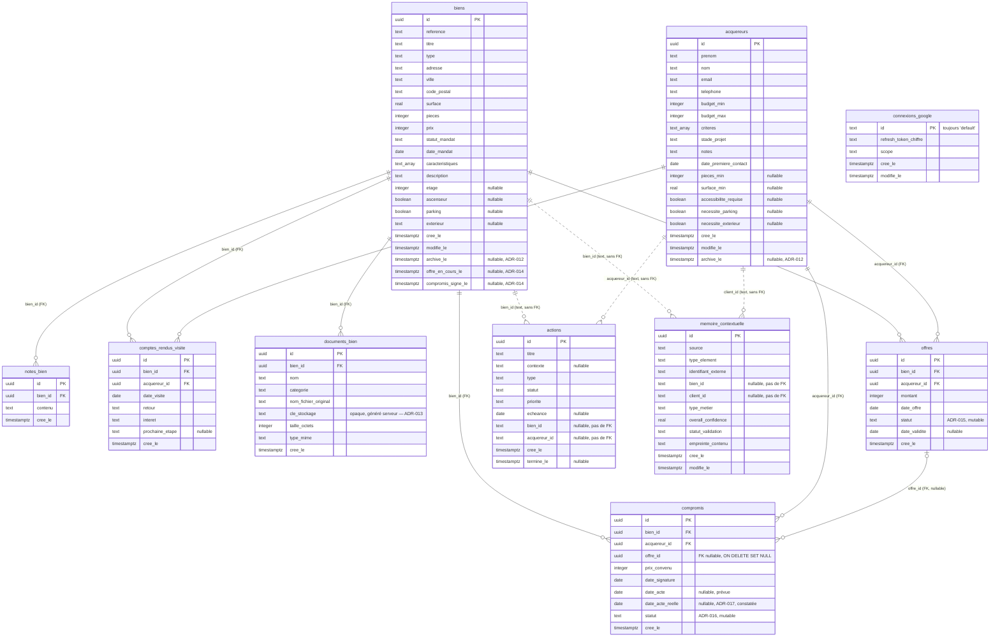

# Modèle de données — Atlas (`apps/web`)

Généré depuis `apps/web/src/db/schema.ts` et les migrations réellement présentes dans
`apps/web/src/db/migrations/` (`0000` à `0010`, vérifiées le 2026-08-12). **Le SQL des migrations
fait foi du schéma physique, pas la définition Drizzle** (principe posé par ADR-006) — en cas de
doute, se référer au fichier `.sql` correspondant.

Convention transversale essentielle, développée dans ADR-009 : **`NULL` signifie "information
inconnue"**, jamais "non" ni "zéro". Pour un booléen optionnel (`ascenseur`, `parking`,
`accessibilite_requise`, `necessite_parking`, `necessite_exterieur`), `false` est une valeur à
part entière signifiant *explicitement connue comme négative* — pas une valeur par défaut.

## Diagramme entité-relation

## `connexions_google`

**Rôle** : fait serveur unique — le conseiller est-il connecté à Google Calendar, et avec quel
refresh token (chiffré). Table à une seule ligne possible (`id` fixé à `"default"`), pas de notion
d'utilisateur/session — voir ADR-006.

| Colonne | Type | Nullable | Notes |
|---|---|---|---|
| `id` | text (PK) | non | valeur unique possible : `"default"` |
| `refresh_token_chiffre` | text | non | AES-256-GCM, voir `lib/google/connexion.ts` |
| `scope` | text | non | scope OAuth accordé par Google |
| `cree_le` / `modifie_le` | timestamptz | non | `defaultNow()` |

Pas de contrainte `CHECK`. Aucune FK. Relation fonctionnelle : consultée par
`getAgendaSemaine()` avant même de décider d'utiliser les mocks (voir `docs/DEMO_VS_REAL.md`).

## `memoire_contextuelle`

**Rôle** : mémoire générique de la correspondance métier (bien/acquéreur/type) qu'Atlas retient
pour un élément externe donné — aujourd'hui uniquement des événements Google Calendar
(`source = "google_calendar"`), conçue pour accueillir d'autres connecteurs sans nouvelle table
(ADR-006).

| Colonne | Type | Nullable | Notes |
|---|---|---|---|
| `id` | uuid (PK) | non | `defaultRandom()` |
| `source` | text | non | ex. `"google_calendar"` |
| `type_element` | text | non | ex. `"evenement"` |
| `identifiant_externe` | text | non | id de l'événement source (`gcal-...`) |
| `bien_id` / `client_id` | text | oui | référence texte, **pas de FK** — voir ADR-010 |
| `type_metier` | text | non | défaut `"autre"` |
| `confidence_bien` / `confidence_client` / `confidence_type` | real | oui | sous-scores |
| `overall_confidence` | real | non | confiance globale calculée |
| `statut_validation` | text | non | défaut `"auto"` |
| `empreinte_contenu` | text | oui | SHA-256 des champs utilisés par le matching |
| `cree_le` / `modifie_le` | timestamptz | non | |

**Contrainte unique** : `(source, identifiant_externe)` — une seule ligne par élément externe.

**Contraintes `CHECK`** :
- `type_metier IN ('visite','estimation','appel','signature','prospection','autre')`
- `statut_validation IN ('auto','confirme','corrige','ignore')`

Relation fonctionnelle : lue/écrite exclusivement par `src/lib/contexteRepository.ts`. Détail du
mécanisme de priorité (validation humaine > cache > moteur) dans `docs/BUSINESS_RULES.md` et
ADR-006.

## `biens`

**Rôle** : premier bien réel persisté (au-delà des mocks `data/biens.ts`). Colonnes structurelles
optionnelles nullables sans défaut (ADR-009).

| Colonne | Type | Nullable | Notes |
|---|---|---|---|
| `id` | uuid (PK) | non | |
| `reference`, `titre`, `adresse`, `ville`, `code_postal` | text | non | |
| `type` | text | non | `CHECK` |
| `surface` | real | non | |
| `pieces` | integer | non | |
| `prix` | integer | non | |
| `statut_mandat` | text | non | défaut `"actif"`, `CHECK` |
| `date_mandat` | date | non | |
| `caracteristiques` | text[] | non | défaut `[]` |
| `description` | text | non | défaut `""` |
| `etage` | integer | **oui** | inconnu = NULL, jamais 0 |
| `ascenseur`, `parking` | boolean | **oui** | inconnu = NULL, jamais false |
| `exterieur` | text | **oui** | `CHECK` si non NULL |
| `cree_le` / `modifie_le` | timestamptz | non | `cree_le` alimente l'historique dérivé (`docs/BUSINESS_RULES.md`) |
| `archive_le` | timestamptz | **oui** | `NULL` = actif, sinon date d'archivage — ADR-012, aucun défaut |
| `offre_en_cours_le` | timestamptz | **oui** | jalon commercial — ADR-014, aucun défaut |
| `compromis_signe_le` | timestamptz | **oui** | jalon commercial — ADR-014, peut être posé sans `offre_en_cours_le` (compromis marqué directement) |

**Contraintes `CHECK`** :
- `type IN ('appartement','maison','studio','loft','local_commercial')`
- `statut_mandat IN ('actif','suspendu','expire')`
- `exterieur IS NULL OR exterieur IN ('aucun','balcon','terrasse','jardin')`

Relation fonctionnelle : référencé par FK réelle depuis `notes_bien` et `comptes_rendus_visite` ;
référencé par id texte (sans FK) depuis `actions` et `memoire_contextuelle` (ADR-010).
`listerBiens()` exclut les lignes où `archive_le` est non NULL ; `getBienById()` les résout
toujours — voir `docs/DEMO_VS_REAL.md`. `offre_en_cours_le`/`compromis_signe_le` ne filtrent rien :
aucun statut commercial stocké, dérivé en lecture par `deriverStatutCommercial()`
(`src/lib/statutCommercialBien.ts`) — voir ADR-014.

## `acquereurs`

**Rôle** : premier acquéreur réel persisté (au-delà des mocks `data/clients.ts`). Mêmes principes
que `biens`.

| Colonne | Type | Nullable | Notes |
|---|---|---|---|
| `id` | uuid (PK) | non | |
| `prenom`, `nom`, `email`, `telephone` | text | non | |
| `budget_min`, `budget_max` | integer | non | |
| `criteres` | text[] | non | défaut `[]` |
| `stade_projet` | text | non | défaut `"decouverte"`, `CHECK` |
| `notes` | text | non | défaut `""` — texte libre, **distinct** de la table `notes_bien` |
| `date_premiere_contact` | date | non | |
| `pieces_min` | integer | **oui** | |
| `surface_min` | real | **oui** | |
| `accessibilite_requise`, `necessite_parking`, `necessite_exterieur` | boolean | **oui** | inconnu = NULL |
| `cree_le` / `modifie_le` | timestamptz | non | |
| `archive_le` | timestamptz | **oui** | `NULL` = actif, sinon date d'archivage — ADR-012, aucun défaut |

**Contrainte `CHECK`** : `stade_projet IN ('decouverte','recherche_active','offre','compromis','acte')`.

`listerClients()` exclut les lignes où `archive_le` est non NULL ; `getClientById()` les résout
toujours — voir `docs/DEMO_VS_REAL.md`.

Relation fonctionnelle : référencé par FK réelle depuis `comptes_rendus_visite` ; par id texte
(sans FK) depuis `actions` et `memoire_contextuelle`.

## `actions`

**Rôle** : actions métier réelles (relances, tâches, suivi de dossier) — remplace les anciens
mocks séparés "relances"/"tâches à préparer". Peut concerner un bien, un acquéreur, les deux, ou
aucun des deux (tâche générale).

| Colonne | Type | Nullable | Notes |
|---|---|---|---|
| `id` | uuid (PK) | non | |
| `titre` | text | non | |
| `contexte` | text | oui | |
| `type` | text | non | défaut `"autre"`, `CHECK` |
| `statut` | text | non | défaut `"a_faire"`, `CHECK` |
| `priorite` | text | non | défaut `"normale"`, `CHECK` |
| `echeance` | date | oui | |
| `bien_id` / `acquereur_id` | text | oui | **pas de FK** — voir ADR-010 |
| `cree_le` | timestamptz | non | |
| `termine_le` | timestamptz | oui | posé atomiquement avec `statut="termine"` par `terminerAction()` |

**Contraintes `CHECK`** :
- `type IN ('appel','email','message','document','relance','autre')`
- `statut IN ('a_faire','termine')`
- `priorite IN ('haute','normale','basse')`

Relation fonctionnelle : priorisée par `lib/actionPriority.ts` (voir `docs/BUSINESS_RULES.md`) ;
alimente l'historique dérivé du bien (`lib/historiqueBien.ts`) via `creee_le`/`termine_le`.

## `notes_bien`

**Rôle** : notes libres sur un bien réel, append-only (ADR-011). Distincte de `acquereurs.notes`
(qui est un champ texte simple, sans historique).

| Colonne | Type | Nullable | Notes |
|---|---|---|---|
| `id` | uuid (PK) | non | |
| `bien_id` | uuid (FK → `biens.id`, `ON DELETE CASCADE`) | non | vraie FK — voir ADR-010 |
| `contenu` | text | non | texte libre, jamais analysé par un moteur (ADR-008) |
| `cree_le` | timestamptz | non | |

Pas de `modifie_le` (ADR-011). Aucune contrainte `CHECK`.

## `comptes_rendus_visite`

**Rôle** : compte rendu structuré après une visite, append-only (ADR-011), table dédiée plutôt
qu'une variante de `notes_bien` (justification complète dans ADR-011).

| Colonne | Type | Nullable | Notes |
|---|---|---|---|
| `id` | uuid (PK) | non | |
| `bien_id` | uuid (FK → `biens.id`, cascade) | non | |
| `acquereur_id` | uuid (FK → `acquereurs.id`, cascade) | non | |
| `date_visite` | date | non | date réelle de la visite — **distincte** de `cree_le` |
| `retour` | text | non | texte libre, jamais analysé (ADR-008) |
| `interet` | text | non | défaut `"inconnu"`, `CHECK` |
| `prochaine_etape` | text | oui | texte libre, ne génère jamais d'action automatiquement |
| `cree_le` | timestamptz | non | instant de saisie |

**Contrainte `CHECK`** : `interet IN ('interesse','a_reflechir','pas_interesse','inconnu')`.

Relation fonctionnelle : alimente l'historique dérivé du bien (`"Visite effectuée — {label}"`,
jamais le texte de `retour`) et la "Mémoire du dossier" de la page de préparation, filtrée sur le
couple `(bien_id, acquereur_id)` exact — voir `docs/BUSINESS_RULES.md`.

## `documents_bien`

**Rôle** : documents réels attachés à un bien (mandat, diagnostics, plans, compromis...),
append-only, aucune suppression en V1 — voir ADR-013 (stratégie de stockage local hors `public/`).

| Colonne | Type | Nullable | Notes |
|---|---|---|---|
| `id` | uuid (PK) | non | |
| `bien_id` | uuid (FK → `biens.id`, `ON DELETE CASCADE`) | non | vraie FK — voir ADR-010 |
| `nom` | text | non | libellé saisi par le conseiller |
| `categorie` | text | non | défaut `"autre"`, `CHECK` |
| `nom_fichier_original` | text | non | nom du fichier tel qu'uploadé — **jamais** utilisé comme chemin physique |
| `cle_stockage` | text | non | identifiant opaque généré côté serveur (ADR-013), reconstruit en chemin uniquement dans `src/lib/stockageDocuments.ts` |
| `taille_octets` | integer | non | |
| `type_mime` | text | non | liste blanche applicative : `application/pdf`, `image/jpeg`, `image/png` |
| `cree_le` | timestamptz | non | |

**Contrainte `CHECK`** : `categorie IN ('mandat','diagnostic','copropriete','technique','commercial','compromis','autre')`.

Pas de `modifie_le` (append-only, même principe que `notes_bien`/`comptes_rendus_visite`,
ADR-011). `ON DELETE CASCADE` nettoie la ligne si un bien était supprimé, mais **ne nettoie
jamais le fichier physique associé** — aucune fonction de suppression n'existe aujourd'hui, voir
ADR-013.

Relation fonctionnelle : lue par `listerDocumentsPourBien()`/`getDocumentBienById()`
(`src/lib/documentBienRepository.ts`), écrite par `ajouterDocumentBienAction`, servie en lecture
par le Route Handler `/api/documents/[id]`.

## `offres`

**Rôle** : offre d'achat structurée sur un bien — bien, acquéreur, montant, date, statut, date de
validité optionnelle. Voir ADR-015.

| Colonne | Type | Nullable | Notes |
|---|---|---|---|
| `id` | uuid (PK) | non | |
| `bien_id` | uuid (FK → `biens.id`, `ON DELETE CASCADE`) | non | vraie FK — voir ADR-010 |
| `acquereur_id` | uuid (FK → `acquereurs.id`, `ON DELETE CASCADE`) | non | vraie FK |
| `montant` | integer | non | immuable après création |
| `date_offre` | date | non | immuable après création |
| `statut` | text | non | défaut `"en_cours"`, `CHECK` — seul champ mutable (`UPDATE` en place, ADR-015) |
| `date_validite` | date | **oui** | optionnel |
| `cree_le` | timestamptz | non | |

**Contrainte `CHECK`** : `statut IN ('en_cours','acceptee','refusee','retiree')`. Transitions
autorisées (`en_cours` → une valeur finale, jamais l'inverse) validées côté Server Action, pas en
`CHECK` SQL.

Pas de `modifie_le` distinct — seul `statut` change après création, en place. Relation
fonctionnelle : lue par `listerOffresPourBien()`/`listerOffresPourAcquereur()`/`getOffreById()`
(`src/lib/offreRepository.ts`), écrite par `ajouterOffreAction`/`changerStatutOffreAction`
(`src/actions/offre.ts`). Créer une offre pose aussi `biens.offreEnCoursLe` (couplage
unidirectionnel, ADR-015) ; changer son statut ne modifie jamais
`offreEnCoursLe`/`compromisSigneLe`.

## `compromis`

**Rôle** : compromis de vente structuré — bien, acquéreur, prix convenu, date de signature, date
d'acte prévue optionnelle, date d'acte réelle, statut, lien optionnel vers l'offre acceptée
d'origine. Voir ADR-016 et ADR-017.

| Colonne | Type | Nullable | Notes |
|---|---|---|---|
| `id` | uuid (PK) | non | |
| `bien_id` | uuid (FK → `biens.id`, `ON DELETE CASCADE`) | non | vraie FK |
| `acquereur_id` | uuid (FK → `acquereurs.id`, `ON DELETE CASCADE`) | non | vraie FK |
| `offre_id` | uuid (FK → `offres.id`, `ON DELETE SET NULL`) | **oui** | optionnel — un compromis peut être marqué directement sans offre structurée préalable |
| `prix_convenu` | integer | non | immuable après création |
| `date_signature` | date | non | immuable après création |
| `date_acte` | date | **oui** | **prévue**, saisie à la création, jamais modifiée ensuite (ADR-017) |
| `date_acte_reelle` | date | **oui** | **constatée**, posée uniquement au passage à `realise`, atomiquement avec le statut — jamais fusionnée avec `date_acte` (ADR-017) |
| `statut` | text | non | défaut `"en_cours"`, `CHECK` — seul champ mutable (`UPDATE` en place, ADR-016) |
| `cree_le` | timestamptz | non | |

**Contrainte `CHECK`** : `statut IN ('en_cours','realise','annule')`. Transitions autorisées
(`en_cours` → une valeur finale, jamais l'inverse), cohérence de l'offre liée (même bien, même
acquéreur, statut `acceptee`), et obligation de `date_acte_reelle` pour la transition `realise` —
toutes validées côté Server Action, pas en `CHECK` SQL. Un seul compromis `en_cours` par bien à la
fois : garde applicative, pas une contrainte SQL d'unicité.

Pas de `modifie_le` distinct. Relation fonctionnelle : lue par
`listerCompromisPourBien()`/`listerCompromisPourAcquereur()`/`getCompromisById()`
(`src/lib/compromisRepository.ts`), écrite par `ajouterCompromisAction` /
`changerStatutCompromisAction` (`src/actions/compromis.ts`, qui appelle
`changerStatutCompromis()` pour `annule` et `marquerCompromisRealise()` pour `realise` — deux
fonctions repository distinctes, la seconde posant `statut` et `date_acte_reelle` dans un seul
`UPDATE` atomique). Créer un compromis pose aussi `biens.compromisSigneLe` (couplage
unidirectionnel, ADR-016) ; changer son statut ne le modifie jamais. `date_acte`/`date_acte_reelle`
distinctes délibérément conservées pour permettre plus tard un suivi de pipeline/délais/CA
prévisionnel vs réalisé (ADR-017) — aucun calcul de ce type n'existe dans cette passe.

## `offre_visites`

**Rôle** : lien explicite many-to-many entre une offre et les visites qui l'ont précédée — jamais
déduit par proximité de date, toujours créé par un geste explicite du conseiller. Voir ADR-019.

| Colonne | Type | Nullable | Notes |
|---|---|---|---|
| `id` | uuid (PK) | non | |
| `offre_id` | uuid (FK → `offres.id`, `ON DELETE CASCADE`) | non | vraie FK |
| `compte_rendu_visite_id` | uuid (FK → `comptes_rendus_visite.id`, `ON DELETE CASCADE`) | non | vraie FK |
| `cree_le` | timestamptz | non | |

**Contrainte `UNIQUE`** : `(offre_id, compte_rendu_visite_id)` — dernier filet de sécurité contre
un doublon, en complément de la validation applicative (même bien, même acquéreur,
`date_visite <= date_offre`, jamais exprimée en `CHECK` SQL puisqu'elle compare deux tables).

Cascade des deux côtés (contrairement à `compromis.offre_id`, en `SET NULL`) : une ligne de
liaison n'a aucun sens indépendamment de l'offre et de la visite qu'elle relie. Table de faits
sans `modifie_le` mais dont les lignes peuvent être supprimées individuellement (correction d'une
erreur de saisie) — seule table du projet où une suppression physique de ligne est un usage normal
plutôt qu'une exception, car le lien n'est pas lui-même un fait métier historique. Relation
fonctionnelle : lue par `listerLiensPourBien()`/`getLienOffreVisiteById()`/`getLienOffreVisite()`,
écrite par `lierVisiteAOffre()`/`retirerLienVisiteOffre()` (`src/lib/offreVisiteRepository.ts`).
Créée soit dans la même transaction que l'offre (`enregistrerOffreAvecLiensEtJalon`,
`src/lib/offreRepository.ts`), soit rétroactivement (`lierVisiteAOffreAction`/`delierVisiteAction`,
`src/actions/offreVisite.ts`).

## Tableau de bord commercial (`dashboardRepository.ts`)

`src/lib/dashboardRepository.ts` (lecture seule, ADR-018/ADR-019) agrège
`compromis`/`offres`/`comptes_rendus_visite`/`biens`/`offre_visites` existants via
`COUNT`/`SUM`/`AVG`/`GROUP BY` exécutés par Postgres — jamais recalculé en mémoire côté
application. Voir `docs/BUSINESS_RULES.md`
pour le détail des métriques et ADR-018 pour la règle d'archivage et les métriques écartées ;
ADR-019 pour `offre_visites` et les métriques visite → offre.

## Migrations

| Fichier | Tables introduites |
|---|---|
| `0000_far_gauntlet.sql` | `connexions_google`, `memoire_contextuelle` |
| `0001_mysterious_rattler.sql` | `biens`, `acquereurs` |
| `0002_cultured_masked_marvel.sql` | `actions` |
| `0003_black_risque.sql` | `notes_bien` |
| `0004_needy_norrin_radd.sql` | `comptes_rendus_visite` |
| `0005_happy_wolfsbane.sql` | `archive_le` sur `biens` et `acquereurs` |
| `0006_volatile_starbolt.sql` | `documents_bien` |
| `0007_absurd_rumiko_fujikawa.sql` | `offre_en_cours_le`, `compromis_signe_le` sur `biens` |
| `0008_great_kid_colt.sql` | `offres` |
| `0009_high_lenny_balinger.sql` | `compromis` |
| `0010_tiny_earthquake.sql` | `date_acte_reelle` sur `compromis` |
| `0011_friendly_captain_flint.sql` | `offre_visites` |

Générées par `pnpm db:generate` (Drizzle Kit) après modification de `src/db/schema.ts`, appliquées
par `pnpm db:migrate`. Voir `apps/web/README.md` pour la procédure complète.
