# Modèle de données — Atlas (`apps/web`)

Généré depuis `apps/web/src/db/schema.ts` et les migrations réellement présentes dans
`apps/web/src/db/migrations/` (`0000` à `0026`, vérifiées le 2026-08-15). **Le SQL des migrations
fait foi du schéma physique, pas la définition Drizzle** (principe posé par ADR-006) — en cas de
doute, se référer au fichier `.sql` correspondant.

Convention transversale essentielle, développée dans ADR-009 : **`NULL` signifie "information
inconnue"**, jamais "non" ni "zéro". Pour un booléen optionnel (`ascenseur`, `parking`,
`accessibilite_requise`, `necessite_parking`, `necessite_exterieur`), `false` est une valeur à
part entière signifiant *explicitement connue comme négative* — pas une valeur par défaut.

## Diagramme entité-relation

```mermaid
erDiagram
    biens ||--o{ notes_bien : "bien_id (FK)"
    biens ||--o{ visites : "bien_id (FK)"
    acquereurs ||--o{ visites : "acquereur_id (FK)"
    visites |o--o{ comptes_rendus_visite : "visite_id (FK, nullable)"
    biens ||--o{ comptes_rendus_visite : "bien_id (FK)"
    biens ||--o{ documents_bien : "bien_id (FK)"
    biens ||--o{ offres : "bien_id (FK)"
    acquereurs ||--o{ offres : "acquereur_id (FK)"
    biens ||--o{ compromis : "bien_id (FK)"
    acquereurs ||--o{ compromis : "acquereur_id (FK)"
    offres |o--o{ compromis : "offre_id (FK, nullable)"
    compromis ||--o| remuneration : "compromis_id (FK, unique)"
    dossier_fiscal ||--o{ profil_fiscal : "dossier_fiscal_id (FK)"
    dossier_fiscal ||--o{ historique_amorcage : "dossier_fiscal_id (FK)"
    dossier_fiscal ||--o{ rfr_foyer : "dossier_fiscal_id (FK)"
    acquereurs ||--o{ comptes_rendus_visite : "acquereur_id (FK)"
    biens |o--o{ taches : "bien_id (FK, nullable)"
    acquereurs |o--o{ taches : "acquereur_id (FK, nullable)"
    prospects_vendeurs |o--o{ taches : "prospect_vendeur_id (FK, nullable)"
    comptes_rendus_visite |o--o{ taches : "visite_id (FK, nullable)"
    offres |o--o{ taches : "offre_id (FK, nullable)"
    compromis |o--o{ taches : "compromis_id (FK, nullable)"
    remuneration |o--o{ taches : "remuneration_id (FK, nullable)"
    acquereurs ||--o{ secteurs_recherche_acquereur : "acquereur_id (FK)"
    biens ||..o{ memoire_contextuelle : "bien_id (text, sans FK)"
    acquereurs ||..o{ memoire_contextuelle : "client_id (text, sans FK)"

    connexions_google {
        text id PK "toujours 'default'"
        text refresh_token_chiffre
        text scope
        timestamptz cree_le
        timestamptz modifie_le
    }
    memoire_contextuelle {
        uuid id PK
        text source
        text type_element
        text identifiant_externe
        text bien_id "nullable, pas de FK"
        text client_id "nullable, pas de FK"
        text type_metier
        real overall_confidence
        text statut_validation
        text empreinte_contenu
        timestamptz cree_le
        timestamptz modifie_le
    }
    biens {
        uuid id PK
        text reference
        text titre
        text type
        text adresse
        text ville
        text code_postal
        real surface
        integer pieces
        integer prix
        text statut_mandat
        date date_mandat
        text_array caracteristiques
        text description
        integer etage "nullable"
        boolean ascenseur "nullable"
        boolean parking "nullable"
        text exterieur "nullable"
        timestamptz cree_le
        timestamptz modifie_le
        timestamptz archive_le "nullable, ADR-012"
        timestamptz offre_en_cours_le "nullable, ADR-014"
        timestamptz compromis_signe_le "nullable, ADR-014"
    }
    acquereurs {
        uuid id PK
        text prenom
        text nom
        text email
        text telephone
        integer budget_min
        integer budget_max
        text_array criteres
        text stade_projet
        text notes
        date date_premiere_contact
        integer pieces_min "nullable"
        real surface_min "nullable"
        boolean accessibilite_requise "nullable"
        boolean necessite_parking "nullable"
        boolean necessite_exterieur "nullable"
        timestamptz cree_le
        timestamptz modifie_le
        timestamptz archive_le "nullable, ADR-012"
    }
    taches {
        uuid id PK
        text titre
        text contexte "nullable"
        text type
        text priorite
        date echeance "nullable"
        text origine
        text origine_code "nullable"
        uuid bien_id FK "nullable, au plus une cible (CHECK)"
        uuid acquereur_id FK "nullable"
        uuid prospect_vendeur_id FK "nullable"
        uuid visite_id FK "nullable"
        uuid offre_id FK "nullable"
        uuid compromis_id FK "nullable"
        uuid remuneration_id FK "nullable"
        timestamptz cree_le
        timestamptz terminee_le "nullable"
        timestamptz annulee_le "nullable"
    }
    notes_bien {
        uuid id PK
        uuid bien_id FK
        text contenu
        timestamptz cree_le
    }
    visites {
        uuid id PK
        uuid bien_id FK
        uuid acquereur_id FK
        date date_prevue
        text statut "planifiee/realisee/annulee"
        text rendez_vous_calendar_id "UNIQUE, référence externe, jamais la PK"
        timestamptz cree_le
    }
    comptes_rendus_visite {
        uuid id PK
        uuid bien_id FK
        uuid acquereur_id FK
        uuid visite_id FK "nullable"
        date date_visite
        text retour
        text interet
        text prochaine_etape "nullable"
        timestamptz cree_le
    }
    documents_bien {
        uuid id PK
        uuid bien_id FK
        text nom
        text categorie
        text nom_fichier_original
        text cle_stockage "opaque, généré serveur — ADR-013"
        integer taille_octets
        text type_mime
        timestamptz cree_le
    }
    offres {
        uuid id PK
        uuid bien_id FK
        uuid acquereur_id FK
        integer montant
        date date_offre
        text statut "ADR-015, mutable"
        date date_validite "nullable"
        timestamptz cree_le
    }
    compromis {
        uuid id PK
        uuid bien_id FK
        uuid acquereur_id FK
        uuid offre_id "FK nullable, ON DELETE SET NULL"
        integer prix_convenu
        date date_signature
        date date_acte "nullable, prévue"
        date date_acte_reelle "nullable, ADR-017, constatée"
        text statut "ADR-016, mutable"
        timestamptz cree_le
    }
    remuneration {
        uuid id PK
        uuid compromis_id "FK unique, ON DELETE CASCADE"
        integer montant_honoraires_total_centimes "nullable"
        integer montant_remuneration_conseiller_centimes
        date date_encaissement_prevue "nullable, prévue"
        date date_encaissement_reelle "nullable, ADR-021, constatée, figée une fois posée"
        timestamptz cree_le
        timestamptz modifie_le "nullable"
    }
    dossier_fiscal {
        text id PK "toujours 'default', ADR-023"
        timestamptz cree_le
    }
    profil_fiscal {
        uuid id PK
        text dossier_fiscal_id FK
        date date_debut_validite "append-only, pas d'ordre imposé"
        text nature_activite
        date date_debut_activite
        text regime_fiscal "'inconnu' possible"
        text regime_comptable "nullable, découplé de la TVA"
        text regime_tva "'inconnu' possible"
        boolean option_debits "nullable"
        text periodicite_urssaf "'inconnu' possible"
        boolean option_versement_liberatoire "nullable"
        boolean acre_actif "nullable"
        date acre_date_debut "nullable"
        date acre_date_fin "nullable"
        text affiliation_retraite "'inconnu' possible"
        timestamptz cree_le
    }
    historique_amorcage {
        uuid id PK
        text dossier_fiscal_id FK
        integer annee
        integer montant_encaisse_centimes "absence de ligne = inconnu, jamais 0"
        date date_fin_couverture "anti-double-comptage"
        timestamptz cree_le
        timestamptz modifie_le "nullable"
    }
    rfr_foyer {
        uuid id PK
        text dossier_fiscal_id FK
        integer annee_rfr
        integer rfr_foyer_centimes
        integer nombre_parts_centiemes "entier exact, 1,5 part = 150"
        timestamptz cree_le
        timestamptz modifie_le "nullable"
    }
    regle_fiscale {
        uuid id PK
        text code
        text categorie_activite
        integer valeur "entier exact, unite fixe la représentation"
        text unite "centimes / points_base / jours"
        date date_debut_validite "intervalle [début, fin["
        date date_fin_validite "nullable, exclue"
        text source_libelle
        text source_url
        date date_publication_source "nullable"
        text statut_verification
        timestamptz cree_le
    }
```



## `workspaces` (ADR-054)

**Rôle** : périmètre PROPRIÉTAIRE des données métier (OWNERSHIP). Une ligne métier appartient à
exactement un workspace, pour toute sa vie. Le produit reste mono-conseiller : une seule ligne
existe, `id = 'default'`, créée par la migration `0032` — même patron de ligne unique que
`connexions_google` et `dossier_fiscal`, mais ici l'unicité est un état de départ, pas une
propriété permanente.

| Colonne | Type | Nullable | Notes |
|---|---|---|---|
| `id` | text (PK) | non | `DEFAULT 'default'` — clé logique, jamais un uuid de substitution |
| `nom` | text | **oui** | `NULL` = aucun libellé saisi ; la migration n'en invente aucun (ADR-009). Distinct d'`ATLAS_ADVISOR_DISPLAY_NAME`, propriété d'instance |
| `cree_le` | timestamptz | non | `defaultNow()` |

Aucune contrainte `CHECK`. Référencée par la colonne `workspace_id` des tables racines (voir
ci-dessous) et par `workspace_membres`.

## `workspace_membres` (ADR-054)

**Rôle** : ACCESS — quelle identité humaine a accès à quel workspace. Ne dit **jamais** qui possède
une ligne métier (c'est `workspace_id`) ni qui a créé quoi (aucune colonne d'auteur n'existe).

**Table vide après la migration `0032`**, volontairement : le `sub` Google n'est jamais persisté
(ADR-047), il n'est connu qu'au retour du callback OIDC — une appartenance initiale ne peut pas être
établie de façon déterministe par une migration, et l'inventer créerait une identité inexistante.
Elle sera posée par le lot qui résout le workspace en session. **Aucun chemin
d'authentification ne lit cette table aujourd'hui** : l'allowlist à une seule adresse
(`ATLAS_ALLOWED_EMAIL`) reste seule maîtresse de qui peut entrer.

| Colonne | Type | Nullable | Notes |
|---|---|---|---|
| `workspace_id` | text (PK composite) | non | FK → `workspaces.id`, NO ACTION |
| `identite_sub` | text (PK composite) | non | `sub` Google, déjà porté par la session Atlas (ADR-047) — aucune seconde notion d'utilisateur n'est créée |
| `email` | text | non | email vérifié au moment de l'ajout |
| `role` | text | non | `CHECK IN ('owner')` — vocabulaire fermé ; `member`/`manager`/`admin` sont absents tant que leur sémantique n'est pas implémentée (ADR-054 §5) |
| `ajoute_le` | timestamptz | non | `defaultNow()` |

PK composite `(workspace_id, identite_sub)` : c'est la clé logique réelle, il n'existe pas de second
axe d'identité pour une appartenance (même raisonnement que `compatibilites_bien_acquereur_etat`).

## Colonne `workspace_id` sur les tables racines (ADR-054)

Neuf tables **racines** portent `workspace_id text NOT NULL DEFAULT 'default'`, FK vers
`workspaces.id` (NO ACTION) : `biens`, `acquereurs`, `prospects_vendeurs`, `taches`, `envois_email`,
`evenements_metier`, `configurations_automatisation`, `runs_scan_automatisation`,
`compatibilites_a_resynchroniser`.

**Aucun `DEFAULT` depuis la migration `0033`** : le filet posé par `0032` a été retiré une fois tous
les chemins d'écriture rendus explicites. C'est un invariant de sécurité — une écriture qui oublie
son périmètre échoue immédiatement (violation `NOT NULL`) au lieu d'être silencieusement rangée dans
le workspace historique. La valeur vient de la session (`exigerWorkspaceCourant`, `src/lib/auth/`)
ou du contexte d'exécution machine (`resoudreWorkspaceExecutionMachine`, `src/lib/workspaceRepository.ts`)
— jamais d'un littéral dans un repository, règle verrouillée par un test structurel.

`configurations_automatisation` conserve sa PK `regle_code` seule : correcte tant qu'il n'existe
qu'un workspace, elle devra devenir `PRIMARY KEY (workspace_id, regle_code)` **dans le lot qui
activera le multi-workspace** — c'est la seule contrainte d'unicité du schéma dans ce cas.

Les tables **feuilles** ne portent **pas** `workspace_id` : leur appartenance se dérive d'une FK
NOT NULL vers un parent possédé, et la dupliquer créerait une seconde vérité pouvant diverger
(ADR-054 §7). Restent sans colonne, chacun pour une raison distincte : `connexions_google` (secret personnel,
ADR-054 §6), `dossier_fiscal` et ses trois filles (**tranché** : données fiscales personnelles du
conseiller, rattachées à l'identité et non au workspace — ADR-054 §6 bis), `memoire_contextuelle`
(**non tranché**, question ouverte 4 bis d'ADR-054), et `regle_fiscale` (référentiel non possédé).

Le classement complet des tables est exécutable et verrouillé par
`apps/web/src/db/appartenanceWorkspace.structurel.test.ts` : toute table ajoutée au schéma sans
être classée fait échouer ce test.

## `contacts` (ADR-055)

**Rôle** : **identité canonique d'une personne**, indépendante de tout dossier — la première brique
du modèle canonique décidé par ADR-055.

**État : fondation, pas encore la source de vérité.** `prospects_vendeurs` et `acquereurs` restent
intacts et pilotent tous les workflows existants (matching, visites, offres, compromis, tâches,
automatisations). `contacts` est une identité **parallèle**, alimentée depuis les créations réelles,
que rien ne lit encore. Ne pas présenter cette table comme utilisée : elle est prête, pas branchée.

| Colonne | Type | Nullable | Notes |
|---|---|---|---|
| `id` | uuid (PK) | non | identité canonique interne — jamais un identifiant fournisseur (ADR-056 §1) |
| `workspace_id` | text | non | FK → `workspaces.id`, sans `DEFAULT` (ADR-054) |
| `nom` | text | **non** | seul champ obligatoire : le seul que les deux modèles historiques garantissent |
| `prenom` | text | oui | |
| `email` | text | oui | |
| `telephone` | text | oui | |
| `cree_le` | timestamptz | non | `defaultNow()` |

**Aucune colonne de rôle** (`role`, `type`, `statut`, `pipeline`…) : un contact est vendeur ou
acquéreur *parce qu'il est partie d'un dossier*, jamais par un attribut stocké. Même discipline que
le statut de tâche dérivé de `terminee_le`/`annulee_le` (ADR-028). **Aucune donnée de projet** non
plus (budget, secteur, critères) : elles décrivent une recherche, pas un humain.

**Aucune contrainte d'unicité sur `email` ou `telephone`**, et c'est une décision : un couple
partage une adresse, une famille un numéro, un prospect terrain peut n'avoir ni l'un ni l'autre, et
la même personne existe légitimement dans deux workspaces. La déduplication passera par une
recherche de candidats et une **validation humaine** — jamais par le schéma, jamais automatiquement
(ADR-055 §H).

Invariants verrouillés par `apps/web/src/db/contactCanonique.structurel.test.ts`.

## Pont `contact_id` (ADR-055)

`acquereurs.contact_id` et `prospects_vendeurs.contact_id` : FK **nullable** vers `contacts`
(NO ACTION), dans le sens ancien → nouveau.

- Les créations passant par les Server Actions (`creerAcquereurAction`,
  `creerProspectVendeurAction`) créent le contact **dans la même transaction** que le dossier et le
  rattachent : les deux existent ensemble ou aucun des deux.
- **Toutes les lignes antérieures gardent `contact_id = NULL`** : aucun backfill n'a été fait.
  « 1 ligne = 1 contact » fabriquerait des doublons structurels (le même humain vendeur puis
  acquéreur donnerait deux contacts) ; un rapprochement sur email/téléphone fusionnerait à tort deux
  personnes mal saisies. Le rattachement de l'historique sera un geste explicite, dans son lot.
- Les autres chemins d'écriture (tests d'intégration, seed, appels internes) laissent le pont
  absent : `contactId` est un champ **optionnel** des types d'entrée.

**Source de vérité pendant la coexistence : le dossier historique.** L'identité est temporairement
dupliquée entre `contacts` et `acquereurs`/`prospects_vendeurs`. Aucune synchronisation
bidirectionnelle n'existe : modifier un acquéreur ne met pas à jour son contact. C'est assumé pour
la durée de la transition — la bascule des lectures se fera quand les projets canoniques existeront.

**Cible (non implémentée)** : `Contact → PartieProjet → SellerProject / BuyerProject`, avec `Mandat`
et `Interaction` comme entités propres. Voir ADR-055. **Le matching restera branché sur le projet
acquéreur, jamais sur le Contact** : un contact n'est pas une recherche immobilière.

## `projets_acquereur` (ADR-055 §B)

**Rôle** : **projet acquéreur canonique** — une intention immobilière située dans le temps. C'est la
moitié « projet » de `acquereurs`, extraite pour qu'une même personne puisse porter plusieurs
recherches successives sans dupliquer son identité, et qu'un projet puisse être porté par deux
personnes sans dupliquer le projet.

**État : fondation, pas encore la source de vérité.** `acquereurs` reste intact et pilote le
matching, les visites, les offres, les tâches et l'UI.

| Colonne | Type | Nullable | Notes |
|---|---|---|---|
| `id` | uuid (PK) | non | identité canonique interne — jamais un identifiant fournisseur (ADR-056) |
| `workspace_id` | text | non | FK → `workspaces.id`, sans `DEFAULT` (ADR-054). **Racine**, pas feuille de `contacts` |
| `budget_min` / `budget_max` | integer | non | |
| `criteres` | text[] | non | `DEFAULT '{}'` |
| `stade_projet` | text | non | `DEFAULT 'decouverte'`, `CHECK` — même vocabulaire que `acquereurs` |
| `pieces_min`, `surface_min`, `accessibilite_requise`, `necessite_parking`, `necessite_exterieur` | | oui | absent = non documenté, jamais « non » (ADR-009) |
| `cree_le` | timestamptz | non | `defaultNow()` |
| `archive_le` | timestamptz | oui | ADR-012 — tient lieu de cycle de vie |

**Aucune identité humaine** (`nom`, `prenom`, `email`, `telephone`, `contact_id`) : les personnes
sont des Contacts, atteints par `parties_projet`. Un projet porté par un couple n'a pas « un » nom.

**Colonnes retenues = exactement ce que lit `evaluerCompatibilite(bien, acquereur, secteurs)`**,
plus `stade_projet`. Ce n'est pas une recopie de `acquereurs` : c'est le sous-ensemble dont un
consommateur futur est déjà identifié.

**Cycle de vie** : `archive_le` (ADR-012) + `stade_projet`. Aucune machine à états n'est introduite —
le modèle actuel n'en a aucune, et en inventer une créerait un vocabulaire que personne n'écrit.

## `parties_projet` (ADR-055 §B)

**Rôle** : la relation « cette personne participe à ce projet ». C'est elle, et elle seule, qui fait
exister le rôle : un contact est acquéreur **parce qu'il est partie d'un projet acquéreur**, vendeur
parce qu'il est partie d'un projet vendeur. **La même personne peut être les deux à la fois**, sans
qu'aucune colonne ne l'affirme — c'est le CAS 8 d'ADR-055, inexprimable dans le modèle historique.

```
                    Contact
                       │
                 parties_projet
                  /          \
        projets_acquereur   projets_vendeur
                 ▲                 ▲
                 │                 │
           acquereurs      prospects_vendeurs
        (historiques, sources de vérité transitoires)
```

| Colonne | Type | Nullable | Notes |
|---|---|---|---|
| `id` | uuid (PK) | non | |
| `contact_id` | uuid | non | FK → `contacts.id`, NO ACTION (un contact n'est jamais supprimé) |
| `projet_acquereur_id` | uuid | oui | FK → `projets_acquereur.id`, CASCADE |
| `projet_vendeur_id` | uuid | oui | FK → `projets_vendeur.id`, CASCADE |
| `role` | text | non | `CHECK ('acquereur','co_acquereur','vendeur','co_vendeur')` |
| `cree_le` | timestamptz | non | |

`UNIQUE(projet_acquereur_id, contact_id)` et `UNIQUE(projet_vendeur_id, contact_id)` : une personne
participe **une fois** à un projet donné ; changer son rôle est une mise à jour, jamais une seconde
ligne. Les lignes de l'autre côté ont leur colonne à `NULL` et ne s'y heurtent pas (deux `NULL` sont
distincts pour un `UNIQUE` Postgres). **Aucune unicité sur une colonne seule** — ce serait faire
retomber le modèle en 1:N.

Aucun rôle de **propriété juridique** (`proprietaire`, `mandant`, `indivisaire`, `usufruitier`) :
ADR-055 §C place ce lien sur le mandat et le projet, et aucun consommateur n'existe — l'inventer
affirmerait un fait que DOMIORA ne constate pas.

**Feuille (ADR-054 §7)** : pas de `workspace_id` dupliqué. La base seule ne peut donc pas refuser
une participation traversant deux périmètres : l'invariant est tenu par `ajouterPartieProjet()`, qui
compare les deux workspaces et **échoue**, et il est prouvé par un test.

**Cibles dédiées + `CHECK` « exactement une »** (ADR-055 invariant 5, patron `taches` /
`evenements_metier`) : `projet_acquereur_id` et `projet_vendeur_id` sont toutes deux nullables, et
c'est `parties_projet_une_seule_cible_check` — pas leur nullabilité — qui impose qu'exactement une
soit renseignée. Jamais zéro (une partie sans projet ne rattache personne à rien), jamais deux (une
participation n'est pas à la fois un achat et une vente). Jamais un couple polymorphe `{type, id}` :
il rendrait les FK impossibles.

## Pont `projet_acquereur_id` (ADR-055 §B)

`acquereurs.projet_acquereur_id` : FK **nullable** vers `projets_acquereur` (NO ACTION), sens ancien
→ nouveau, même direction et même prudence que `contact_id`.

- `creerAcquereurAction` crée, **dans une seule transaction** : le Contact, le projet canonique, la
  partie (`role = 'acquereur'`, le porteur que la ligne historique décrit), la ligne `acquereurs`
  avec ses deux ponts, puis la demande de resynchronisation ADR-036. Tout existe, ou rien.
- **Toutes les lignes antérieures gardent `projet_acquereur_id = NULL`** : aucun backfill. Un
  acquéreur historique peut être une recherche close, abandonnée ou saisie deux fois ; en faire
  mécaniquement un projet actif fabriquerait des faits que personne n'a constatés.
- `modifierAcquereur()` **ne propage rien** vers le modèle canonique, et réciproquement : aucun
  miroir en écriture n'existe dans un sens ni dans l'autre. Depuis la bascule des lectures
  ci-dessous, une modification du dossier historique sur un acquéreur **rattaché** ne change plus le
  matching — c'est le projet canonique qui fait foi pour ses critères. Le formulaire de modification
  reste donc à basculer sur le projet, dans son propre lot.

## Lecture effective des critères acquéreur (ADR-055 §B, lot « read bridge »)

**La règle, au niveau de l'AGRÉGAT :**

| État de la ligne `acquereurs` | Critères lus par `evaluerCompatibilite` |
| --- | --- |
| `projet_acquereur_id` **présent** | **`projets_acquereur`** — pour **tous** les champs qu'il porte |
| `projet_acquereur_id` **absent** | `acquereurs` — pour tous les champs |

**Jamais de repli champ par champ.** Un `pieces_min` NULL sur un projet canonique est une
information — « ce critère n'est pas documenté » — pas un trou à combler avec la vieille valeur du
dossier. Reprendre le legacy champ à champ ressusciterait silencieusement un critère qu'une source
externe vient précisément d'effacer, et rendrait indécidable ce que le produit affiche. Un test
structurel interdit la forme `projet.x ?? acquereur.x`.

**Référence de projet cassée : fail closed.** `projet_acquereur_id` non nul pointant vers un projet
introuvable est impossible par FK ; y arriver signifie une incohérence de données, jamais un cas
métier. La lecture lève une erreur explicite au lieu de retomber sur le legacy — présenter des
critères périmés comme canoniques serait un mensonge stable, bien pire qu'une erreur visible.

**Où vit cette règle** : `lib/compatibilite/profilCompatibiliteRepository.ts`, et nulle part
ailleurs. Le moteur (`evaluerCompatibilite.ts`, `criteres.ts`) reçoit un
`ProfilCompatibiliteAcquereur` — type sans identité humaine, sans `budgetMin` (aucune sémantique de
compatibilité, ADR-034) et sans `criteres` (texte libre, ADR-008) — et ignore d'où viennent les
valeurs.

**Champs canoniques réellement lus** : `budget_max`, `pieces_min`, `surface_min`,
`accessibilite_requise`, `necessite_parking`, `necessite_exterieur`.

**Inputs restés LEGACY, et assumés** : `secteurs_recherche_acquereur` (ADR-035) reste une table
enfant de `acquereurs`, chargée par l'id du **dossier** et passée au moteur comme avant. Le modèle
de lecture effectif est donc **hybride** — critères canoniques, enfants encore ancrés au dossier —
jusqu'au lot qui canonicalisera ces enfants. Aucune FK n'est déplacée ici.

**Invalidation** : `modifierChampProjetAcquereur()` enfile lui-même une demande de resynchronisation
ADR-036 pour chaque dossier qui référence le projet, sur l'`executeur` de l'appelant. Sans elle, une
mutation canonique (Sync Engine compris) changerait le verdict du matching sans que rien ne demande
de le recalculer. La porter dans le writer Core plutôt que dans `appliquerMutationExterne()` tient la
frontière ADR-056 §9 : une source externe pousse une valeur au Core et n'a jamais à savoir qu'un
moteur de matching existe.

## Recherche de personnes (ADR-058)

**SEARCH UNIT = `contacts`.** On cherche une personne ; ses dossiers sont du contexte. Un contact
multi-rôle et multi-projets donne **une seule ligne** de résultat.

**NOT DEDUP KEY = `email`, `telephone`.** Deux contacts partageant une adresse ou un numéro restent
**deux résultats**. Aucun `GROUP BY`, aucun `DISTINCT ON`, aucun regroupement visuel : les mettre
côte à côte est ce qui permet à un humain de trancher, et à lui seul (ADR-055 §H).

**WORKSPACE = obligatoire.** `workspaceId` est un paramètre requis, jamais optionnel, jamais avec
repli. C'est la deuxième surface de recherche du produit à l'être.

**Champs cherchés** : `nom`, `prenom`, `email`, `telephone`, **et le nom complet concaténé** —
« Jean Dupont » n'est contenu dans aucune colonne prise seule, alors que c'est la façon la plus
naturelle de chercher quelqu'un.

**Ranking déterministe, en paliers** : email exact, téléphone exact, nom complet exact, préfixe de
nom ou prénom, puis contient ; départage par `nom`, `id`. Calculé en SQL pour que le tri et la
pagination portent sur le même ordre — trier en mémoire après un `LIMIT` rendrait la page 2
incohérente avec la page 1. Aucun score composite : il ne s'explique pas.

**Trois requêtes, quel que soit le nombre de résultats** : la page de contacts, puis les rôles et
résumés de projets, puis `MAX(survenu_le)` par contact. Les deux agrégats sont batchés sur les ids
de la page. Une page de 25 coûte autant qu'une page d'un seul.

**Rôles dérivés de `parties_projet`**, jamais stockés. Le **statut vendeur** est calculé par
`deriverStatutProspectVendeur` sur les jalons bruts — sa cascade n'est pas réécrite en SQL
(le paramètre de la primitive a été élargi aux seuls jalons qu'elle lit, `ProspectVendeur` restant
assignable).

**Pagination** `limit`/`offset`, bornée à 100. `hasMore` obtenu en demandant une ligne de plus —
aucun `COUNT(*)` global, puisque aucun écran n'affiche encore de total.

**Index** : `contacts(workspace_id)` (migration `0042`), le filtre le plus sélectif et le seul qui
manquait. Aucun index trigram, aucune colonne normalisée, aucune unicité sur email ou téléphone.

**Résultats mixtes (`rechercherPersonnes()`, `recherchePersonneRepository.ts`).** La page
`/contacts` consomme une orchestration au-dessus du read model canonique, qui rend une **union
discriminée** `ResultatRecherchePersonne` : `{ type: "contact" }` (le résultat canonique, inchangé),
`{ type: "legacy_acquereur", acquereurId }` ou `{ type: "legacy_vendeur", prospectVendeurId }` avec
l'identité telle que le dossier la stocke. Un résultat legacy **n'a pas de `contactId`** : ce n'est
pas un Contact virtuel, c'est un dossier qu'un humain n'a pas encore rattaché.

- **Sources historiques** : `acquereurs.contact_id IS NULL` et `prospects_vendeurs.contact_id IS NULL`
  uniquement. Un dossier déjà rattaché n'apparaît jamais une seconde fois à côté de son Contact.
- **Une seule liste ordonnée, en SQL** : `UNION ALL` des trois sources (jamais `UNION`, qui
  dédoublonnerait), **mêmes paliers de rang** calculés par la même fonction (`expressionRang`), puis
  `ORDER BY rang, nom, type (contact < acquéreur < vendeur), id`, `LIMIT`/`OFFSET` globaux. La
  pertinence textuelle prime toujours sur la nature du résultat ; à égalité seulement, le canonique
  précède l'historique.
- **Aucune fusion** : un Contact et un dossier à la même identité sont deux résultats ; deux dossiers
  au même email sont deux résultats. Aucun `GROUP BY`, aucun `DISTINCT`, aucun score.
- **Requête vide** : uniquement les Contacts récents (`rechercherContacts()` tel quel) — les dossiers
  historiques n'apparaissent que lorsqu'un conseiller cherche réellement quelqu'un.
- **Lecture seule** : le module n'importe aucun chemin d'écriture ni de rattachement (verrouillé par
  `recherchePersonneRepository.structurel.test.ts`). Rattacher reste le geste de la fiche du dossier.
- **Coût** : une requête `UNION ALL`, puis les deux agrégats batchés du read model canonique sur les
  Contacts de la page — quatre requêtes au plus, quel que soit le nombre de résultats.

### Fiche Contact (`chargerContactDetail()`, `contactDetailRepository.ts`)

**Lecture seule, par clés réelles.** Le read model `ContactDetail` rend, pour un contact lu par
`(id, workspace_id)` : l'identité canonique (jamais reprise du dossier), les rôles dérivés des
participations, les projets acquéreur et vendeur du contact, les dossiers historiques rattachés, et
les `LIMITE_INTERACTIONS_RECENTES` (10) dernières interactions par `contact_id` exact.

- **Pont projet → dossier** : un dossier entre dans la fiche par `contact_id` ou parce que son
  `projet_acquereur_id` / `projet_vendeur_id` désigne un projet du contact. S'il décrit un projet, il
  est **porté par ce projet** (`acquereurId` / `prospectVendeurId`, seul id que `/clients/[id]` et
  `/prospects-vendeurs/[id]` acceptent) ; sinon il est listé en **contact-only**. Jamais les deux.
- **Aucune ressemblance** : ni nom, ni email, ni téléphone n'y font entrer un dossier ou une
  interaction (verrouillé par `src/app/contacts/[id]/page.structurel.test.ts`).
- **Cinq requêtes, quel que soit le volume** : contact, participations + projets (jointure),
  dossiers acquéreur, dossiers vendeur, interactions bornées. Vérifié par un test qui compte.
- Le statut vendeur vient de `deriverStatutProspectVendeur` sur les jalons bruts, comme partout.

## Rattachement assisté de l'historique (ADR-055 §H)

**Suggérer n'est pas rattacher.** Un dossier historique (`contact_id = NULL`) peut être rattaché à
une identité canonique par **deux gestes humains explicitement distincts**, jamais par déduction :

| Geste | Effet |
| --- | --- |
| Rattacher à un contact **existant** | `contact_id` renseigné ; partie de projet créée si un projet canonique existe |
| **Créer** un contact depuis ce dossier | contact créé à l'image de l'instantané legacy, puis rattaché — dans la même transaction |

**Aucun rapprochement automatique.** Ni email, ni téléphone, ni nom, ni score ne déclenchent quoi que
ce soit. `rechercherContactsCandidats()` sert à ce qu'un humain **reconnaisse** quelqu'un ; elle
n'est jamais appelée par un chemin d'écriture, et « créer un nouveau contact » reste offert même
quand des candidats sont proposés. Un couple partage une adresse, une famille un numéro : le coût
d'une fusion à tort dépasse celui d'un doublon, qui se corrige.

**Aucun relink silencieux.** Un dossier déjà rattaché est refusé explicitement
(`deja_rattache`). Changer la personne canonique d'un dossier emporterait tout son historique
relationnel : ce geste aura ses propres garanties.

**Concurrence.** La garde vit dans le `WHERE ... AND contact_id IS NULL` de l'`UPDATE` : deux
rattachements simultanés du même dossier ne peuvent pas tous deux réussir, et le perdant reçoit un
refus explicite plutôt qu'un succès silencieux. C'est la même condition qui interdit le relink.

**Ce geste canonicalise l'IDENTITÉ, pas le projet.** Aucun `projets_acquereur` ni `projets_vendeur`
n'est créé au passage : un dossier peut légitimement porter un `contact_id` sans projet canonique.
La partie de projet n'est créée que si le projet existe déjà, et une seule fois.

**Multi-rôle et multi-projets.** Un contact déjà acquéreur peut recevoir un ancien dossier vendeur ;
un contact peut porter plusieurs projets successifs. Rien ne l'en empêche, et c'est le point du
modèle.

**Après rattachement**, l'identité effective bascule immédiatement pour tous les lecteurs —
communications comprises — par les projections existantes. Aucun consommateur n'a été modifié.
L'instantané legacy n'est jamais réécrit.

**Hors périmètre, volontairement** : aucun verrou humain posé à la création d'un contact depuis
l'historique (transcrire ce que le dossier dit n'est pas corriger une valeur proposée par une
source), aucun rattachement des interactions ou références externes historiques, aucune
déduplication, aucune fusion, aucun alias.

## Identité canonique effective (ADR-057)

**Deux ponts INDÉPENDANTS.** `acquereurs.contact_id` et `acquereurs.projet_acquereur_id` sont
nullables séparément : un dossier peut être rattaché à un Contact sans projet canonique, ou
l'inverse. Chacun porte sa propre règle, sur son propre périmètre, et aucun ne complète l'autre.

| État de la ligne `acquereurs` | Identité lue ET écrite |
| --- | --- |
| `contact_id` **présent** | **`contacts`** — `nom`, `prenom`, `email`, `telephone` |
| `contact_id` **absent** | `acquereurs`, exactement comme avant |

**Aucun repli champ par champ.** `contact.email` à NULL signifie « on ne connaît pas son adresse »,
jamais « reprendre celle du dossier ». C'est la règle qui compte le plus ici : un repli ferait
repartir un email à une adresse qu'un humain vient peut-être d'effacer.

**Après la création, une seule copie bouge.** `acquereurs.nom/prenom/email/telephone` sont `NOT NULL`
et restent écrits **à la création**, comme instantané et couche de compatibilité ; ils ne sont plus
jamais réécrits pour un dossier rattaché. `modifierAcquereur()` prend donc deux cibles obligatoires
(`identite`, `criteres`) : un oubli refuse de compiler.

**Conséquence sur les communications.** `versCandidatAcquereur()` reçoit un `ProfilAcquereur` déjà
projeté : pour un dossier rattaché, **l'email Gmail part à l'adresse du Contact**. Le code de
communication n'interroge jamais `contacts` lui-même — un test structurel le vérifie.

**`ProfilAcquereur.email` et `.telephone` sont optionnels** depuis ce lot, parce que
`contacts.email`/`telephone` sont nullables. `NouvelAcquereur` les redéclare obligatoires : une
création doit satisfaire les colonnes `NOT NULL` du dossier.

**Verrou humain (ADR-056 §4).** `modifierIdentiteContact` pose lui-même le verrou sur les champs
réellement corrigés. Contrairement à `modifierChampProjetAcquereur`, partagé avec le Sync Engine,
cette primitive n'a aucun chemin machine : elle est humaine par construction.

**`contacts.modifie_le`** (migration `0041`) est posée avec ce premier chemin d'écriture. Égale à
`cree_le` pour un contact jamais corrigé.

**Le vendeur suit la MÊME règle.** `prospects_vendeurs.contact_id` présent → le Contact fait foi en
lecture comme en écriture ; absent → le prospect. `lib/identiteContactEffective.ts` porte la règle
**pour les deux côtés**, paramétrée par la table qui porte le pont : acquéreur et vendeur ne
diffèrent que par elle, et une seconde copie divergerait au premier ajustement. Le writer Contact
est transverse et ignore les rôles — il n'existe qu'un seul `UPDATE contacts` dans tout le produit.

**Un contact, deux rôles.** Le même humain peut vendre un bien et en chercher un autre : corriger son
numéro depuis la fiche vendeur le corrige aussi pour le parcours acquéreur, sans qu'aucun des deux
dossiers legacy ne soit réécrit. C'est la promesse d'ADR-055 §A, rendue observable par un test.

**Deux trous préexistants fermés au passage** : `modifierProspectVendeurAction` n'exigeait aucun
workspace, et `modifierProspectVendeur` n'était ni transactionnel ni filtré par périmètre. Les deux
le sont désormais, comme leurs pendants acquéreur.

**Reste LEGACY** : le parcours (`stade_projet`, jalons vendeur), les notes, la date de premier
contact et les secteurs de recherche.

## Écriture humaine des critères acquéreur (ADR-055 §B, lot « human write bridge »)

**La règle d'écriture est le miroir exact de la règle de lecture, au niveau de l'AGRÉGAT :**

| État de la ligne `acquereurs` | Où `modifierAcquereurAction` écrit les critères |
| --- | --- |
| `projet_acquereur_id` **présent** | **`projets_acquereur`** — et les colonnes de critères du dossier ne sont plus touchées |
| `projet_acquereur_id` **absent** | `acquereurs`, exactement comme avant |

**Aucun double-write.** Une fois le projet présent, il est la source de vérité de son périmètre.
Continuer à écrire les colonnes du dossier « pour rester synchronisé » recréerait les deux vérités
que la bascule des lectures a défaites. `modifierAcquereur()` prend donc une cible **obligatoire**
(`'dossier'` / `'projet_canonique'`) : un oubli refuse de compiler au lieu d'écrire au mauvais
endroit.

**Lecture pour affichage et pour édition, même source.** `getClientById()`, `listerClients()`,
`listerClientsArchives()` et `rechercherAcquereursPage()` superposent les critères effectifs au
dossier rendu. Sans cela, un dossier rattaché afficherait ses colonnes gelées à la création — le
formulaire rechargerait une valeur que le matching n'utilise pas, et un simple réenregistrement
écraserait le canonique. `listerClientsActifsPersistes()` reste volontairement brute : ses seuls
consommateurs (synchroniseur et baseline ADR-036) résolvent eux-mêmes le profil du moteur.

**Une seule règle, deux projections.** `lib/criteresAcquereurEffectifs.ts` porte la règle et la
requête ; `lib/compatibilite/profilCompatibiliteRepository.ts` en projette ce que le moteur lit,
`lib/clientRepository.ts` ce que l'écran affiche. Verrouillé par un test structurel : une seconde
jointure `acquereurs ⟕ projets_acquereur` ailleurs dans `src/` fait échouer la suite.

**Verrou humain (ADR-056 §4).** Une correction humaine d'un critère pose un `champs_verrouilles` sur
`(projet_acquereur, champ)` — une valeur corrigée par un humain n'est plus jamais réécrite par une
synchronisation. Seuls les champs **réellement modifiés** sont verrouillés : réenregistrer un
formulaire à l'identique n'est pas une correction, et verrouillerait sinon les huit champs d'un coup.

**Atomicité.** Résolution de la source, écriture du projet, écriture du dossier, verrous et demande
de resynchronisation ADR-036 sont dans **une seule transaction**.

**Ce que ce lot ne déplace PAS**, faute d'écran et de writer côté canonique : l'identité
(`nom`, `prenom`, `email`, `telephone` — elles vivront sur `contacts`), le parcours
(`stade_projet`), le cycle de vie (`archive_le`), `notes`, `date_premiere_contact` et les secteurs
de recherche. Conséquence assumée : `projets_acquereur.stade_projet`, écrit à la création, n'est plus
mis à jour ensuite — aucun lecteur ne s'en sert, et le corriger demanderait de basculer le pipeline
commercial, qui est un lot à part entière.

**Consommateurs basculés** : `lib/compatibilite/orchestration.ts` (écrans bien et acquéreur),
`lib/compatibilite/synchronisation.ts` (ADR-036), `lib/compatibilite/baseline.ts`,
`lib/opportunites/contexte.ts` (écran Aujourd'hui), `lib/automatisations/catalogueRegles.ts`
(revalidation ADR-037).

**Consommateurs encore LEGACY, volontairement non touchés** : `lib/pointsAttention/moteur.ts` et
`lib/pointsForts/moteur.ts` (réutilisent les fonctions de `criteres.ts` avec le dossier),
`lib/matching/` (rapprochement flou d'événements d'agenda, jamais une décision de compatibilité),
`lib/relations/`, `lib/communications/`, `lib/visites/suiteVisite.ts`, `lib/documents/packNotaire.ts`
et toute l'UI. Aucun ne décide d'une compatibilité.

**Dettes ouvertes, volontairement non traitées par ce lot :**

- `secteurs_recherche_acquereur` reste feuille de `acquereurs`, y compris depuis que les critères
  sont lus sur le projet : un secteur appartient conceptuellement au projet, mais lui ajouter un
  second parent nullable créerait une ambiguïté sur le parent faisant foi. Le moteur les reçoit donc
  toujours par l'id du dossier — frontière explicite, à lever dans son propre lot.
- `reperes_relationnels_acquereur` reste intact, et son appartenance est **ambiguë par nature** :
  `preference_contact` et `preference_relationnelle` décrivent la personne (→ `contacts`),
  `centre_interet` peut relever de l'une ou de l'autre, `autre` n'est pas classable. Trancher sans
  analyse déplacerait des faits vers la mauvaise entité ; l'existant est laissé en place.
- `notes` et `date_premiere_contact` de `acquereurs` ne sont **pas** repris dans le projet canonique :
  ils décrivent la relation avec la personne autant que le projet, et les trancher sans consommateur
  inventerait une frontière.

## `projets_vendeur` (ADR-055 §B)

**Rôle** : **projet vendeur canonique** — une intention de VENDRE située dans le temps. C'est la
généralisation de `prospects_vendeurs`, dont ADR-027 §1 assume explicitement les limites (« un seul
contact principal par opportunité », « une seule opportunité par bien potentiel », séparation
contact ↔ opportunité renvoyée à « une passe ultérieure »). C'est cette passe.

**État : fondation, pas encore la source de vérité.** `prospects_vendeurs` reste intact et pilote le
pipeline vendeur, la signature de mandat, les tâches, les événements métier et l'UI.

| Colonne | Type | Nullable | Notes |
|---|---|---|---|
| `id` | uuid (PK) | non | identité canonique interne — jamais un identifiant fournisseur (ADR-056) |
| `workspace_id` | text | non | FK → `workspaces.id`, sans `DEFAULT` (ADR-054). **Racine** |
| `origine_lead` / `origine_lead_detail` | text | oui | `CHECK` sur le vocabulaire d'`OrigineLead` |
| `qualifie_le` | timestamptz | oui | jalon ADR-027 |
| `rdv_estimation_prevu_le` | timestamptz | oui | **planifié** — ne fait jamais avancer le statut |
| `rdv_estimation_realise_le` | timestamptz | oui | **tenu** — le seul des deux qui le fasse |
| `estimation_proposee_centimes` / `_le` | integer / date | oui | `CHECK` montant > 0 |
| `mandat_propose_le` / `mandat_signe_le` | timestamptz | oui | jalons **du projet**, pas attributs du mandat |
| `motif_perte` / `date_perte` | text / date | oui | issue commerciale, `CHECK` sur le vocabulaire |
| `dernier_contact_le` | timestamptz | oui | ADR-027 §4 — seules de vraies interactions le font avancer |
| `cree_le` | timestamptz | non | `defaultNow()` |
| `archive_le` | timestamptz | oui | geste administratif (ADR-012), **jamais** l'issue commerciale |

**Aucune identité humaine** : les vendeurs sont des Contacts, atteints par `parties_projet`. Un
couple qui vend en indivision porte UN projet à deux.

**Aucun `stade_projet` stocké** : le statut se dérive du jalon le plus avancé réellement atteint,
exactement comme `deriverStatutProspectVendeur()` (ADR-014/027). Le stocker créerait une seconde
vérité.

**Aucune description de bien** (`adresse_bien_potentiel`, `ville`, `code_postal`, `type_bien`,
`bien_id`) : elles décrivent le bien, pas le projet. Les recopier ici figerait la frontière
projet/bien avant que le lot Property/Mandat ne la traite.

**Aucun attribut de mandat** (numéro, type, exclusivité, date de fin, résiliation) : ADR-055 §F en
fait une entité à part entière, **non créée à ce jour**. `mandat_propose_le` et `mandat_signe_le`
restent ici parce que ce sont des jalons du projet ; le jour où `mandats` existera,
`mandat_signe_le` deviendra dérivable de `mandats.date_debut`.

## Pont `projet_vendeur_id` (ADR-055 §B)

`prospects_vendeurs.projet_vendeur_id` : FK **nullable** vers `projets_vendeur` (NO ACTION), pendant
vendeur de `acquereurs.projet_acquereur_id`.

- `creerProspectVendeurAction` crée, **dans une seule transaction** : le Contact, le projet vendeur,
  la partie (`role = 'vendeur'`, le contact principal que la ligne historique décrit) et la ligne
  `prospects_vendeurs` avec ses deux ponts. Tout existe, ou rien.
- **Toutes les lignes antérieures gardent `projet_vendeur_id = NULL`** : aucun backfill. Un prospect
  historique peut être un lead mort, un doublon, ou l'un de plusieurs prospects décrivant le **même**
  projet à deux propriétaires — chacun deviendrait un projet distinct.
- Aucun geste ultérieur (qualification, estimation, proposition ou signature de mandat, perte,
  archivage) **ne propage quoi que ce soit** vers le projet canonique. Décision assumée, identique
  au côté acquéreur : ce lot alimente les créations, sans miroir en écriture. La copie canonique
  garde donc les valeurs de la création — acceptable tant que **rien ne la lit**.

**Source de vérité pendant la coexistence : `prospects_vendeurs`.** Pipeline, signature de mandat,
tâches (`taches.prospect_vendeur_id`), notes, événements métier et UI le lisent, inchangés. Un test
structurel vérifie qu'aucun moteur pur (`lib/compatibilite/`, `lib/opportunites/`, `lib/alertes/`,
`lib/fiscal/`) ni aucun écran ne référence le modèle canonique.

**Frontière projet ↔ bien, non tranchée par ce lot** (à traiter avec Property/Mandat) :

- Aujourd'hui, `prospects_vendeurs.bien_id` est **`UNIQUE` et posé uniquement à la signature du
  mandat** (ADR-010) : avant le mandat, l'opportunité ne pointe vers aucun bien réel, seulement vers
  une description libre (`adresse_bien_potentiel`, `secteur_bien_potentiel`).
- ADR-055 §C prévoit qu'un projet vendeur puisse porter **plusieurs** biens (CAS 5), via une
  relation dédiée (`projets_vendeur_biens`) — non créée ici.
- Un même bien pourrait relever de **plusieurs projets vendeur successifs** (revente des années plus
  tard). Rien dans le modèle actuel ne l'interdit ni ne le représente.
- Aucune FK `projets_vendeur → biens` n'est posée : la choisir maintenant trancherait ces trois
  questions sans consommateur.

**Champs qui relèveront du futur `mandats` (ADR-055 §F), aujourd'hui dispersés :**

| Fait | Où il vit aujourd'hui | Destination |
|---|---|---|
| mandat proposé | `prospects_vendeurs.mandat_propose_le`, `projets_vendeur.mandat_propose_le` | reste un jalon du **projet** (aucun mandat n'existe encore à ce moment) |
| mandat signé (date de début) | `prospects_vendeurs.mandat_signe_le`, `projets_vendeur.mandat_signe_le` | `mandats.date_debut` — le jalon deviendra dérivable |
| type / exclusivité / numéro | **nulle part** — jamais saisis | `mandats.type`, `.exclusivite_jusqu_au`, `.numero` |
| date de fin, résiliation, motif | **nulle part** | `mandats.date_fin`, `.resilie_le`, `.motif_resiliation` |
| renouvellement | **nulle part** | `mandats.remplace_mandat_id` (CAS 7 : une ligne, jamais une mutation) |
| statut du mandat sur le bien | `biens.statut_mandat` | dérivé des dates (ADR-014) ; coexistera le temps de la bascule |

**`notes_prospect_vendeur` : laissée intacte, appartenance non tranchée.** Son vocabulaire
(`appel`, `email`, `sms`, `rendez_vous`, `autre_interaction`, `note_interne`) est **exactement**
celui des futures `interactions` (ADR-055 §G) : ces lignes ne sont ni « du projet » ni « de la
personne », ce sont des faits d'échange qui devront être rattachés à un Contact avec un contexte
optionnel. Les déplacer vers `projets_vendeur` les enfermerait dans un contexte qu'elles n'ont pas.
Elles restent feuilles de `prospects_vendeurs` jusqu'au lot Interaction.

## `mandats` (ADR-055 §F)

**Rôle** : le **contrat** confié au professionnel pour une période donnée. Entité à part entière —
la décision « OUI » d'ADR-055 §F — et non une poignée de colonnes dispersées sur `biens` et
`prospects_vendeurs`.

**État : fondation, pas encore la source de vérité.** `biens.statut_mandat` et `biens.date_mandat`
restent intacts et pilotent les écrans, le tunnel commercial et les automatisations.

| Colonne | Type | Nullable | Notes |
|---|---|---|---|
| `id` | uuid (PK) | non | identité interne — jamais un numéro de réseau (ADR-056) |
| `bien_id` | uuid | **non** | FK → `biens.id`, NO ACTION. **Feuille de `biens`** : le périmètre est celui du bien |
| `projet_vendeur_id` | uuid | oui | FK → `projets_vendeur.id`. Absent quand le mandat vient d'une opportunité antérieure au modèle canonique |
| `date_debut` | date | non | **prise d'effet** |
| `date_fin` | date | oui | terme — dernier jour couvert |
| `resilie_le` | date | oui | résiliation anticipée, distincte de l'expiration |
| `remplace_mandat_id` | uuid | oui | FK → `mandats.id` — le mandat renouvelé/remplacé |
| `cree_le` | timestamptz | non | |

**Aucun `workspace_id`** (ADR-054 §7) : `mandats` est une feuille de `biens`. Ce n'est pas une
feuille de `projets_vendeur` — un mandat porte sur un **actif identifié**, et un mandat signé sur un
bien reste un fait même quand aucun projet canonique ne le précède.

**Aucune unicité sur `bien_id` ni sur `projet_vendeur_id`** : un bien remandaté deux ans plus tard a
deux mandats ; un projet qui a connu un mandat expiré puis un renouvellement en a deux aussi.
L'imposer rendrait l'historique contractuel inexprimable.

**Aucun statut stocké** (ADR-055 invariant 9, ADR-014) : `deriverStatutMandat(mandat, aujourdhui)`
retourne `actif` / `expire` / `resilie` à partir des trois dates. Un statut stocké deviendrait faux
tout seul, le lendemain du jour où un mandat expire. **« Remplacé » n'est pas un statut** : c'est une
relation portée par le successeur.

**Renouvellement = une ligne, jamais une mutation** (CAS 7). `creerMandatSuccesseur()` crée un
mandat qui référence celui qu'il remplace ; le précédent n'est **pas** modifié, et aucune date de
fin ne lui est posée d'autorité — clore l'ancien est un geste distinct, qui n'existe pas encore.
Un `CHECK` interdit qu'un mandat se remplace lui-même.

**Champs volontairement absents**, tous pour la même raison — aucun écrivain **et** aucun lecteur,
donc une colonne que rien ne remplirait :

- `type` (`simple` / `exclusif` / `semi_exclusif`, vocabulaire fixé par ADR-055 §F) : **aucun écran,
  aucun formulaire, aucun import ne saisit le type d'un mandat**. Toujours NULL, il n'exprimerait pas
  « mandat simple » mais « personne n'a rempli cette colonne ». L'exclusivité arrivera avec lui.
- `numero` : il vient des registres de réseau, donc d'un connecteur, donc d'ADR-056 — non
  implémenté. Aucune unicité ne serait honnête : deux réseaux numérotent indépendamment.
- `motif_resiliation` : le geste de résiliation n'existe pas. `resilie_le` reste, lui, parce que la
  dérivation du statut le lit.

**Limite de sémantique des dates, assumée** : le produit ne distingue pas encore la date de
**signature** de la date de **prise d'effet**. Le formulaire de signature ne saisit qu'une date
(`biens.date_mandat`), qui alimente `date_debut`. Créer une seconde colonne toujours égale à la
première ne les distinguerait pas davantage.

**Mandants non modélisés.** Aucun lien direct `mandats ↔ contacts`, et aucune table `parties_mandat` :
la qualité juridique de mandant (qui signe, qui engage une indivision, qui est représenté) n'est
**pas** la participation à un projet de vente, et réutiliser `parties_projet` pour l'affirmer
inventerait un fait juridique. Aucun écran, aucune règle et aucun document ne consomme cette
information aujourd'hui.

**Alimentation et coexistence :**

```
        Contact
           │
     parties_projet
           │
     projets_vendeur ──────┐
                           │ (projet_vendeur_id, nullable)
     biens ── mandats ─────┘
                │
                └── mandats (successeur, remplace_mandat_id)
```

- `signerMandatProspectVendeur()` crée le mandat **dans la transaction existante**, avec le bien et
  le jalon `mandat_signe_le` : tout existe, ou rien. Il est créé pour **toute** signature, avec ou
  sans projet canonique.
- **Aucun backfill** : un bien historique avec `statut_mandat = 'actif'` peut avoir connu plusieurs
  mandats successifs, avoir été importé après signature, ou n'avoir aucun projet vendeur. Seules les
  signatures postérieures à la migration `0037` produisent un mandat canonique.
- **Aucun pont `biens.mandat_courant_id`** : « le mandat courant » se **déduit** (celui dont le
  statut dérivé est actif, prise d'effet la plus récente). Le stocker serait un cache permanent sans
  lecteur, faux dès le jour d'une expiration.
- `projets_vendeur.mandat_propose_le` reste **légitimement propre au projet** : un mandat peut avoir
  été proposé sans qu'aucun mandat n'ait jamais existé. `mandat_signe_le` deviendra dérivable de
  `mandats.date_debut` — plus tard, jamais dans ce lot.

**Source de vérité pendant la coexistence : `biens` et `prospects_vendeurs`.** Un test structurel
vérifie qu'aucun écran ni aucun moteur pur ne référence `mandats`.

## `interactions` (ADR-055 §G)

**Rôle** : un **échange humain** avec une personne. Cette table comble un **vide réel** — il
n'existait aucune table d'interaction côté contact/acquéreur — elle ne généralise rien.

**État : fondation, aucun écrivain en production.** Aucun flux existant n'en crée ; le repository
est la surface d'écriture prête pour le lot qui saisira les interactions.

| Colonne | Type | Nullable | Notes |
|---|---|---|---|
| `id` | uuid (PK) | non | identité interne — jamais un identifiant Gmail/Calendar (ADR-056) |
| `contact_id` | uuid | **non** | FK → `contacts.id`, NO ACTION. **Feuille de `contacts`** |
| `type` | text | non | `CHECK ('appel','email','sms','rendez_vous','message','note')` |
| `sens` | text | **oui** | `CHECK` NULL ou `('entrant','sortant','interne')` |
| `survenu_le` | timestamptz | non | **date métier du fait**, sans `DEFAULT` |
| `contenu` | text | oui | texte libre, **jamais lu par un moteur** (ADR-008) |
| `projet_acquereur_id` / `projet_vendeur_id` / `bien_id` | uuid | oui | contexte, **au plus un** |
| `cree_le` | timestamptz | non | quand DOMIORA l'a enregistré |

**Le contact est obligatoire** : une interaction sans personne ne décrit aucune relation. Une note
libre sur un bien sans interlocuteur est une `notes_bien`, qui existe déjà.

**`sens` est nullable, et c'est une décision** : `entrant`/`sortant`/`interne` décrivent honnêtement
un appel, un email, un SMS, un message ou une note — mais **aucun des trois ne décrit un
rendez-vous**, qui n'est ni reçu, ni émis, ni interne à l'agence. Un `NOT NULL` forcerait une valeur
inventée sur un cas réel. ADR-055 §G le liste sans `?` ; l'écart est délibéré.

**`survenu_le` ≠ `cree_le`**, et `survenu_le` n'a **aucun `DEFAULT`** : un import futur enregistrera
des échanges vieux de six mois, et les dater d'aujourd'hui inventerait une chronologie.

**Contexte : cibles dédiées + `CHECK` « au plus une »**, patron `taches` — jamais un couple
polymorphe `{contexte_type, contexte_id}`, qui remplacerait l'intégrité référentielle par une
convention. « Au plus » et non « exactement » : un appel de courtoisie sans dossier reste un fait
relationnel valide. **Trois cibles** là où ADR-055 §G en énumère six : visite, offre et mandat se
rejoignent depuis leur bien ou leur projet, et les poser maintenant ferait trois colonnes que
personne n'écrirait. Les ajouter est une migration additive.

**Chronologie déterministe** : `listerInteractionsDuContact()` trie par `survenu_le DESC`, puis
`cree_le DESC`, puis `id ASC`. Deux interactions peuvent partager `survenu_le` à la seconde près
(import, saisie en lot) ; un tri partiel rendrait le résultat dépendant du plan d'exécution — donc
des tests instables et un affichage qui change sans raison.

### Interaction ≠ Event ≠ Task ≠ Domain Record

C'est la frontière que ce lot pose, et la seule chose qu'une table « générique » efface
irréversiblement — une fois effacée, on ne sait plus lesquelles des lignes décrivaient un échange
humain et lesquelles un fait du domaine.

| Ce qu'on veut dire | Où ça vit | Exemple |
|---|---|---|
| Ce qui s'est passé dans la **relation** | `interactions` | « appelé le vendeur » |
| Un fait **déterministe du domaine** | `evenements_metier` | « mandat signé » |
| Ce qui **doit être fait** | `taches` | « rappeler demain » |
| Un **enregistrement métier structuré** | `comptes_rendus_visite` | intérêt, réserves, suite |
| Un **audit technique** d'envoi | `envois_email` | hash, état `incertain` (ADR-031-bis) |

**Aucune table n'est fusionnée** (ADR-055 §G, point 1) — et ce n'est pas de la prudence, ce sont
des invariants qu'une table polymorphe détruirait :

- `comptes_rendus_visite.interet` est un vocabulaire **contrôlé lu par des moteurs**
  (`opportunites/regles.ts`), pas un « payload » ;
- `notes_prospect_vendeur.type` **conditionne l'avancement de `dernier_contact_le`** (ADR-027 §4) ;
- `envois_email` est un audit technique avec clé d'idempotence et état `incertain`, sans contact ni
  contenu — seulement un hash. « Jamais un fait CRM ».

**Aucun miroir depuis un flux existant, et aucun backfill.** Une note vendeur a déjà un foyer ; la
recopier fabriquerait un doublon. Convertir les notes, emails et comptes rendus historiques
produirait exactement les doublons qu'un futur connecteur Gmail/Calendar ne saurait pas rapprocher,
faute de provenance. L'import viendra avec ADR-056.

### Mémoire relationnelle : un read model, jamais une table (non implémentée)

```
interactions  +  domain records  +  external evidence
                        │
                        ▼
        Relationship Memory  (fonction pure, dérivée à la lecture)
                        │
                        ▼
                DOMIORA Intelligence
```

La vue unifiée d'un contact reste **dérivée à la lecture**, sur le patron déjà en production et
testé (`memoireAcquereur.ts`, `deriverHistoriqueBien`, `deriverJournalProspectVendeur`). Elle
s'étendra aux nouvelles sources ; elle ne devient **jamais** une table matérialisée.
`memoire_contextuelle` n'est ni remplacée, ni touchée par ce lot.

**Dette assumée — aucun auteur.** `interactions` ne dit pas *qui* a mené l'échange : le produit est
mono-conseiller et aucun modèle d'identité interne n'existe. Un `auteur_user_id` posé maintenant
n'aurait rien à référencer, et réutiliser un `sub` Google comme clé métier serait une facilité que
la première invitation d'un second membre ferait payer.

## `references_externes` et `champs_verrouilles` (ADR-056)

**Rôle** : la couche **provenance**. `references_externes` dit « telle entité DOMIORA correspond à
telle entité chez tel fournisseur ». `champs_verrouilles` dit « cette valeur a été voulue par un
humain, aucune synchronisation ne la réécrira ».

**État : primitives seules.** Aucun connecteur, aucune synchronisation, aucun écran. Les deux
tables sont vides et le resteront jusqu'au premier connecteur.

```
SYSTÈME EXTERNE
      │  (id chez le fournisseur)
      ▼
RÉFÉRENCE EXTERNE          ← assertion d'un connecteur
      │  (FK réelle)
      ▼
ENTITÉ CANONIQUE           ← uuid interne, seule identité du Core
```

### Quatre notions à ne jamais confondre

| Notion | Où elle vit | Ce qu'elle affirme |
|---|---|---|
| **identité externe** | `references_externes` | « cet objet chez ce fournisseur, c'est cette entité » |
| **identifiant métier** | la table métier (ex. un futur `numero_mandat`) | une donnée du dossier, saisie ou reçue |
| **credential OAuth** | `connexions_google` | un moyen d'accès — **jamais** une identité |
| **indice de déduplication** | `memoire_contextuelle` | une **hypothèse** scorée, pas une assertion |

### `references_externes` (racine)

| Colonne | Type | Nullable | Notes |
|---|---|---|---|
| `id` | uuid (PK) | non | |
| `workspace_id` | text | non | FK → `workspaces.id`, sans `DEFAULT` |
| `fournisseur` | text | non | **clé technique**, `CHECK ~ '^[a-z0-9_]+$'` — pas de vocabulaire fermé |
| `type_entite_externe` | text | non | vocabulaire **du fournisseur**, jamais réinterprété |
| `id_externe` | text | non | |
| `contact_id` / `projet_acquereur_id` / `projet_vendeur_id` / `bien_id` / `mandat_id` / `interaction_id` | uuid | oui | **exactement une**, `CHECK` |
| `vue_pour_la_premiere_fois_le` / `vue_pour_la_derniere_fois_le` | timestamptz | non | |

`UNIQUE (workspace_id, fournisseur, type_entite_externe, id_externe)` — **l'invariant 2 d'ADR-056**,
tenu par la base : une identité externe désigne au plus une entité canonique. L'inverse reste libre :
une entité peut porter plusieurs références (invariant 3), un contact reçu de trois sources étant
trois faits vrais simultanément.

**Le workspace fait partie de la clé, et ce n'est pas une commodité** : deux conseillers parlant à
deux comptes du même fournisseur peuvent légitimement recevoir le même `id_externe`. Sans lui, l'un
écraserait l'autre.

**Cibles dédiées, pas de couple polymorphe.** ADR-056 §2 esquisse `type_entite_canonique` +
`id_entite_canonique` ; ce couple ne peut porter **aucune** clé étrangère, alors que la même ADR
exige « FK réelle vers une entité canonique ». Un id qui ne désigne rien passerait sans bruit. Même
patron que `taches`, `parties_projet` et `interactions`.

**`interactions` est une cible** : c'est ainsi qu'un identifiant de message Gmail se rattachera à un
échange, **sans ajouter la moindre colonne à `interactions`**.

**Résoudre une identité n'est pas dédupliquer.** Rattacher deux références au même contact est une
assertion portée par l'appelant. Aucune règle ne déduit « même email donc même personne » (ADR-055
§H).

### `champs_verrouilles` (racine)

| Colonne | Type | Nullable | Notes |
|---|---|---|---|
| `id` | uuid (PK) | non | |
| `workspace_id` | text | non | FK → `workspaces.id` |
| `contact_id` / `projet_acquereur_id` / `projet_vendeur_id` / `bien_id` / `mandat_id` | uuid | oui | **exactement une**, `CHECK` |
| `champ` | text | non | propriété **canonique** DOMIORA (`budgetMax`), jamais `playiad.budget` |
| `verrouille_le` | timestamptz | non | date du **premier** verrou |

`UNIQUE` par (cible, `champ`) : verrouiller deux fois le même champ est le même fait.

**Verrou par (entité, champ), pas par (entité, fournisseur)** — écart délibéré vis-à-vis du croquis
d'ADR-056 §4, et il renforce l'invariant 4 : une correction humaine est un fait sur **la valeur
DOMIORA**. Verrouiller par fournisseur laisserait un second connecteur écraser ce que le premier
respecte.

**Provenance hybride** (§4, option C) : cette table ne stocke **que les exceptions**. Une provenance
colonne par colonne créerait un schéma fantôme aussi gros que le schéma réel, à maintenir à chaque
migration, pour zéro connecteur en production.

La liste des champs verrouillables est validée **par le repository**, là où le type de l'entité est
connu — pas par un `CHECK` global qui deviendrait un catalogue de colonnes.

### HUMAN OVERRIDE > EXTERNAL SYNC

`deciderApplicationValeurExterne()` (`lib/provenance/decisionImport.ts`) est une **fonction pure** :
aucun I/O, aucune base, aucun réseau, aucune IA — donc exhaustivement testable, et l'invariant ne
dépend d'aucun état d'exécution.

| Situation | Décision |
|---|---|
| valeurs identiques | `ignorer` — un accord n'est jamais un conflit, verrou ou pas |
| **champ verrouillé**, valeurs différentes | **`conflit`** — aucune écriture, quelle que soit la source de vérité |
| source `domiora`, valeurs différentes | `conflit` — le pull ne sert qu'à **détecter des écarts** |
| source `externe`, champ libre, différent | `appliquer` |

Le verrou est évalué **avant** la source de vérité : même quand le fournisseur fait foi, une
correction humaine reste prioritaire. Un conflit est un **fait**, jamais un log silencieux, jamais
une résolution automatique. Aucune table de conflit n'est créée dans ce lot — sa forme (table dédiée
ou tâche du moteur existant) reste une question ouverte d'ADR-056.

### Frontière CORE / SYNC ENGINE / CONNECTOR (ADR-056 §9)

```
CONNECTEURS ──> SYNC ENGINE ──> CORE <── INTELLIGENCE / AUTOMATISATIONS
```

Le Core ne dépend de personne. `lib/provenance/contratConnecteur.ts` déclare les capacités
(`read_only` / `pull` / `push` / `bidirectionnel`) **par type d'entité** : un connecteur sans `push`
ne peut structurellement jamais écrire vers l'extérieur, et **l'omission vaut refus**, jamais
permission par défaut. Aucun SDK fournisseur n'est ajouté à `package.json`.

#### Le premier fournisseur réel : Gmail sortant (`lib/communications/finaliserEnvoiGmail.ts`)

Un email parti de DOMIORA vers une personne connue **canoniquement** devient un fait relationnel,
et l'identifiant Gmail de ce message devient l'identité externe de ce fait :

```
Gmail send ── message.id ──> finaliserEnvoiGmailReussi()
                                  ├── envois_email      = audit TECHNIQUE (déjà écrit, intact)
                                  ├── interactions      = fait relationnel (email / sortant)
                                  └── references_externes = identité Gmail du message
```

| | `envois_email` | `interactions` |
|---|---|---|
| Répond à | « l'email est-il parti ? » | « que s'est-il passé dans cette relation ? » |
| Porte | clé d'idempotence, état `incertain`, hash, catégorie d'erreur | contact, type, sens, date |
| Statut | audit technique, jamais un fait CRM (ADR-031-bis) | fait canonique (ADR-055 §G) |

Les deux coexistent, aucune ne remplace l'autre. **L'audit reste la source de vérité de l'envoi** :
il est marqué réussi dans sa propre transaction, **avant** toute écriture canonique, et l'échec de
l'écriture canonique ne le fait jamais mentir — Google a envoyé l'email, prétendre l'inverse serait
plus grave que l'absence d'interaction.

**Identité externe** : `fournisseur = gmail`, `type_entite_externe = message`, `id_externe` = le
`message.id` **brut** rendu par l'API — sans préfixe, contrairement à
`visites.rendez_vous_calendar_id` (`gcal-…`), exception antérieure et gelée.

**Le rattachement passe par une colonne, jamais par une adresse.** `acquereurs.contact_id` ou
`prospects_vendeurs.contact_id` : deux primitives dédiées les lisent, et rien d'autre. Ces colonnes
sont **NULL sur toutes les lignes antérieures à ADR-055** — dans ce cas l'envoi réussit, l'audit est
correct, et **aucune interaction n'est créée**. Ce n'est pas une erreur : c'est le refus de fabriquer
une identité que personne n'a rattachée (ADR-055 §H).

**Aucun contenu, aucun contexte métier.** Le corps n'est jamais persisté (ADR-031-bis) et
`interactions` n'a pas de champ `sujet` : recopier l'objet dans `contenu` le ferait passer pour le
message. Quant au contexte, le flux d'envoi connaît un `bienId` (ce dont le message parle) et le
dossier du destinataire (une propriété de la personne) — ni l'un ni l'autre n'établit dans quel
dossier l'échange a eu lieu.

**Un message Gmail, une interaction.** L'identité externe est interrogée **avant** toute création ;
interaction et référence sont écrites dans **une** transaction. Face à deux finalisations
concurrentes, c'est la contrainte `UNIQUE (workspace, fournisseur, type, id externe)` qui tranche :
la transaction perdante emporte son interaction, aucune orpheline ne subsiste. Aucun verrou
applicatif.

**Aucun backfill** : seuls les envois postérieurs à ce lot produisent une interaction. Convertir
l'historique fabriquerait les doublons qu'un futur pull Gmail ne saurait pas rapprocher.

#### Le pipeline d'application (`lib/provenance/appliquerMutationExterne.ts`)

Le Sync Engine n'a **qu'une** porte d'entrée, et elle traite **une** mutation :

```
Connecteur ──(normalisation)──> MutationExterneNormalisee ──> appliquerMutationExterne() ──> Core
```

Une `MutationExterneNormalisee` (`types/synchronisation.ts`) décrit une intention de mise à jour
**déjà traduite en concepts DOMIORA** : fournisseur, type et id externes, entité canonique visée,
champ, valeur. Elle ne transporte ni payload brut, ni en-tête, ni jeton, ni URL — la normalisation
(« 450 000 € » → `450000`) appartient à l'adaptateur du connecteur, jamais au domaine.

Huit étapes, dans cet ordre, chacune pouvant refuser avant que la suivante ne coûte quoi que ce
soit — et toutes avant la moindre écriture :

| # | Étape | Refus possible |
|---|---|---|
| 1 | capacité déclarée du connecteur (`pull` ou `bidirectionnel`) | `capacite_refusee` |
| 2 | type de la valeur, validé côté Core | `mutation_invalide` |
| 3 | résolution d'identité, **uniquement** via `references_externes` | `identite_inconnue` |
| 4 | type de l'entité résolue | `cible_inattendue` |
| 5 | valeur canonique actuelle, lue par le repository du Core | — |
| 6 | verrou humain | — |
| 7 | `deciderApplicationValeurExterne()` | `ignoree` / `conflit` |
| 8 | écriture d'**un seul** champ, par mapping explicite | `refus_metier` |

Les étapes 3 à 8 se déroulent dans **une transaction** : lire un verrou hors d'elle reviendrait à
écrire sur la foi d'un état périmé. Le résultat est un type **discriminé** — aucune de ces issues
n'est une exception, ce sont des réponses métier normales.

**Ce que le pipeline ne fait jamais** : créer une entité canonique, rapprocher par email, téléphone
ou nom, poser un verrou (importer n'est pas décider), déclencher un workflow métier, ou toucher un
autre champ que celui visé. Le périmètre V1 est le **projet acquéreur**, huit champs
(`ChampProjetAcquereurModifiable`) — `stadeProjet` en est exclu : le parcours commercial du
conseiller ne recule pas parce qu'un CRM tiers est en retard.

**Les invariants restent au Core.** `budgetMin <= budgetMax` est vérifié par
`modifierChampProjetAcquereur()`, pas par le Sync Engine et pas par Postgres : un chemin d'écriture
qui ne passe pas par le formulaire doit porter la règle, sinon une source externe écrirait un
intervalle impossible un champ à la fois. La valeur est alors abandonnée entière, jamais réparée.

**Non créé, faute d'écrivain** : `synchronisations_entite` (`source_de_verite`, `mode`,
`synchronise_le`, `dernier_conflit_le`). `mode` et `source_de_verite` sont des propriétés **du
connecteur** (§6), portées par le contrat typé ; les deux dates attendent le premier moteur de
synchronisation.

### Aucun backfill — candidats de migration futurs, documentés

| Existant | Nature réelle | Pourquoi il n'est pas converti |
|---|---|---|
| `visites.rendez_vous_calendar_id` | corrélation temporaire avec un événement d'agenda | `UNIQUE` et `NOT NULL` aujourd'hui ; une conversion changerait des invariants du tunnel visite |
| `envois_email.gmail_message_id` | audit **technique** d'un envoi sortant (ADR-031-bis) | ce n'est pas un fait CRM, et il n'a pas d'entité canonique à désigner |
| `memoire_contextuelle.source` + `identifiant_externe` | **hypothèse** scorée, cibles en texte sans FK | une confiance n'a aucun sens sur un `id` d'API ; ADR-056 §2 refuse explicitement la fusion |

Les convertir affirmerait des identités que personne n'a constatées. Ces trois exceptions sont
**constatées et gelées** (ADR-056 §10) : elles ne créent aucun précédent et ne s'étendent pas.

## `connexions_google`

**Rôle** : fait serveur unique — le conseiller est-il connecté à Google Calendar, et avec quel
refresh token (chiffré). Table à une seule ligne possible (`id` fixé à `"default"`), pas de notion
d'utilisateur/session — voir ADR-006.

| Colonne | Type | Nullable | Notes |
|---|---|---|---|
| `id` | text (PK) | non | valeur unique possible : `"default"` |
| `refresh_token_chiffre` | text | non | AES-256-GCM, voir `lib/google/connexion.ts` |
| `scope` | text | non | scope OAuth accordé par Google |
| `cree_le` / `modifie_le` | timestamptz | non | `defaultNow()` |

Pas de contrainte `CHECK`. Aucune FK. Relation fonctionnelle : consultée par
`getAgendaSemaine()` avant même de décider d'utiliser les mocks (voir `docs/DEMO_VS_REAL.md`).

## `memoire_contextuelle`

**Rôle** : mémoire générique de la correspondance métier (bien/acquéreur/type) qu'Atlas retient
pour un élément externe donné — aujourd'hui uniquement des événements Google Calendar
(`source = "google_calendar"`), conçue pour accueillir d'autres connecteurs sans nouvelle table
(ADR-006).

| Colonne | Type | Nullable | Notes |
|---|---|---|---|
| `id` | uuid (PK) | non | `defaultRandom()` |
| `source` | text | non | ex. `"google_calendar"` |
| `type_element` | text | non | ex. `"evenement"` |
| `identifiant_externe` | text | non | id de l'événement source (`gcal-...`) |
| `bien_id` / `client_id` | text | oui | référence texte, **pas de FK** — voir ADR-010 |
| `type_metier` | text | non | défaut `"autre"` |
| `confidence_bien` / `confidence_client` / `confidence_type` | real | oui | sous-scores |
| `overall_confidence` | real | non | confiance globale calculée |
| `statut_validation` | text | non | défaut `"auto"` |
| `empreinte_contenu` | text | oui | SHA-256 des champs utilisés par le matching |
| `cree_le` / `modifie_le` | timestamptz | non | |

**Contrainte unique** : `(source, identifiant_externe)` — une seule ligne par élément externe.

**Contraintes `CHECK`** :
- `type_metier IN ('visite','estimation','appel','signature','prospection','autre')`
- `statut_validation IN ('auto','confirme','corrige','ignore')`

Relation fonctionnelle : lue/écrite exclusivement par `src/lib/contexteRepository.ts`. Détail du
mécanisme de priorité (validation humaine > cache > moteur) dans `docs/BUSINESS_RULES.md` et
ADR-006.

## `biens`

**Rôle** : premier bien réel persisté (au-delà des mocks `data/biens.ts`). Colonnes structurelles
optionnelles nullables sans défaut (ADR-009).

| Colonne | Type | Nullable | Notes |
|---|---|---|---|
| `id` | uuid (PK) | non | |
| `reference`, `titre`, `adresse`, `ville`, `code_postal` | text | non | |
| `type` | text | non | `CHECK` |
| `surface` | real | non | |
| `pieces` | integer | non | |
| `prix` | integer | non | |
| `statut_mandat` | text | non | défaut `"actif"`, `CHECK` |
| `date_mandat` | date | non | |
| `caracteristiques` | text[] | non | défaut `[]` |
| `description` | text | non | défaut `""` |
| `etage` | integer | **oui** | inconnu = NULL, jamais 0 |
| `ascenseur`, `parking` | boolean | **oui** | inconnu = NULL, jamais false |
| `exterieur` | text | **oui** | `CHECK` si non NULL |
| `cree_le` / `modifie_le` | timestamptz | non | `cree_le` alimente l'historique dérivé (`docs/BUSINESS_RULES.md`) |
| `archive_le` | timestamptz | **oui** | `NULL` = actif, sinon date d'archivage — ADR-012, aucun défaut |
| `offre_en_cours_le` | timestamptz | **oui** | jalon commercial — ADR-014, aucun défaut |
| `compromis_signe_le` | timestamptz | **oui** | jalon commercial — ADR-014, peut être posé sans `offre_en_cours_le` (compromis marqué directement) |
| `nom_copropriete` | text | **oui** | ADR-029 — déclaratif, pas d'entité `copropriete` dédiée en V1 (voir ADR-029, point 7) |
| `charge_honoraires` | text | **oui** | ADR-029 — `CHECK`, condition du mandat, connue avant toute offre/tout compromis (jamais dupliquée sur `compromis`) |
| `code_insee_commune` | text | **oui** | ADR-035 — citycode IGN canonique, chaîne (jamais un entier, Corse "2A"/"2B"), résolu automatiquement à chaque création/édition (non bloquant), jamais calculé à la lecture ni saisi manuellement ; ne remplace jamais `adresse`/`ville`/`code_postal` |

**Contraintes `CHECK`** :
- `type IN ('appartement','maison','studio','loft','local_commercial')`
- `statut_mandat IN ('actif','suspendu','expire')`
- `exterieur IS NULL OR exterieur IN ('aucun','balcon','terrasse','jardin')`
- `charge_honoraires IS NULL OR charge_honoraires IN ('vendeur','acquereur')` — V1 volontairement
  binaire, aucune répartition réelle modélisée (ADR-029)

Relation fonctionnelle : référencé par FK réelle depuis `notes_bien`, `comptes_rendus_visite` et
`taches` (ADR-028) ; référencé par id texte (sans FK) depuis `memoire_contextuelle` (ADR-010).
`listerBiens()` exclut les lignes où `archive_le` est non NULL ; `getBienById()` les résout
toujours — voir `docs/DEMO_VS_REAL.md`. `offre_en_cours_le`/`compromis_signe_le` ne filtrent rien :
aucun statut commercial stocké, dérivé en lecture par `deriverStatutCommercial()`
(`src/lib/statutCommercialBien.ts`) — voir ADR-014.

`etage`/`ascenseur`/`parking`/`exterieur`/`pieces`/`surface`/`prix`/`code_insee_commune` sont les
champs lus par le moteur de compatibilité déterministe bien × acquéreur (`src/lib/compatibilite/`,
ADR-034/035), en plus de `pointsAttention`/`pointsForts` (ADR-034 en réutilise désormais les mêmes
fonctions de critère pour les règles qui se recouvrent). `ville`/`code_postal` ne sont **jamais**
lus par ce moteur (ADR-035) — seul `code_insee_commune` participe à la décision géographique.

## `acquereurs`

**Rôle** : premier acquéreur réel persisté (au-delà des mocks `data/clients.ts`). Mêmes principes
que `biens`.

| Colonne | Type | Nullable | Notes |
|---|---|---|---|
| `id` | uuid (PK) | non | |
| `prenom`, `nom`, `email`, `telephone` | text | non | |
| `budget_min`, `budget_max` | integer | non | |
| `criteres` | text[] | non | défaut `[]` |
| `stade_projet` | text | non | défaut `"decouverte"`, `CHECK` |
| `notes` | text | non | défaut `""` — texte libre, **distinct** de la table `notes_bien` |
| `date_premiere_contact` | date | non | |
| `pieces_min` | integer | **oui** | |
| `surface_min` | real | **oui** | |
| `accessibilite_requise`, `necessite_parking`, `necessite_exterieur` | boolean | **oui** | inconnu = NULL — besoin fonctionnel immobilier uniquement (`accessibilite_requise`), jamais une donnée de santé |
| `cree_le` / `modifie_le` | timestamptz | non | |
| `archive_le` | timestamptz | **oui** | `NULL` = actif, sinon date d'archivage — ADR-012, aucun défaut |

**Contrainte `CHECK`** : `stade_projet IN ('decouverte','recherche_active','offre','compromis','acte')`.

`listerClients()` exclut les lignes où `archive_le` est non NULL ; `getClientById()` les résout
toujours — voir `docs/DEMO_VS_REAL.md`.

Relation fonctionnelle : référencé par FK réelle depuis `comptes_rendus_visite`, `taches`
(ADR-028) et `secteurs_recherche_acquereur` (ADR-035) ; par id texte (sans FK) depuis
`memoire_contextuelle`.

## `secteurs_recherche_acquereur`

**Rôle** : secteurs de recherche géographique d'un acquéreur (ADR-035) — une ligne par commune/
arrondissement explicitement sélectionné par le conseiller, via une recherche IGN vérifiée
côté serveur (jamais une valeur soumise par le client persistée telle quelle).

| Colonne | Type | Nullable | Notes |
|---|---|---|---|
| `id` | uuid (PK) | non | |
| `acquereur_id` | uuid (FK → `acquereurs.id`, `ON DELETE CASCADE`) | non | |
| `code_insee` | text | non | citycode IGN canonique — chaîne, jamais un entier ; seul champ comparé par le moteur de compatibilité |
| `nom_commune` | text | non | affichage uniquement, jamais comparé — vient toujours de la réponse IGN vérifiée, jamais de la saisie brute du conseiller |
| `code_postal` | text | non | affichage uniquement, jamais comparé |
| `cree_le` | timestamptz | non | |

**Contrainte `UNIQUE`** : `(acquereur_id, code_insee)` — empêche un doublon en base pour un même
acquéreur, indépendamment de toute validation applicative.

Aucune colonne `jsonb`/`json` n'a été utilisée pour cette collection (le schéma Atlas n'en compte
aucune à ce jour) — table dédiée avec FK `CASCADE`, même idiome que `notes_bien`/`taches`/
`notes_prospect_vendeur` pour toute entité répétable structurée. `nom_commune`/`code_postal` ne
sont jamais éditables indépendamment de `code_insee` — corriger un secteur suppose de le supprimer
puis d'en resélectionner un nouveau.

`pieces_min`/`surface_min`/`accessibilite_requise`/`necessite_parking`/`necessite_exterieur` (ADR-009)
et `budget_max` sont les champs lus par le moteur de compatibilité déterministe
(`src/lib/compatibilite/`, ADR-034) — `budget_min`, lui, n'a volontairement aucune sémantique dans
ce moteur (voir `docs/BUSINESS_RULES.md`). Aucune nouvelle colonne introduite par ADR-034.

## `taches`

**Rôle** : moteur de tâches générique (ADR-028) — remplace l'ancienne table `actions`. Contrairement
à `actions`, l'intégrité référentielle est réelle : sept colonnes FK nullables dédiées (une par
cible réellement supportée), jamais un couple `objetType`/`objetId` polymorphe (voir ADR-010, qui ne
couvre plus ce cas depuis ADR-028). Une tâche sans aucune cible reste valide (tâche générale).

| Colonne | Type | Nullable | Notes |
|---|---|---|---|
| `id` | uuid (PK) | non | |
| `titre` | text | non | |
| `contexte` | text | oui | |
| `type` | text | non | défaut `"autre"`, `CHECK` |
| `priorite` | text | non | défaut `"normale"`, `CHECK` |
| `echeance` | date | oui | absence affichée "Sans échéance", jamais confondue avec `en_attente` |
| `origine` | text | non | défaut `"manuelle"`, `CHECK IN ('manuelle','automatique')` — `'automatique'` réservé, aucun code actuel ne l'utilise |
| `origine_code` | text | oui | identifiant machine stable pour de futures règles automatiques — jamais du texte d'affichage |
| `bien_id` | uuid (FK → `biens.id`, `ON DELETE CASCADE`) | oui | |
| `acquereur_id` | uuid (FK → `acquereurs.id`, `ON DELETE CASCADE`) | oui | |
| `prospect_vendeur_id` | uuid (FK → `prospects_vendeurs.id`, `ON DELETE CASCADE`) | oui | |
| `visite_id` | uuid (FK → `comptes_rendus_visite.id`, `ON DELETE CASCADE`) | oui | nom trompeur (ADR-040) : référence un **compte rendu**, jamais `visites.id` — `deriverRouteFicheCible()` (ADR-039) n'en dérive donc aucun lien navigable, limite documentée dans `KNOWN_LIMITATIONS.md` |
| `offre_id` | uuid (FK → `offres.id`, `ON DELETE CASCADE`) | oui | |
| `compromis_id` | uuid (FK → `compromis.id`, `ON DELETE CASCADE`) | oui | |
| `remuneration_id` | uuid (FK → `remuneration.id`, `ON DELETE CASCADE`) | oui | |
| `cree_le` | timestamptz | non | |
| `terminee_le` | timestamptz | oui | posée atomiquement (gel concurrent) par `terminerTache()` |
| `annulee_le` | timestamptz | oui | posée atomiquement (gel concurrent) par `annulerTache()`, mutuellement exclusive avec `terminee_le` |

**Contraintes `CHECK`** :
- `type IN ('appel','email','message','document','relance','autre')`
- `priorite IN ('haute','normale','basse')`
- `origine IN ('manuelle','automatique')`
- `taches_une_seule_cible_check` — somme des sept indicatrices de présence (`bien_id` non NULL, etc.)
  `<= 1` : au plus une cible à la fois, jamais "exactement une" (une tâche générale reste valide),
  jamais "au moins une".

Statut jamais stocké : dérivé de `terminee_le`/`annulee_le` à la lecture (`deriverStatutTache`,
`src/types/tache.ts`), même principe que `biens.offre_en_cours_le`/`compromis_signe_le` (ADR-014).
`StatutTache` inclut une valeur `'en_attente'` **réservée**, jamais dérivée aujourd'hui — préparée
pour une future vraie notion métier d'attente (client/notaire/document), à ne pas confondre avec
l'absence d'échéance.

Relation fonctionnelle : priorisée par `lib/tachePriority.ts` (voir `docs/BUSINESS_RULES.md`) ;
alimente l'historique dérivé du bien (`lib/historiqueBien.ts`) via `cree_le`/`terminee_le`/
`annulee_le`. Terminer une tâche rattachée à un `prospect_vendeur_id` peut optionnellement
enregistrer dans le même geste une vraie interaction via le mécanisme ADR-027
(`notes_prospect_vendeur` + `dernier_contact_le`) — jamais automatique, jamais pour les autres
cibles.

## `notes_bien`

**Rôle** : notes libres sur un bien réel, append-only (ADR-011). Distincte de `acquereurs.notes`
(qui est un champ texte simple, sans historique).

| Colonne | Type | Nullable | Notes |
|---|---|---|---|
| `id` | uuid (PK) | non | |
| `bien_id` | uuid (FK → `biens.id`, `ON DELETE CASCADE`) | non | vraie FK — voir ADR-010 |
| `contenu` | text | non | texte libre, jamais analysé par un moteur (ADR-008) |
| `cree_le` | timestamptz | non | |

Pas de `modifie_le` (ADR-011). Aucune contrainte `CHECK`.

## `visites`

**Rôle** (ADR-040) : entité métier minimale — une rencontre immobilière planifiée entre UN Bien et
UN Acquéreur, suivie par Atlas. Distincte de l'événement Google Calendar (jamais persisté comme
fait métier) et de `comptes_rendus_visite` (le fait qualitatif après-coup, jamais fusionné ici).

| Colonne | Type | Nullable | Notes |
|---|---|---|---|
| `id` | uuid (PK) | non | |
| `bien_id` | uuid (FK → `biens.id`, cascade) | non | jamais un id mocké — vrai UUID persisté uniquement |
| `acquereur_id` | uuid (FK → `acquereurs.id`, cascade) | non | idem |
| `date_prevue` | date | non | jour civil prévu, jamais un `timestamptz` (même convention que `date_visite`/`date_offre`) |
| `statut` | text | non | défaut `"planifiee"`, `CHECK` |
| `rendez_vous_calendar_id` | text | non | référence externe (`RendezVous.id`, ex. `"gcal-xxxx"`) — **jamais la PK métier**, `UNIQUE` |
| `cree_le` | timestamptz | non | instant de matérialisation |

**Contrainte `CHECK`** : `statut IN ('planifiee','realisee','annulee')`.
**Contrainte `UNIQUE`** : `rendez_vous_calendar_id` — garantit qu'un même rendez-vous Calendar ne
matérialise jamais deux visites (idempotence au niveau DB, pas seulement applicative).

Relation fonctionnelle : alimente l'onglet "Visites → À venir" de la fiche bien (statut
`planifiee`, ADR-040) et le signal `existeVisitePlanifieePourPaire()` exploité par la règle
`nouveau_match_bien_acquereur` (ADR-037/040) — voir `docs/BUSINESS_RULES.md`.

## `comptes_rendus_visite`

**Rôle** : compte rendu structuré après une visite, append-only (ADR-011), table dédiée plutôt
qu'une variante de `notes_bien` (justification complète dans ADR-011).

| Colonne | Type | Nullable | Notes |
|---|---|---|---|
| `id` | uuid (PK) | non | |
| `bien_id` | uuid (FK → `biens.id`, cascade) | non | |
| `acquereur_id` | uuid (FK → `acquereurs.id`, cascade) | non | |
| `visite_id` | uuid (FK → `visites.id`, `ON DELETE SET NULL`) | oui | ADR-040 — absent pour tout compte rendu créé avant cette ADR (aucun backfill par proximité de date) |
| `date_visite` | date | non | date réelle de la visite — **distincte** de `cree_le` |
| `retour` | text | non | texte libre, jamais analysé (ADR-008) |
| `interet` | text | non | défaut `"inconnu"`, `CHECK` — reste **uniquement** ici, jamais dupliqué sur `visites` (ADR-040) |
| `prochaine_etape` | text | oui | texte libre, ne génère jamais d'action automatiquement |
| `cree_le` | timestamptz | non | instant de saisie |

**Contrainte `CHECK`** : `interet IN ('interesse','a_reflechir','pas_interesse','inconnu')`.

Relation fonctionnelle : alimente l'historique dérivé du bien (`"Visite effectuée — {label}"`,
jamais le texte de `retour`) et la "Mémoire du dossier" de la page de préparation, filtrée sur le
couple `(bien_id, acquereur_id)` exact — voir `docs/BUSINESS_RULES.md`. L'enregistrement d'un
compte rendu sur une visite `planifiee` fait transiter cette visite vers `realisee`, dans la même
transaction (ADR-040) — `visites.statut` et `comptesRendusVisite.interet` restent deux notions
séparées : le premier répond à "que s'est-il passé ?", le second à "quel est le retour de
l'acquéreur ?".

## `documents_bien`

**Rôle** : documents réels attachés à un bien (mandat, diagnostics, plans, compromis...). Depuis
ADR-029, sépare explicitement le **fichier** (immuable, ADR-013 — jamais de ré-upload) des
**métadonnées de classement/rattachement** (corrigibles sans toucher au fichier).

| Colonne | Type | Nullable | Notes |
|---|---|---|---|
| `id` | uuid (PK) | non | |
| `bien_id` | uuid (FK → `biens.id`, `ON DELETE CASCADE`) | non | vraie FK — corrigible (ADR-029, retour terrain : documents mélangés entre dossiers) |
| `nom` | text | non | libellé saisi par le conseiller — corrigible |
| `categorie` | text | non | défaut `"autre"`, `CHECK` — corrigible |
| `nom_fichier_original` | text | non | nom du fichier tel qu'uploadé — **immuable**, jamais utilisé comme chemin physique |
| `cle_stockage` | text | non | identifiant opaque généré côté serveur (ADR-013), **immuable** |
| `taille_octets` | integer | non | **immuable** |
| `type_mime` | text | non | liste blanche applicative : `application/pdf`, `image/jpeg`, `image/png` — **immuable** |
| `cree_le` | timestamptz | non | date d'upload — **immuable**, distincte de `date_document` |
| `type_document` | text | **oui** | ADR-029 — vocabulaire produit fermé (`src/types/documentBien.ts`, `TYPES_DOCUMENT`), `CHECK`, non exhaustif juridiquement |
| `type_document_detail` | text | **oui** | ADR-029 — texte libre, pertinent seulement si `type_document = 'autre'` |
| `date_document` | date | **oui** | ADR-029 — date du document lui-même (émission/réalisation), distincte de `cree_le` |
| `date_fin_validite` | date | **oui** | ADR-029 — pertinent pour les diagnostics ; aucune durée légale calculée, uniquement saisie manuelle |
| `compromis_id` | uuid (FK → `compromis.id`, `ON DELETE SET NULL`) | **oui** | ADR-029 — rattachement cumulable, cohérence avec `bien_id` vérifiée en Server Action (jamais en `CHECK`) |
| `acquereur_id` | uuid (FK → `acquereurs.id`, `ON DELETE SET NULL`) | **oui** | ADR-029 — idem, cohérence avec le compromis rattaché si présent |
| `prospect_vendeur_id` | uuid (FK → `prospects_vendeurs.id`, `ON DELETE SET NULL`) | **oui** | ADR-029 — cohérence avec `bien_id` (doit être le vendeur ayant converti ce bien) |
| `copropriete_declaree` | text | **oui** | ADR-029 — déclaratif, terrain de comparaison humaine future avec `biens.nom_copropriete` |
| `adresse_declaree` | text | **oui** | ADR-029 — idem, comparaison future avec `biens.adresse` |
| `provenance` | text | **oui** | ADR-029 — texte libre, vocabulaire non figé |
| `etat_verification` | text | non | ADR-029 — défaut `"non_verifie"`, `CHECK` (`non_verifie`/`confirme`/`a_verifier`/`rejete`) — état du **classement**, distinct de l'état de contrôle d'une exigence de checklist |
| `modifie_le` | timestamptz | **oui** | ADR-029 — posé uniquement par une correction de classement, jamais par un upload |

**Contraintes `CHECK`** :
- `categorie IN ('mandat','diagnostic','copropriete','technique','commercial','compromis','autre')`
- `type_document IS NULL OR type_document IN (...)` — 28 valeurs, voir `TYPES_DOCUMENT`
- `etat_verification IN ('non_verifie','confirme','a_verifier','rejete')`

`ON DELETE CASCADE` sur `bien_id` nettoie la ligne si un bien était supprimé, mais **ne nettoie
jamais le fichier physique associé** — aucune fonction de suppression n'existe aujourd'hui, voir
ADR-013. `compromis_id`/`acquereur_id`/`prospect_vendeur_id` en `ON DELETE SET NULL` (jamais
cascade) : un document reste consultable même si la cible d'un rattachement disparaissait.

Relation fonctionnelle : lue par `listerDocumentsPourBien()`/`getDocumentBienById()`
(`src/lib/documentBienRepository.ts`), écrite par `ajouterDocumentBienAction`, corrigée par
`corrigerClassementDocumentBienAction` (remplacement complet, jamais un patch partiel — même
contrat que `remuneration`, ADR-021), servie en lecture par le Route Handler `/api/documents/[id]`.
Cohérence des rattachements vérifiée par
`validerCoherenceRattachementsDocument` (`src/lib/documents/coherenceRattachementDocument.ts`) —
des FK valides séparément ne suffisent pas (ADR-029). Moteur de checklist dérivé :
`src/lib/documents/checklistDossier.ts` (`calculerChecklistDossier`).

## `offres`

**Rôle** : offre d'achat structurée sur un bien — bien, acquéreur, montant, date, statut, date de
validité optionnelle, date de décision et motif de perte (ADR-020). Voir ADR-015 et ADR-020.

| Colonne | Type | Nullable | Notes |
|---|---|---|---|
| `id` | uuid (PK) | non | |
| `bien_id` | uuid (FK → `biens.id`, `ON DELETE CASCADE`) | non | vraie FK — voir ADR-010 |
| `acquereur_id` | uuid (FK → `acquereurs.id`, `ON DELETE CASCADE`) | non | vraie FK |
| `montant` | integer | non | immuable après création |
| `date_offre` | date | non | immuable après création |
| `statut` | text | non | défaut `"en_cours"`, `CHECK` — seul champ mutable avec `date_decision`/`motif_perte` (`UPDATE` atomique, ADR-015/ADR-020) |
| `date_validite` | date | **oui** | optionnel |
| `date_decision` | date | **oui** | posée atomiquement avec `statut` pour les 3 transitions finales (`acceptee`/`refusee`/`retiree`, ADR-020) ; `NULL` sur les lignes créées avant cette fonctionnalité, aucun backfill |
| `motif_perte` | text | **oui** | `CHECK` sur la valeur (vocabulaire `MotifPerte`) uniquement, jamais sur son obligation ; obligatoire pour `refusee`/`retiree`, toujours `NULL` pour `acceptee` — appliqué côté Server Action (type discriminé `TransitionFinaleOffre`) |
| `cree_le` | timestamptz | non | |

**Contrainte `CHECK`** : `statut IN ('en_cours','acceptee','refusee','retiree')` ;
`motif_perte IS NULL OR motif_perte IN (...)` (les 7 valeurs de `MotifPerte`, voir plus bas).
Transitions autorisées (`en_cours` → une valeur finale, jamais l'inverse), et l'obligation
conditionnelle de `date_decision`/`motif_perte` selon le statut, sont validées côté Server Action,
jamais en `CHECK` SQL — une contrainte corrélée au statut casserait les lignes historiques sans
date ni motif (aucun backfill, ADR-020).

Pas de `modifie_le` distinct — seuls `statut`/`date_decision`/`motif_perte` changent après
création, en place. Relation fonctionnelle : lue par
`listerOffresPourBien()`/`listerOffresPourAcquereur()`/`getOffreById()`
(`src/lib/offreRepository.ts`), écrite par `ajouterOffreAction`/`changerStatutOffreAction`
(`src/actions/offre.ts`, qui construit un `TransitionFinaleOffre` — type discriminé rendant
`motif_perte` renseigné pour `acceptee` irreprésentable à la compilation). Créer une offre pose
aussi `biens.offreEnCoursLe` (couplage unidirectionnel, ADR-015) ; changer son statut ne modifie
jamais `offreEnCoursLe`/`compromisSigneLe`.

## `compromis`

**Rôle** : compromis de vente structuré — bien, acquéreur, prix convenu, date de signature, date
d'acte prévue optionnelle, date d'acte réelle, date d'annulation et motif d'annulation (ADR-020),
statut, lien optionnel vers l'offre acceptée d'origine. Voir ADR-016, ADR-017 et ADR-020.

| Colonne | Type | Nullable | Notes |
|---|---|---|---|
| `id` | uuid (PK) | non | |
| `bien_id` | uuid (FK → `biens.id`, `ON DELETE CASCADE`) | non | vraie FK |
| `acquereur_id` | uuid (FK → `acquereurs.id`, `ON DELETE CASCADE`) | non | vraie FK |
| `offre_id` | uuid (FK → `offres.id`, `ON DELETE SET NULL`, **`UNIQUE`**) | **oui** | optionnel — un compromis peut être marqué directement sans offre structurée préalable ; `UNIQUE` (ADR-047) plusieurs `NULL` restent valides |
| `prix_convenu` | integer | non | immuable après création |
| `date_signature` | date | non | immuable après création |
| `date_acte` | date | **oui** | **prévue**, saisie à la création, jamais modifiée ensuite (ADR-017) |
| `date_acte_reelle` | date | **oui** | **constatée**, posée uniquement au passage à `realise`, atomiquement avec le statut — jamais fusionnée avec `date_acte` (ADR-017) |
| `date_annulation` | date | **oui** | posée atomiquement avec `statut = 'annule'` uniquement (ADR-020) ; jamais touchée par `realise` ; `NULL` sur les lignes créées avant cette fonctionnalité, aucun backfill |
| `motif_annulation` | text | **oui** | `CHECK` sur la valeur (vocabulaire `MotifPerte`) uniquement ; obligatoire pour `annule`, appliqué côté Server Action |
| `statut` | text | non | défaut `"en_cours"`, `CHECK` — seul champ mutable avec `date_acte_reelle` ou `date_annulation`/`motif_annulation` selon la transition (`UPDATE` atomique, ADR-016/ADR-017/ADR-020) |
| `cree_le` | timestamptz | non | |

**Contrainte `CHECK`** : `statut IN ('en_cours','realise','annule')` ;
`motif_annulation IS NULL OR motif_annulation IN (...)` (mêmes 7 valeurs `MotifPerte` qu'`offres`).
Transitions autorisées (`en_cours` → une valeur finale, jamais l'inverse), cohérence de l'offre
liée (même bien, même acquéreur, statut `acceptee`), obligation de `date_acte_reelle` pour
`realise`, et obligation de `date_annulation`/`motif_annulation` pour `annule` — toutes validées
côté Server Action, pas en `CHECK` SQL (même raison qu'`offres.date_decision`/`motif_perte` :
aucun backfill possible sur une contrainte corrélée au statut). Un seul compromis `en_cours` par
bien à la fois : garde applicative ET, depuis ADR-047, un index unique partiel
`compromis_bien_id_en_cours_unique` sur `(bien_id) WHERE statut = 'en_cours'` — jamais un
`UNIQUE(bien_id)` classique, qui interdirait l'historique légitime de plusieurs compromis
`realise`/`annule` par bien. De même, `UNIQUE(offre_id)` (ci-dessus) durcit en base la garantie
« une Offre acceptée, origine d'au plus un Compromis » (ADR-045), jusqu'ici seulement applicative.

Pas de `modifie_le` distinct. Relation fonctionnelle : lue par
`listerCompromisPourBien()`/`listerCompromisPourAcquereur()`/`getCompromisById()`
(`src/lib/compromisRepository.ts`), écrite par `ajouterCompromisAction` /
`changerStatutCompromisAction` (`src/actions/compromis.ts`, qui appelle
`marquerCompromisAnnule()` pour `annule` et `marquerCompromisRealise()` pour `realise` — deux
fonctions repository distinctes et mutuellement exclusives, chacune posant son statut et ses
champs dédiés dans un seul `UPDATE` atomique). Créer un compromis pose aussi
`biens.compromisSigneLe` (couplage unidirectionnel, ADR-016) ; changer son statut ne le modifie
jamais. `date_acte`/`date_acte_reelle` distinctes délibérément conservées pour permettre plus tard
un suivi de pipeline/délais/CA prévisionnel vs réalisé (ADR-017) — aucun calcul de ce type
n'existe dans cette passe.

## Vocabulaire `MotifPerte` (ADR-020)

Partagé entre `offres.motif_perte` et `compromis.motif_annulation` — un seul type TypeScript
(`src/types/motifPerte.ts`), dérivé d'un unique tableau `as const` (`MOTIFS_PERTE`), source de
vérité unique dupliquée à la main dans les deux `CHECK` SQL (même convention que
`offres_statut_check`/`compromis_statut_check`, qui dupliquent déjà leurs valeurs sans mécanisme de
synchronisation automatique) :

```
financement_refuse | acquereur_se_retire | vendeur_se_retire | desaccord_prix
| juridique_administratif | delai_calendrier | autre
```

Toujours choisi explicitement par le conseiller dans un menu fermé au moment de la transition,
jamais déduit d'un texte libre (`retour` des comptes rendus, notes) ni d'un acteur implicite —
`retiree`/`refusee` ne disent pas par eux-mêmes qui est à l'origine de la perte, seul le motif
choisi fait foi.

## `remuneration`

**Rôle** : rémunération du conseiller sur un compromis, en relation 1:1 stricte (`compromis_id`
`UNIQUE`). Première donnée financière précise d'Atlas — montants stockés en **centimes entiers**,
contrairement à `compromis.prix_convenu`/`offres.montant` qui sont des euros entiers. Voir ADR-021.

| Colonne | Type | Nullable | Notes |
|---|---|---|---|
| `id` | uuid (PK) | non | |
| `compromis_id` | uuid (FK → `compromis.id`, `ON DELETE CASCADE`, `UNIQUE`) | non | vraie FK, 1:1 strict |
| `montant_honoraires_total_centimes` | integer | **oui** | `CHECK` : `NULL` ou `> 0` |
| `montant_remuneration_conseiller_centimes` | integer | non | `CHECK` : `> 0` ; aucune ligne vide, aucune relation automatique avec les honoraires totaux |
| `date_encaissement_prevue` | date | **oui** | **prévue**, corrigible tant que non encaissée |
| `date_encaissement_reelle` | date | **oui** | **constatée**, posée uniquement par la transition d'encaissement dédiée, jamais à la création ; une fois posée, toute la ligne est figée |
| `cree_le` | timestamptz | non | |
| `modifie_le` | timestamptz | **oui** | posé uniquement par une correction avant encaissement |

**Contrainte `CHECK`** : `montant_remuneration_conseiller_centimes > 0` ;
`montant_honoraires_total_centimes IS NULL OR montant_honoraires_total_centimes > 0`. Aucun `CHECK`
inter-colonnes ni inter-tables (même principe qu'`offres`/`compromis`) : la règle "encaissement
uniquement sur un compromis `realise` avec `date_acte_reelle`" et le gel après encaissement sont
entièrement portés par `src/actions/remuneration.ts`.

Pas de `statut` stocké : l'état prévisionnelle / associée à une vente finalisée / encaissée se
déduit à la lecture de `compromis.statut` + `date_encaissement_reelle`
(`deriverEtatRemuneration()`, `src/types/remuneration.ts`), jamais une colonne dupliquée. Relation
fonctionnelle : lue par `listerRemunerationsPourBien()`/`getRemunerationParCompromis()`, écrite par
`enregistrerRemuneration()` (création, `date_encaissement_reelle` exclue par construction du type
`NouvelleRemuneration`), `modifierRemunerationPrevisionnelle()` (remplacement complet, protégé par
`WHERE date_encaissement_reelle IS NULL`) et `marquerRemunerationEncaissee()` (transition atomique
dédiée, même garde) — toutes dans `src/lib/remunerationRepository.ts`, appelées par
`src/actions/remuneration.ts`.

Archivage : contrairement au reste du domaine commercial, l'archivage du bien/acquéreur ne bloque
**que** les nouveaux engagements/corrections sur un compromis encore `en_cours` — il ne bloque
jamais la correction (avant encaissement) ni l'encaissement d'une rémunération sur un compromis déjà
`realise` (voir ADR-021, "Archivage commercial ≠ clôture du suivi financier historique").

## `offre_visites`

**Rôle** : lien explicite many-to-many entre une offre et les visites qui l'ont précédée — jamais
déduit par proximité de date, toujours créé par un geste explicite du conseiller. Voir ADR-019.

| Colonne | Type | Nullable | Notes |
|---|---|---|---|
| `id` | uuid (PK) | non | |
| `offre_id` | uuid (FK → `offres.id`, `ON DELETE CASCADE`) | non | vraie FK |
| `compte_rendu_visite_id` | uuid (FK → `comptes_rendus_visite.id`, `ON DELETE CASCADE`) | non | vraie FK |
| `cree_le` | timestamptz | non | |

**Contrainte `UNIQUE`** : `(offre_id, compte_rendu_visite_id)` — dernier filet de sécurité contre
un doublon, en complément de la validation applicative (même bien, même acquéreur,
`date_visite <= date_offre`, jamais exprimée en `CHECK` SQL puisqu'elle compare deux tables).

Cascade des deux côtés (contrairement à `compromis.offre_id`, en `SET NULL`) : une ligne de
liaison n'a aucun sens indépendamment de l'offre et de la visite qu'elle relie. Table de faits
sans `modifie_le` mais dont les lignes peuvent être supprimées individuellement (correction d'une
erreur de saisie) — seule table du projet où une suppression physique de ligne est un usage normal
plutôt qu'une exception, car le lien n'est pas lui-même un fait métier historique. Relation
fonctionnelle : lue par `listerLiensPourBien()`/`getLienOffreVisiteById()`/`getLienOffreVisite()`,
écrite par `lierVisiteAOffre()`/`retirerLienVisiteOffre()` (`src/lib/offreVisiteRepository.ts`).
Créée soit dans la même transaction que l'offre (`enregistrerOffreAvecLiensEtJalon`,
`src/lib/offreRepository.ts`), soit rétroactivement (`lierVisiteAOffreAction`/`delierVisiteAction`,
`src/actions/offreVisite.ts`).

## Tableau de bord commercial (`dashboardRepository.ts`)

`src/lib/dashboardRepository.ts` (lecture seule, ADR-018/ADR-019/ADR-020/ADR-021/ADR-022) agrège
`compromis`/`offres`/`comptes_rendus_visite`/`biens`/`offre_visites`/`remuneration` existants via
`COUNT`/`SUM`/`AVG`/`GROUP BY` exécutés par Postgres — jamais recalculé en mémoire côté
application. `chargerDelaisPertes()` a été scindée en `chargerDelais()` et `chargerPertes()`
(ADR-020) : les compromis annulés (compteur et volume) ont été déplacés de la première vers la
seconde, sans duplication. `chargerRemuneration()` (ADR-021) ajoute la famille "Rémunération" —
trois montants mutuellement exclusifs en centimes, chacun accompagné d'un compteur de couverture
(nombre de lignes `remuneration` renseignées / population éligible) pour ne jamais laisser une somme
partielle se lire comme un total exhaustif ; règle d'archivage volontairement asymétrique
(prévisionnelle exclut les biens archivés, les deux métriques "vente finalisée" les incluent).
`chargerProjectionAnnuelle()` (ADR-022, scindée de `chargerRemuneration()` même logique qu'ADR-020)
ajoute la vue "année en cours" — encaissé depuis janvier, prévisionnel restant jusqu'au 31/12
(`en_cours` uniquement, jamais fusionné avec finalisé non encaissé), "Encaissement(s) attendu(s)
dépassé(s)" (jamais "retard"), ventilation mensuelle zero-remplie par `generate_series` (deuxième et
dernier usage de SQL brut du fichier, avec `chargerActivite()`). Compteurs de couverture à un
troisième niveau (a en plus une `dateEncaissementPrevue`), composés dans `dashboard/page.tsx` avec
les deux premiers niveaux déjà fournis par `chargerRemuneration()`, jamais dupliqués.
`finaliseNonEncaisseRestantCentimes`/`nombreFinaliseNonEncaisseRestant` (ADR-024) complètent cette
même fonction : symétrique de `encaissementsAttendusDepassesCentimes`, fenêtre inversée (date prévue
entre aujourd'hui et le 31/12 plutôt que dépassée) — consommé par le moteur fiscal
(`src/lib/fiscal/projectionFinAnnee.ts`) sans dupliquer la requête SQL. Voir `docs/BUSINESS_RULES.md`
pour le détail des métriques et ADR-018 pour la règle d'archivage et les métriques écartées ;
ADR-019 pour `offre_visites` et les métriques visite → offre ; ADR-020 pour les motifs/dates de
perte et la famille "Pertes commerciales" ; ADR-021 pour la rémunération ; ADR-022 pour la
projection annuelle ; ADR-024 pour son usage par le moteur fiscal.

## `dossier_fiscal`

**Rôle** : racine du domaine fiscal (ADR-023). Mono-dossier aujourd'hui — table à une seule ligne
(`id = 'default'`), même patron que `connexions_google` (ADR-006) — créée à la demande par
`obtenirDossierFiscalDefaut()`, jamais en migration/seed. `profil_fiscal`, `historique_amorcage` et
`rfr_foyer` référencent cette table plutôt que d'exister isolément : le futur rattachement
conseiller → dossier fiscal sera additif (une colonne sur `dossier_fiscal` seule), sans retoucher
ces trois tables ni leurs contraintes `UNIQUE(dossier_fiscal_id, ...)`.

| Colonne | Type | Nullable | Notes |
|---|---|---|---|
| `id` | text (PK) | non | `DEFAULT 'default'` |
| `cree_le` | timestamptz | non | |

## `profil_fiscal`

**Rôle** : instantané complet du régime fiscal/social du conseiller, historisé, append-only —
jamais un historique champ par champ (les paramètres sont interdépendants : l'option débits n'a de
sens qu'avec un régime TVA donné). Voir ADR-023.

| Colonne | Type | Nullable | Notes |
|---|---|---|---|
| `id` | uuid (PK) | non | |
| `dossier_fiscal_id` | text (FK → `dossier_fiscal.id`, `ON DELETE CASCADE`) | non | vraie FK |
| `date_debut_validite` | date | non | aucune contrainte d'ordre — correction rétroactive admise |
| `nature_activite` | text | non | `CHECK IN ('agent_commercial_immobilier')`, `DEFAULT` idem |
| `date_debut_activite` | date | non | |
| `regime_fiscal` | text | non | `CHECK IN ('micro_bnc','declaration_controlee','inconnu')` |
| `regime_comptable` | text | **oui** | `CHECK NULL OR IN ('caisse','engagement','inconnu')` ; découplé de la TVA |
| `regime_tva` | text | non | `CHECK IN ('franchise','redevable_reel_simplifie','redevable_reel_normal','inconnu')` |
| `option_debits` | boolean | **oui** | pertinent seulement hors franchise (règle applicative) |
| `periodicite_urssaf` | text | non | `CHECK IN ('mensuelle','trimestrielle','inconnu')` |
| `option_versement_liberatoire` | boolean | **oui** | |
| `acre_actif` | boolean | **oui** | |
| `acre_date_debut` / `acre_date_fin` | date | **oui** | cohérence avec `acre_actif` portée par la Server Action |
| `affiliation_retraite` | text | non | `CHECK IN ('ssi_regime_general','cipav','inconnu')` |
| `cree_le` | timestamptz | non | |

`'inconnu'` est une vraie valeur stockée pour chaque champ à choix contraint, distincte de
l'absence de ligne (généralisation d'ADR-009) : absence = jamais interrogé, `'inconnu'` = interrogé,
réponse "je ne sais pas" — jamais un régime déduit par défaut. Les `CHECK` ne valident que le
vocabulaire de chaque colonne ; les règles croisées (`regimeComptable` pertinent seulement en
déclaration contrôlée, `optionDebits` pertinent seulement hors franchise, cohérence des dates ACRE)
sont entièrement portées par `src/actions/profilFiscal.ts`, même séparation que
`motifPerte`/`motifAnnulation` (ADR-020).

**Résolution "profil à la date D"** (`chargerProfilFiscalADate`, `profilFiscalRepository.ts`) : la
ligne la plus récente dont `date_debut_validite <= D`, triée par `date_debut_validite DESC,
cree_le DESC`. En cas d'égalité exacte de `date_debut_validite` entre plusieurs lignes, la plus
récemment créée fait foi — aucune ligne n'est jamais supprimée ni modifiée.

## `historique_amorcage`

**Rôle** : agrégat annuel des recettes encaissées avant l'usage d'Atlas. Corrigible (upsert par
`(dossier_fiscal_id, annee)`) — contrairement à `profil_fiscal`, ce n'est pas un fait historisé mais
une estimation d'amorçage. Voir ADR-023.

| Colonne | Type | Nullable | Notes |
|---|---|---|---|
| `id` | uuid (PK) | non | |
| `dossier_fiscal_id` | text (FK → `dossier_fiscal.id`, `ON DELETE CASCADE`) | non | vraie FK |
| `annee` | integer | non | |
| `montant_encaisse_centimes` | integer | non | `CHECK >= 0` ; entier, jamais un flottant |
| `date_fin_couverture` | date | non | `CHECK` : même année que `annee` ; borne anti-double-comptage |
| `cree_le` | timestamptz | non | |
| `modifie_le` | timestamptz | **oui** | posé par l'upsert |

**Contrainte `UNIQUE`** : `(dossier_fiscal_id, annee)`.

**Absence de ligne pour une année = couverture antérieure inconnue, jamais un CA de 0** : si Atlas
ne possède que les encaissements depuis septembre, leur somme ne doit jamais être présentée comme
le CA annuel complet sans confirmation explicite de la période janvier-août. Contrat de lecture
typé pour le futur résolveur (ADR-024), `chargerCouvertureAnnee` (`historiqueAmorcageRepository.ts`) :

```ts
type CouvertureAnnuelle =
  | { annee: number; connu: true; montantEncaisseCentimes: number; dateFinCouverture: string }
  | { annee: number; connu: false };
```

`date_fin_couverture` porte l'invariant anti-double-comptage : un fait Atlas utilisé en complément
(`remuneration.dateEncaissementReelle`) ne doit être additionné que s'il est strictement postérieur
à `date_fin_couverture`, jamais à l'aveugle.

## `rfr_foyer`

**Rôle** : revenu fiscal de référence du foyer par année, entièrement séparé de
`historique_amorcage` — donnée du foyer, pas de l'activité, utile uniquement au contrôle optionnel
d'éligibilité au versement libératoire. Table entièrement optionnelle : zéro ligne n'empêche jamais
`profil_fiscal.optionVersementLiberatoire = true`. Voir ADR-023.

| Colonne | Type | Nullable | Notes |
|---|---|---|---|
| `id` | uuid (PK) | non | |
| `dossier_fiscal_id` | text (FK → `dossier_fiscal.id`, `ON DELETE CASCADE`) | non | vraie FK |
| `annee_rfr` | integer | non | |
| `rfr_foyer_centimes` | integer | non | `CHECK >= 0` |
| `nombre_parts_centiemes` | integer | non | `CHECK > 0` ; entier exact, 1,5 part = `150`, jamais un flottant |
| `cree_le` | timestamptz | non | |
| `modifie_le` | timestamptz | **oui** | posé par l'upsert |

**Contrainte `UNIQUE`** : `(dossier_fiscal_id, annee_rfr)`. Corrigible (upsert), même rationale que
`historique_amorcage`. Le rapport RFR/part utilisé pour un futur contrôle de seuil légal est dérivé
au moment du calcul (ADR-024), jamais saisi ni stocké.

## `regle_fiscale`

**Rôle** : référentiel légal — uniquement des paramètres datés (taux, seuils, abattements, durées),
jamais un algorithme. Les mécanismes (deux années consécutives micro-BNC, prorata temporis,
franchissement de seuil TVA, barème ACRE) vivront en code, versionnés et testés séparément, dans
ADR-024. Voir ADR-023.

| Colonne | Type | Nullable | Notes |
|---|---|---|---|
| `id` | uuid (PK) | non | |
| `code` | text | non | ex. `plafond_micro_bnc`, `seuil_tva_base` |
| `categorie_activite` | text | non | `'agent_commercial_immobilier'` en V1 |
| `valeur` | integer | non | entier exact, `unite` fixe la représentation |
| `unite` | text | non | `CHECK IN ('centimes','points_base','jours')` |
| `date_debut_validite` | date | non | borne incluse |
| `date_fin_validite` | date | **oui** | borne exclue, `NULL` = pas de fin connue |
| `source_libelle` / `source_url` | text | non | |
| `date_publication_source` | date | **oui** | |
| `statut_verification` | text | non | `CHECK IN ('verifie_direct','recoupement','a_confirmer')` |
| `cree_le` | timestamptz | non | |

**Contrainte `UNIQUE`** : `(code, categorie_activite, date_debut_validite)`. **Contrainte `CHECK`** :
`date_fin_validite IS NULL OR date_fin_validite > date_debut_validite`.

Convention temporelle : intervalle semi-ouvert `[date_debut_validite, date_fin_validite[` — fin
exclue. Pour un même `(code, categorie_activite)`, deux règles ne se chevauchent jamais : validation
portée par `referentielFiscalRepository.insererRegleFiscale` (rejet explicite par exception, pas de
`CHECK` SQL inter-lignes — seul chemin d'écriture est un script de seed, jamais une Server Action
utilisateur). `resoudreRegle(code, categorieActivite, date)` retourne la règle applicable à la date
D ou `undefined` (jamais une valeur par défaut ni une extrapolation) ; `statutVerification` est
toujours retourné avec la règle, jamais filtré — au futur moteur de calcul (ADR-024) de refuser un
résultat "officiel" si le statut vaut autre chose que `verifie_direct`. Amorcé en
`0015_seed_referentiel_fiscal_2026.sql` (plafond micro-BNC, seuils de franchise TVA, taux de
cotisations, CFP, abattement micro-BNC, versement libératoire — barème ACRE volontairement absent,
aucune valeur vérifiée pendant l'audit).

## `prospects_vendeurs`

**Rôle** : opportunité commerciale de prise de mandat sur un bien potentiel, avec un contact
vendeur principal — en amont de `biens` (ADR-027). Statut jamais stocké, dérivé à la lecture d'une
cascade de jalons (`deriverStatutProspectVendeur`, `src/types/prospectVendeur.ts`). Limites V1 :
un seul contact par opportunité, une seule opportunité par bien (`bien_id` `UNIQUE`) — pas de
modèle personne physique/personne morale ni de séparation contact ↔ opportunité.

| Colonne | Type | Nullable | Notes |
|---|---|---|---|
| `id` | uuid (PK) | non | |
| `nom` | text | non | seul champ d'identité obligatoire |
| `prenom` | text | **oui** | un lead peut n'être connu que par son nom |
| `email` / `telephone` | text | **oui** | tous deux nullables, aucun invariant croisé |
| `origine_lead` | text | **oui** | `CHECK` vocabulaire fermé (`OrigineLead`) ou `NULL` = non déterminée |
| `origine_lead_detail` | text | **oui** | texte libre, ex. "Facebook", "SeLoger" |
| `adresse_bien_potentiel` | text | **oui** | adresse **précise** uniquement |
| `secteur_bien_potentiel` | text | **oui** | description approximative — jamais fusionnée avec l'adresse |
| `ville` / `code_postal` | text | **oui** | alignés sur `biens` |
| `type_bien` | text | **oui** | `CHECK` = vocabulaire `biens.type` |
| `qualifie_le` | timestamptz | **oui** | jalon technique |
| `estimation_proposee_centimes` | integer | **oui** | `CHECK > 0` ; posé atomiquement avec la ligne suivante |
| `estimation_proposee_le` | date | **oui** | |
| `rdv_estimation_prevu_le` | timestamptz | **oui** | planifié — ne fait jamais avancer le statut |
| `rdv_estimation_realise_le` | timestamptz | **oui** | tenu — fait avancer le statut vers `rendez_vous` |
| `mandat_propose_le` / `mandat_signe_le` | timestamptz | **oui** | jalons |
| `bien_id` | uuid (FK → `biens.id`, `UNIQUE`) | **oui** | posé atomiquement avec `mandat_signe_le` |
| `motif_perte` | text | **oui** | `CHECK` vocabulaire dédié (`MotifPerteProspectVendeur`, distinct de `MotifPerte`) |
| `date_perte` | date | **oui** | posée atomiquement avec `motif_perte` |
| `dernier_contact_le` | timestamptz | **oui** | uniquement de vraies interactions, jamais un jalon de pipeline seul |
| `archive_le` | timestamptz | **oui** | gestion administrative (ADR-012), distincte de `motif_perte` |
| `cree_le` / `modifie_le` | timestamptz | non | |

## `notes_prospect_vendeur`

**Rôle** : notes append-only sur un prospect vendeur, même patron que `notes_bien` (ADR-011). Le
champ `type` distingue une vraie interaction vendeur d'une remarque interne — seul
`type != 'note_interne'` avance `prospects_vendeurs.dernier_contact_le`.

| Colonne | Type | Nullable | Notes |
|---|---|---|---|
| `id` | uuid (PK) | non | |
| `prospect_vendeur_id` | uuid (FK → `prospects_vendeurs.id`, `ON DELETE CASCADE`) | non | vraie FK |
| `type` | text | non | `CHECK IN ('appel','email','sms','rendez_vous','autre_interaction','note_interne')`, default `'note_interne'` |
| `contenu` | text | non | |
| `cree_le` | timestamptz | non | append-only, aucun `modifie_le` |

## Moteur fiscal (`src/lib/fiscal/`)

**Rôle** : premier moteur de calcul fiscal, borné à l'année civile en cours (ADR-024). Ne crée
aucune table — consomme exclusivement `dossier_fiscal`/`profil_fiscal`/`historique_amorcage`/
`rfr_foyer`/`regle_fiscale` (ADR-023), `remuneration` (ADR-021, via la nouvelle
`remunerationRepository.listerEncaissementsAnnee`) et `dashboardRepository.chargerProjectionAnnuelle()`
(ADR-022).

- `assietteAnnuelle.ts` — `resoudreAssietteAnnuelle`/`calculerAssietteAnnuelle` : construit
  l'assiette annuelle fiable (montant connu, origines tracées, état de couverture, périodes non
  garanties exhaustives). Jamais de déduction d'un début de couverture depuis le seul fait qu'un
  encaissement Atlas existe.
- `resolutionTranche.ts` — `resoudreTrancheAvecTaux`/`construireResultatFiscal` : rattache chaque
  tranche datée de l'assiette à la règle légale applicable à sa date exacte (jamais un taux moyen),
  et agrège les résolutions en `ResultatFiscal<T>` (`src/types/resultatFiscal.ts` — jamais un
  `number` nu, toujours `statut` + `provenance`/`raisons`).
- `arithmetiqueFiscale.ts` — arithmétique entière/`BigInt` exclusive (taux en points de base,
  prorata en jours), aucune division JS `number` sur une donnée monétaire ou fiscale.
- `cotisationsSociales.ts`/`cfp.ts`/`versementLiberatoire.ts` — moteurs sociaux micro, gardés
  strictement au régime/à l'affiliation réellement couverts par le référentiel seedé (jamais une
  approximation pour un régime non couvert) ; le versement libératoire n'est jamais dérivé du RFR
  (`verifierEligibiliteRfr`, contrôle informatif séparé).
- `microBnc.ts`/`franchiseTva.ts` — plafond/seuils vs recettes connues ; le franchise TVA ne
  fonctionne que pour `regimeTva = 'franchise'` (aucune sémantique HT/TTC modélisée pour les autres
  régimes).
- `projectionFinAnnee.ts` — trois blocs jamais fusionnés silencieusement (encaissé réel / finalisé
  non encaissé restant / compromis en cours restant).
- `libellesRaisons.ts` — traduit chaque raison d'indisponibilité en phrase française, consommé par
  `/fiscal` (`VueAnneeResume`/`ExplicationCalcul`).

## Moteur d'alertes (`src/lib/alertes/`)

**Rôle** : moteur d'alertes déterministes du copilote (ADR-026). Ne crée aucune table, aucune
persistance — dérive à chaque lecture un ensemble priorisé d'`AlerteCopilote`
(`src/types/alerte.ts`) exclusivement à partir des résultats déjà exposés par le moteur fiscal
ci-dessus (ADR-024/025) et par `dashboardRepository.chargerRemuneration()`/
`chargerProjectionAnnuelle()` (ADR-022).

- `contexte.ts` — `chargerContexteAlertes` : seul point du dossier qui touche des repositories,
  assemble `ContexteAlertes` en réutilisant les fonctions déjà exposées, aucune nouvelle requête.
- `reglesDonnees.ts`/`reglesCommercial.ts`/`reglesFiscal.ts`/`reglesProjection.ts` — règles pures
  `{ id, evaluer }` (même patron que `pointsForts`/`pointsAttention`), aucune requête, aucune
  interprétation LLM.
- `deduplication.ts` — déduplication par cause racine (type + code), jamais par texte : un profil
  fiscal absent supprime les alertes fiscales dépendantes (jamais les commerciales), une couverture
  insuffisante peut absorber le run-rate insuffisant (jamais les règles futures hypothétiques).
- `priorite.ts` — score = poids du niveau (dominant) + poids fixe par type + tie-break sur
  l'identifiant déterministe de l'alerte, même principe que `tachePriority.ts`. Aucun score n'est
  jamais exposé à l'UI.
- `moteur.ts` — `produireAlertes` : compose règles → déduplication → priorité.

## Pack notaire (`src/lib/documents/packNotaire.ts`, ADR-030)

**Rôle** : contrôle documentaire pré-transmission et sélection d'export — entièrement **dérivé**,
aucune table, aucune ligne persistée. Consomme `calculerChecklistDossier()` (ADR-029) tel quel,
ne réimplémente aucune règle de présence/validité documentaire.

- `calculerPackNotaire(ctx, documents, maintenant?)` : classe le résultat de la checklist en
  `ConstatPackNotaire[]` à sévérité (`a_obtenir`/`a_verifier`/`information`/`bloquant_technique`,
  jamais de critère juridique bloquant inventé), ajoute la détection anti-mauvais-dossier
  (rattachements `compromisId`/`acquereurId`/`prospectVendeurId` structurellement contradictoires
  avec `compromisActuel`/`prospectVendeurOrigine`, distincte d'une simple correspondance
  impossible à établir faute de contexte), et calcule `documentsInterdits`/`selectionProposee`/
  `documentsDisponibles` ainsi qu'un `EtatPreparationPack` (jamais une prétention juridique de
  complétude).
- `genererNomExport(doc, index, ctx)` : nom d'export séquentiel dérivé uniquement de données déjà
  structurées — ne renomme jamais `nomFichierOriginal`/`cleStockage` (ADR-013 inchangée).
- `genererManifestePackNotaire(ctx, pack, documentsSelectionnes)` : texte brut, uniquement des
  faits structurés (« Contact vendeur principal », « Acquéreur enregistré » — jamais « Vendeur »/
  « Acquéreur » seuls, ADR-027).
- `genererZipPackNotaire()` (`src/lib/documents/genererZipPackNotaire.ts`, E/S) : génération ZIP
  **atomique** en mémoire (`jszip`) — vérifie la taille cumulée (`MAX_TAILLE_PACK_OCTETS`, 200 Mo,
  contrainte technique V1) avant toute lecture, lit et valide tous les fichiers avant tout
  `zip.file()`, jamais de ZIP partiel. Jamais écrit sur disque.
- `POST /api/biens/[id]/pack-notaire` : revalide tout côté serveur (jamais confiance dans la
  sélection client), refuse (409) si aucun compromis en cours n'existe pour le bien.
- `/biens/[id]/pack-notaire` : page de lecture, formulaire HTML natif (pas de JavaScript
  nécessaire) pour la sélection manuelle éphémère.

## Transmissions du Pack Notaire (`transmissions_dossier_notaire`, ADR-049)

**Rôle** : traçabilité déclarative — Atlas ne transporte aucun fichier ici. Le conseiller transmet
le Pack par son canal externe habituel puis déclare explicitement la transmission dans Atlas, qui
en fige le contenu. Pivot : `compromisId` (jamais une table `transactions`).

| Colonne | Type | Notes |
|---|---|---|
| `id` | uuid PK | |
| `compromis_id` | uuid, FK → `compromis.id`, **pas de `onDelete`** | NO ACTION — même choix que `evenements_metier.compromis_id` : aucun `DELETE` physique de `compromis` n'existe en production, une transmission ne doit jamais disparaître silencieusement avec son Compromis |
| `cle_idempotence` | uuid, **`UNIQUE`** | générée côté client, `ON CONFLICT DO NOTHING` — double submit → une seule ligne |
| `etude_nom` | text NOT NULL | seul champ destinataire obligatoire |
| `destinataire_nom` / `destinataire_email` | text nullables | snapshotés, pas de FK vers une entité contact (aucune table Notaire/Étude n'existe) |
| `transmis_le` | timestamptz NOT NULL | date DÉCLARÉE par le conseiller, distincte de `cree_le` |
| `cree_par_email` | text NOT NULL | email de la session Atlas créatrice (ADR-047, mono-conseiller) — pas de FK utilisateur |
| `manifeste_version` | integer NOT NULL DEFAULT 1 | seule source de vérité du format ; le JSON ne duplique pas ce champ |
| `manifeste_snapshot` | **jsonb** NOT NULL | premier usage JSONB du projet — `{manifesteTexte, documents: [{documentId, nomExport, nomOriginal, categorie, typeDocument?, etatVerification, tailleOctets, sha256}]}`, figé au moment T, jamais recalculé à la lecture |
| `cree_le` | timestamptz NOT NULL DEFAULT now() | |

Aucun statut technique d'envoi (`demarreLe`/`reussiLe`/`echoueLe`) : aucun transport réel à tracer.
Immuable : aucune Server Action de modification/suppression — une correction crée une nouvelle
ligne. SHA-256 (`node:crypto`) calculé sur les octets réellement lus dans `stockage-documents/` au
moment de l'enregistrement ; fichier absent → transmission entière refusée (aucune ligne partielle).

`src/actions/transmissionDossierNotaire.ts` (`enregistrerTransmissionDossierNotaireAction`) revalide
tout côté serveur en réutilisant `chargerContextePackNotaire`/`calculerPackNotaire`/
`determinerCompromisActuel` (extraits d'ADR-030 dans `packNotaire.ts`, désormais partagés par le
Route Handler ZIP, la page Pack et cette action) : Compromis `annule` → refus, `en_cours`/`realise`
→ autorisé, Bien archivé → refus, sélection hors ensemble autorisé → refus total, > 200 Mo → refus.

## Communications (`src/lib/communications/`, ADR-031)

**Rôle** : brouillons d'email assistés (relances/suivis), entièrement éphémères — aucune table,
aucun brouillon persisté. Cinq couches séparées (intention/faits/brouillon/validation/envoi).

- `resoudreContexteCommunicationDepuisTache(tache)` : suit uniquement les FK/relations métier de la
  tâche (ADR-028 — prospectVendeur/acquereur direct, visite/offre/compromis via leur acquéreur,
  bien via le contact vendeur principal ADR-027 + l'acquéreur du compromis pertinent) — jamais
  `titre`/`contexte` (texte libre). Retourne 0/1/plusieurs `DestinataireCandidat` ; un choix humain
  est requis dès qu'il y en a plusieurs, jamais tranché côté serveur.
- `resoudreDestinatairesDepuisDocument(document, bienId)` (dans `destinataireCommunication.ts`) :
  présélectionne un destinataire uniquement si le document porte lui-même un rattachement
  structuré non ambigu ; sinon repli sur `resoudreDestinatairesDepuisBien`. Aucune correspondance
  `typeDocument → personne` codée.
- `genererBrouillonEmail(intention, faits, ton, destinataireEmail?)` : templates déterministes
  (8 intentions × 4 tons), zéro LLM, zéro donnée inventée — un fait absent est omis du texte.
- `construireLienMailto` : seul mécanisme d'envoi V1 (`encodeURIComponent`, jamais
  `URLSearchParams`) — reconstruit à chaque rendu depuis le texte édité par le conseiller. Toujours
  doublé d'un bouton "Copier le message", jamais un bouton "Envoyer".
- `/communications/nouveau` (page, trois origines via `searchParams` : `tacheId`, ou
  `bienId`+`exigenceCode`, ou `bienId`+`notaire=1`) : orchestre résolution + génération, présente le
  choix humain si plusieurs destinataires sont possibles.
- Aucun contact notaire structuré n'existe : `message_notaire` a toujours 0 candidat (contenu
  seul) — `biens.notaireEmail` volontairement non ajouté (arbitrage ADR-031).

## `envois_email` (ADR-031-bis)

**Rôle** : audit TECHNIQUE d'une tentative d'envoi Gmail — jamais un fait CRM (voir
`notes_prospect_vendeur`, ADR-027, pour l'équivalent CRM, posé séparément uniquement après succès).
Le corps complet du message n'y est jamais stocké.

| Colonne | Type | Nullable | Notes |
|---|---|---|---|
| `id` | uuid (PK) | non | **Fourni par l'appelant** (pas `defaultRandom()`) — clé d'idempotence cliente, `INSERT ... ON CONFLICT (id) DO NOTHING` avant tout appel Gmail |
| `destinataire_email`, `objet` | text | non | |
| `contenu_hash` | text | non | SHA-256(destinataire+objet+corps) — diagnostic uniquement, jamais utilisé pour bloquer un envoi |
| `fournisseur` | text | non | défaut `"gmail"`, `CHECK` |
| `bien_id` (FK → `biens`, SET NULL), `tache_id` (FK → `taches`, SET NULL) | uuid | **oui** | contexte d'origine |
| `origine_intention` | text | **oui** | `CHECK`, les 9 valeurs `IntentionCommunication` (ADR-031, `retour_vendeur_apres_visite` ajoutée en ADR-042) |
| `gmail_message_id` | text | **oui** | posé uniquement au succès |
| `demarre_le` | timestamptz | non | |
| `reussi_le` / `echoue_le` / `incertain_le` | timestamptz | **oui** | mutuellement exclusifs par construction applicative (gel concurrent), jamais un `CHECK` SQL — voir `deriverEtatEnvoiEmail` |
| `erreur_technique` | text | **oui** | catégorie courte, jamais un dump brut ni un token |

`incertain_le` est distinct d'`echoue_le` : posé quand une rupture réseau/timeout survient
**après** le déclenchement de l'appel Gmail — le résultat réel est alors inconnu, jamais assimilé à
un échec net (qui suppose une réponse HTTP effectivement reçue de Google).

## `evenements_metier` (ADR-032)

**Rôle** : trace append-only d'un fait métier structuré déjà survenu — jamais un jugement dérivé
(voir `evenements_metier` vs alertes ADR-026), jamais l'action produite (voir `taches`, ADR-028).

| Colonne | Type | Nullable | Notes |
|---|---|---|---|
| `id` | uuid (PK) | non | |
| `type_evenement` | text | non | `CHECK`, 6 valeurs : les 4 d'ADR-032 + `inactivite_prospect_vendeur` (ADR-033) + `compatibilite_bien_acquereur_devenue_compatible` (ADR-036) |
| `compte_rendu_visite_id` | uuid (FK → `comptes_rendus_visite.id`, **`NO ACTION`**) | oui | |
| `prospect_vendeur_id` | uuid (FK → `prospects_vendeurs.id`, **`NO ACTION`**) | oui | |
| `compromis_id` | uuid (FK → `compromis.id`, **`NO ACTION`**) | oui | |
| `ancre_cycle` | timestamptz | oui | ADR-033 — `NULL` pour les 4 types ponctuels ; pour `inactivite_prospect_vendeur`, `dernierContactLe` (ou `creeLe` si aucun contact n'a jamais eu lieu) au moment du franchissement du seuil. Voir index dédié ci-dessous |
| `bien_id` | uuid (FK → `biens.id`, **`NO ACTION`**) | oui | ADR-036 — toujours posé avec `acquereur_id` (jamais l'un sans l'autre) |
| `acquereur_id` | uuid (FK → `acquereurs.id`, **`NO ACTION`**) | oui | ADR-036 — idem |
| `cycle_compatibilite` | integer | oui | ADR-036 — compteur (jamais un timestamp : aucun ancrage métier externe n'existe ici) incrémenté à chaque retour à `compatible`. `NULL` pour tous les autres types |
| `survenu_le` | timestamptz | non | |

**Contraintes** :
- `evenements_metier_une_seule_cible_check` — exactement une cible logique est renseignée (`= 1`,
  pas `<= 1`) : les trois colonnes ponctuelles/cycliques historiques comptent chacune pour une
  cible, et le couple `(bien_id, acquereur_id)` posé **ensemble** (ADR-036) compte pour une
  quatrième — jamais deux. `ancre_cycle`/`cycle_compatibilite` n'entrent jamais dans ce calcul (ce
  ne sont pas des cibles).
- `evenements_metier_bien_acquereur_ensemble_check` (ADR-036) — `bien_id` et `acquereur_id` sont
  soit tous deux `NULL`, soit tous deux renseignés : jamais l'un sans l'autre.
- Index unique partiel `(type_evenement, compte_rendu_visite_id) WHERE ... IS NOT NULL`, idem pour
  `compromis_id` — empêchent un double submit de la mutation métier de créer deux événements
  représentant le même fait.
- Index unique partiel `(type_evenement, prospect_vendeur_id) WHERE prospect_vendeur_id IS NOT NULL
  AND type_evenement <> 'inactivite_prospect_vendeur'` — réservé aux types **ponctuels** sur
  prospect (`rdv_estimation_realise`, `mandat_signe`). Exclut explicitement le type cyclique
  d'ADR-033 (corrigé depuis la version initiale du plan ADR-033, qui aurait sinon bloqué à vie
  toute deuxième occurrence de silence pour le même prospect).
- Index unique partiel dédié `(type_evenement, prospect_vendeur_id, ancre_cycle) WHERE
  type_evenement = 'inactivite_prospect_vendeur'` (ADR-033) — une occurrence par (prospect, ancre
  de cycle). Un nouveau contact change l'ancre et ouvre donc une nouvelle occurrence possible ; la
  même ancre rejouée (double submit, scans concurrents) ne duplique jamais.
- Index unique partiel dédié `(type_evenement, bien_id, acquereur_id, cycle_compatibilite) WHERE
  type_evenement = 'compatibilite_bien_acquereur_devenue_compatible'` (ADR-036) — même principe
  que le précédent : une occurrence par (paire, cycle). Un retour ultérieur à `compatible`
  incrémente le cycle et ouvre une nouvelle occurrence ; le même cycle rejoué (retry, deux
  synchronisations concurrentes de la même paire) ne duplique jamais.

**Aucun `ON DELETE CASCADE` depuis les entités source** (volontaire, ADR-032 correction n°5, étendu
sans exception à `biens`/`acquereurs` par ADR-036) : supprimer un compte rendu de visite, un
prospect vendeur, un compromis, un bien ou un acquéreur alors qu'un événement le référence encore
est **refusé** par Postgres, jamais un effacement silencieux de la trace d'audit — cohérent avec le
fait qu'aucune de ces entités n'est de toute façon jamais supprimée physiquement dans ce produit
(archivage seulement, ADR-012).

## `executions_automatisation` (ADR-032)

**Rôle** : une tentative d'application d'une règle (`src/lib/automatisations/catalogueRegles.ts`,
code TypeScript, pas une table) à un événement donné — traçable, jamais réévaluée après coup.

| Colonne | Type | Nullable | Notes |
|---|---|---|---|
| `id` | uuid (PK) | non | |
| `regle_code` | text | non | `CHECK`, 7 valeurs `CodeRegleAutomatisation` (ADR-033 ajoute `inactivite_prospect_vendeur`, ADR-037 ajoute `nouveau_match_bien_acquereur`, ADR-042 ajoute `retour_vendeur_apres_visite`) |
| `evenement_id` | uuid (FK → `evenements_metier.id`, **`NO ACTION`**) | non | |
| `tache_id` | uuid (FK → `taches.id`, `SET NULL`, **`UNIQUE`**) | oui | posé uniquement au succès, dans la même transaction que la création de la tâche ; `UNIQUE` (ADR-047) plusieurs `NULL` restent valides |
| `demarree_le` | timestamptz | non | posée à la création de la ligne (dans la transaction métier — ADR-032 correction n°2, jamais après coup) |
| `reussie_le` / `echouee_le` | timestamptz | oui | mutuellement exclusifs par construction applicative (gel concurrent), jamais un `CHECK` SQL |
| `erreur_technique` | text | oui | message court (`.slice(0,200)`), jamais un dump brut |
| `nombre_tentatives` | integer | non | ADR-038 — défaut `0`, `CHECK >= 0`. Observabilité/plafond de la reprise après crash, **jamais** la source de la garantie d'idempotence (portée par `UNIQUE` + la transaction unique ci-dessous) |
| `derniere_tentative_le` | timestamptz | oui | ADR-038 — posée dans une petite transaction séparée, avant chaque tentative de traitement |

**Contrainte `UNIQUE(regle_code, evenement_id)`** : une règle ne s'exécute jamais deux fois pour le
même événement déjà enregistré. **`UNIQUE(tache_id)`** (ADR-047) : durcit en base, en défense en
profondeur, la garantie « au plus une exécution automatique par tâche » (ADR-043) — jusqu'ici
portée uniquement par la discipline du moteur et la lecture fail-closed
(`getExecutionAutomatisationParTacheId`).

État jamais stocké séparément : dérivé de `reussie_le`/`echouee_le` (`deriverEtatEnvoiEmail`-like
`deriverEtatExecutionAutomatisation`, `src/types/automatisation.ts`) — `a_traiter` (les deux `NULL`,
état laissé par la transaction métier), `reussie`, `echouee`.

**Atomicité effet + succès (ADR-032, correction n°6, vérifiée par audit ADR-038)** :
`traiterUneExecution()` (`moteur.ts`) crée la tâche **et** pose `reussie_le` dans une **seule**
transaction Postgres — un crash à n'importe quel point entre les deux annule l'ensemble, jamais un
résidu partiel. C'est cette propriété, déjà acquise, qui rend sûre la reprise inconditionnelle
d'une ligne `a_traiter` (ADR-038, `/api/automatisations/reprise`) : `a_traiter` signifie
indifféremment "jamais commencée" ou "tentée puis avortée par un crash", les deux étant strictement
équivalentes côté DB. `nombre_tentatives` plafonne cette reprise (`MAX_TENTATIVES_AUTOMATISATION =
5`, `src/lib/automatisations/reprise.ts`) — au-delà, la ligne devient `echouee` (sémantique
d'échec déjà existante, jamais un nouveau statut), retraitée manuellement si besoin, jamais en
boucle silencieuse. `echouee` reste dans tous les cas terminal : aucun retry automatique.

## `configurations_automatisation` (ADR-032)

**Rôle** : seule partie d'une règle qui vit en base — son activation, jamais sa logique (le
catalogue reste TypeScript, versionné et testé, pas un constructeur no-code).

| Colonne | Type | Nullable | Notes |
|---|---|---|---|
| `regle_code` | text (PK) | non | `CHECK`, une des 7 valeurs `CodeRegleAutomatisation` |
| `active` | boolean | non | défaut `false` — une règle absente de cette table est traitée comme inactive par l'appelant, jamais supposée active |
| `seuil_jours_inactivite` | integer | oui | ADR-033 — paramètre produit explicite, n'a de sens que pour `inactivite_prospect_vendeur` (`NULL` pour les autres). `CHECK > 0` si renseigné. Activer la règle sans seuil valide configuré est refusé (Server Action), jamais une valeur implicite |
| `modifie_le` | timestamptz | non | |

Lue **au moment de l'émission de l'événement**, dans la transaction métier (ADR-032 correction
n°3) — jamais réévaluée plus tard : activer une règle après coup ne traite jamais rétroactivement
les événements déjà survenus pendant qu'elle était inactive.

## `runs_scan_automatisation` (ADR-033)

**Rôle** : journal technique des passages du scanner temporel — répond à "un scan a-t-il eu lieu ?"
même quand il ne trouve rien de nouveau (aucune ligne `evenements_metier` n'est alors écrite).
**Mutation contrôlée, pas append-only strict** : une ligne est insérée au démarrage puis complétée
à la fin.

| Colonne | Type | Nullable | Notes |
|---|---|---|---|
| `id` | uuid (PK) | non | |
| `regle_code` | text | non | `CHECK`, une des 7 valeurs `CodeRegleAutomatisation` |
| `demarre_le` | timestamptz | non | posé à l'insertion, au tout début du scan |
| `termine_le` | timestamptz | oui | posé à la complétion (succès ou échec) — absent si le process a crashé pendant le scan |
| `nombre_candidats` | integer | oui | prospects actifs analysés |
| `nombre_occurrences_creees` | integer | oui | événements réellement nouveaux (jamais un rejeu idempotent) |
| `erreur_technique` | text | oui | message court, jamais un dump brut |

Trois états dérivés (`deriverEtatRunScanAutomatisation`, jamais stockés) : `termine_le` absent →
`en_cours` (reste honnêtement visible comme tel après un crash, jamais confondu avec un run
terminé) ; `erreur_technique` posé → `echoue` ; sinon → `termine`. **Aucune donnée personnelle** :
uniquement des compteurs agrégés, jamais un identifiant de prospect.

## `compatibilites_bien_acquereur_etat` (ADR-036)

**Rôle** : mémoire technique de dernière observation par paire — sert **uniquement** à détecter une
transition, jamais à afficher ou décider qu'une paire est compatible. La source de vérité du
matching reste exclusivement `evaluerCompatibilite()` (ADR-034/035), relue à chaque affichage.

| Colonne | Type | Nullable | Notes |
|---|---|---|---|
| `bien_id` | uuid (FK → `biens.id`, **`NO ACTION`**) | non | avec `acquereur_id`, forme la clé primaire composite |
| `acquereur_id` | uuid (FK → `acquereurs.id`, **`NO ACTION`**) | non | |
| `dernier_statut` | text | non | `CHECK IN ('compatible','incompatible','a_verifier')` — dernière sortie honnête d'`evaluerCompatibilite()`, jamais détournée pour représenter autre chose (l'archivage ne la touche jamais) |
| `dans_perimetre_actif` | boolean | non | défaut `true` — axe **technique** distinct de `dernier_statut` : `false` uniquement lorsque le bien ou l'acquéreur de la paire est archivé |
| `cycle_compatibilite` | integer | non | défaut `0`, `CHECK >= 0` — incrémenté uniquement quand `dans_perimetre_actif ET dernier_statut = 'compatible'` passe de faux à vrai |
| `observe_le` | timestamptz | non | défaut `now()` |

**Clé primaire composite `(bien_id, acquereur_id)`** — pas d'UUID de substitution (même précédent
que `configurations_automatisation`, clé métier directe en PK) : il n'existe pas de second axe
d'identité pour une paire.

**Formule de transition unifiée** (`src/lib/compatibilite/synchronisation.ts`) — couvre
`incompatible`/`a_verifier` → `compatible`, une première observation (aucun état précédent) et un
désarchivage avec statut toujours compatible, sans branche spéciale pour aucun de ces cas :

```text
etat_effectif(ligne) = dans_perimetre_actif ET dernier_statut = 'compatible'
émettre un événement (et incrémenter le cycle) SSI etat_effectif(avant) = faux ET etat_effectif(après) = vrai
```

**Aucun `ON DELETE CASCADE`** : mêmes raisons que `evenements_metier` ci-dessus.

**Entièrement reconstructible** depuis `{biens, acquereurs, secteurs, evaluerCompatibilite()}` — si
la table est perdue/corrompue, l'outil de baseline (voir `appliquerBaseline()`,
`src/lib/compatibilite/baseline.ts`) la reconstruit à l'identique, silencieusement (jamais
d'événement), en reprenant le cycle au maximum déjà observé dans `evenements_metier` pour chaque
paire (jamais un cycle déjà utilisé historiquement).

## `compatibilites_a_resynchroniser` (ADR-036)

**Rôle** : handoff durable — garantit qu'aucune mutation susceptible de changer une compatibilité
ne peut être perdue entre son commit et la synchronisation effective. La ligne est insérée **dans
la même transaction** que la mutation source (création/modification/désarchivage d'un bien ou d'un
acquéreur, ajout/suppression d'un secteur) ; traitée normalement de façon synchrone juste après le
commit (même requête, aucun worker), avec `/api/compatibilite/scan` comme filet de reprise pour un
crash exactement entre les deux.

| Colonne | Type | Nullable | Notes |
|---|---|---|---|
| `id` | uuid (PK) | non | |
| `bien_id` | uuid (FK → `biens.id`, **`NO ACTION`**) | oui | discriminé, jamais avec `acquereur_id` simultanément |
| `acquereur_id` | uuid (FK → `acquereurs.id`, **`NO ACTION`**) | oui | idem |
| `demandee_le` | timestamptz | non | défaut `now()` |
| `traitee_le` | timestamptz | oui | `NULL` = reste à traiter (jamais tenté, ou tentative précédente en échec) |
| `derniere_tentative_le` | timestamptz | oui | |
| `derniere_erreur` | text | oui | |

**File d'attente, pas un registre de faits** — contrairement à `evenements_metier`, un doublon ici
est inoffensif (retraiter deux fois la même source est un no-op idempotent en aval) : aucune
contrainte `UNIQUE` stricte. Deux index uniques **partiels** activent un coalescing optionnel :

```sql
CREATE UNIQUE INDEX ... ON compatibilites_a_resynchroniser (bien_id) WHERE bien_id IS NOT NULL AND traitee_le IS NULL;
CREATE UNIQUE INDEX ... ON compatibilites_a_resynchroniser (acquereur_id) WHERE acquereur_id IS NOT NULL AND traitee_le IS NULL;
```

Tant qu'une ligne pour une source donnée reste non traitée, une nouvelle demande la rafraîchit
(`ON CONFLICT ... DO UPDATE`) plutôt que d'en empiler une nouvelle. Dès qu'une ligne est marquée
traitée, elle sort de ce prédicat : une demande arrivée pendant un traitement en cours ne peut donc
jamais être silencieusement absorbée par lui, elle crée naturellement une nouvelle ligne — jamais
perdue. La complétion (`marquerDemandeTraitee`) se fait toujours **par identité** (`id`), jamais par
source, pour la même raison.

**Échec jamais terminal** (contrairement à `executions_automatisation.echoueeLe`, ADR-032) : une
ligne en échec reste éligible au retraitement — la correction (aucune transition perdue) prime sur
toute notion de résolution définitive pour ce handoff technique.

## Migrations

| Fichier | Tables introduites |
|---|---|
| `0000_far_gauntlet.sql` | `connexions_google`, `memoire_contextuelle` |
| `0001_mysterious_rattler.sql` | `biens`, `acquereurs` |
| `0002_cultured_masked_marvel.sql` | `actions` |
| `0003_black_risque.sql` | `notes_bien` |
| `0004_needy_norrin_radd.sql` | `comptes_rendus_visite` |
| `0005_happy_wolfsbane.sql` | `archive_le` sur `biens` et `acquereurs` |
| `0006_volatile_starbolt.sql` | `documents_bien` |
| `0007_absurd_rumiko_fujikawa.sql` | `offre_en_cours_le`, `compromis_signe_le` sur `biens` |
| `0008_great_kid_colt.sql` | `offres` |
| `0009_high_lenny_balinger.sql` | `compromis` |
| `0010_tiny_earthquake.sql` | `date_acte_reelle` sur `compromis` |
| `0011_friendly_captain_flint.sql` | `offre_visites` |
| `0012_furry_cassandra_nova.sql` | `date_decision`/`motif_perte` sur `offres`, `date_annulation`/`motif_annulation` sur `compromis` |
| `0013_thin_warbird.sql` | `remuneration` |
| `0014_lame_deadpool.sql` | `dossier_fiscal`, `profil_fiscal`, `historique_amorcage`, `rfr_foyer`, `regle_fiscale` |
| `0015_seed_referentiel_fiscal_2026.sql` | seed `regle_fiscale` (aucune nouvelle table) |
| `0016_cute_doorman.sql` | `prospects_vendeurs`, `notes_prospect_vendeur` |
| `0017_sudden_surge.sql` | `taches` (remplace `actions`, supprimée) ; migration des données `actions`→`taches` et `prospects_vendeurs.prochaine_action*`→`taches` ; `DROP TABLE actions` ; `DROP COLUMN` des deux anciens champs simples sur `prospects_vendeurs` |
| `0018_wise_morgan_stark.sql` | ADR-029 : `nom_copropriete`/`charge_honoraires` sur `biens` ; `type_document`, `type_document_detail`, `date_document`, `date_fin_validite`, `compromis_id`, `acquereur_id`, `prospect_vendeur_id`, `copropriete_declaree`, `adresse_declaree`, `provenance`, `etat_verification`, `modifie_le` sur `documents_bien` |
| `0019_new_hemingway.sql` | ADR-031-bis : table `envois_email` |
| `0020_furry_whirlwind.sql` | ADR-032 : `evenements_metier`, `executions_automatisation`, `configurations_automatisation` ; seed des 4 règles V1, toutes `active = false` |
| `0021_loud_jubilee.sql` | ADR-033 : `ancre_cycle` sur `evenements_metier` (+ index prospect ponctuel corrigé, index cyclique dédié) ; `seuil_jours_inactivite` sur `configurations_automatisation` ; `CHECK` étendus (`inactivite_prospect_vendeur`) ; table `runs_scan_automatisation` ; seed de la 5ᵉ règle, `active = false` |
| `0022_dashing_speed.sql` | ADR-035 : table `secteurs_recherche_acquereur` (FK CASCADE, `UNIQUE(acquereur_id, code_insee)`) ; colonne nullable `code_insee_commune` sur `biens` |
| `0023_milky_giant_girl.sql` | ADR-036 : tables `compatibilites_bien_acquereur_etat` (PK composite) et `compatibilites_a_resynchroniser` (index uniques partiels) ; `bien_id`/`acquereur_id`/`cycle_compatibilite` sur `evenements_metier` ; `CHECK`/index étendus pour le 6ᵉ type d'événement |
| `0024_blue_roland_deschain.sql` | ADR-037 : `CHECK` étendus (`configurations_automatisation`, `executions_automatisation`) pour la 6ᵉ règle `nouveau_match_bien_acquereur` ; seed `active = false` |
| `0025_wide_mindworm.sql` | ADR-038 : `nombre_tentatives`/`derniere_tentative_le` sur `executions_automatisation`, `CHECK` associé — aucune nouvelle table |
| `0026_flowery_mephisto.sql` | ADR-040 : table `visites` (entité métier minimale, `CHECK`/`UNIQUE`) ; colonne nullable `visite_id` sur `comptes_rendus_visite` (`ON DELETE SET NULL`) |
| `0027_abandoned_red_wolf.sql` | ADR-042 : `CHECK` étendus (`configurations_automatisation`, `envois_email`, `executions_automatisation`) pour la 7ᵉ règle `retour_vendeur_apres_visite` ; seed `active = false` |
| `0028_mixed_lorna_dane.sql` | ADR-047 : `UNIQUE(executions_automatisation.tache_id)`, `UNIQUE(compromis.offre_id)`, index unique partiel `compromis_bien_id_en_cours_unique` — trois invariants jusqu'ici seulement applicatifs, désormais garantis en base |
| `0029_nappy_microbe.sql` | ADR-049 : table `transmissions_dossier_notaire` (FK `compromis_id` NO ACTION, `UNIQUE(cle_idempotence)`, premier usage `jsonb` du projet) |
| `0030_hot_leo.sql` | ADR-052 : table `photos_bien` (FK `bien_id` CASCADE, `CHECK` type MIME/taille/ordre) |
| `0031_awesome_stellaris.sql` | VALUE-06 : table `reperes_relationnels_acquereur` (FK `acquereur_id` CASCADE, `CHECK` catégorie/provenance, `utilisable_communication` `DEFAULT false`) |
| `0032_polite_wolverine.sql` | ADR-054 : tables `workspaces` et `workspace_membres` ; INSERT du workspace historique `'default'` (**complété à la main** — indispensable avant les FK, voir l'en-tête du fichier) ; colonne `workspace_id` (`NOT NULL DEFAULT 'default'`, FK NO ACTION) sur les 9 tables racines. Additive : aucune table supprimée, aucune lecture applicative modifiée |
| `0033_safe_invisible_woman.sql` | ADR-054 : `DROP DEFAULT` sur les 9 colonnes `workspace_id`, une fois tous les chemins d'écriture rendus explicites. `NOT NULL` et les FK restent en place ; aucune donnée historique touchée. Invariant de sécurité : une écriture sans périmètre échoue désormais au lieu de retomber sur le workspace historique |
| `0034_dark_maverick.sql` | ADR-055 : table `contacts` (identité canonique, racine avec `workspace_id`) ; colonne nullable `contact_id` sur `acquereurs` et `prospects_vendeurs` (FK NO ACTION). Strictement additive : aucune table supprimée, aucune colonne retirée, **aucun backfill** |
| `0035_mighty_human_fly.sql` | ADR-055 §B : tables `projets_acquereur` (racine, `workspace_id`, `CHECK` stade) et `parties_projet` (feuille, `UNIQUE(projet, contact)`, `CHECK` rôle) ; colonne nullable `projet_acquereur_id` sur `acquereurs` (FK NO ACTION). Strictement additive : aucune table supprimée, aucune colonne retirée, **aucun backfill** |

| `0036_smiling_iron_fist.sql` | ADR-055 §B : table `projets_vendeur` (racine, jalons ADR-027, `CHECK` origine/motif/estimation) ; `parties_projet` étendue aux deux côtés (`projet_vendeur_id`, `DROP NOT NULL` sur `projet_acquereur_id`, `CHECK` « exactement une cible », `CHECK` rôle élargi, second `UNIQUE`) ; colonne nullable `projet_vendeur_id` sur `prospects_vendeurs`. Ordre volontaire pour qu'aucune ligne existante ne devienne invalide. Strictement additive, **aucun backfill** |

| `0037_safe_legion.sql` | ADR-055 §F : table `mandats` (feuille de `biens`, `projet_vendeur_id` nullable, auto-référence `remplace_mandat_id`, `CHECK` auto-remplacement / période / résiliation). Aucun statut stocké, aucun identifiant fournisseur, aucun pont sur `biens`. Strictement additive, **aucun backfill** |

| `0038_secret_rawhide_kid.sql` | ADR-055 §G : table `interactions` (feuille de `contacts`, `CHECK` type / sens / « au plus un contexte », `survenu_le` sans `DEFAULT`). Aucune table existante touchée, aucune fusion, **aucun backfill** |

| `0039_overconfident_sentinel.sql` | ADR-056 : tables `references_externes` (racine, `UNIQUE` d'identité par workspace, `CHECK` « exactement une cible », `CHECK` format de clé fournisseur) et `champs_verrouilles` (racine, `CHECK` « exactement une cible », `UNIQUE` par cible+champ). Aucune table existante modifiée, aucune colonne ajoutée au Core, **aucun backfill** |
| `0040_nosy_morlocks.sql` | ADR-033 : colonne `ordre` (`bigint GENERATED ALWAYS AS IDENTITY`) sur `runs_scan_automatisation`. Donne au journal de scan l'ordre TOTAL que `demarre_le` seul n'a pas — `now()` est le `transaction_timestamp()`, et deux scans concurrents peuvent le partager. Strictement additive, aucune colonne retirée, **aucun backfill** |
| `0041_fresh_black_queen.sql` | ADR-057 : colonne `modifie_le` (`timestamptz NOT NULL DEFAULT now()`) sur `contacts`, posée avec le premier chemin d'écriture d'un contact existant. Strictement additive — aucun index, aucune unicité sur email ou téléphone, **aucun backfill** |
| `0042_last_proemial_gods.sql` | ADR-058 : index `contacts_workspace_idx` sur `contacts(workspace_id)`, posé avec le premier lecteur de production de cette table. Strictement additif — aucun index sur email ou téléphone, aucune unicité, **aucun backfill** |

Générées par `pnpm db:generate` (Drizzle Kit) après modification de `src/db/schema.ts`, appliquées
par `pnpm db:migrate`. Voir `apps/web/README.md` pour la procédure complète.
