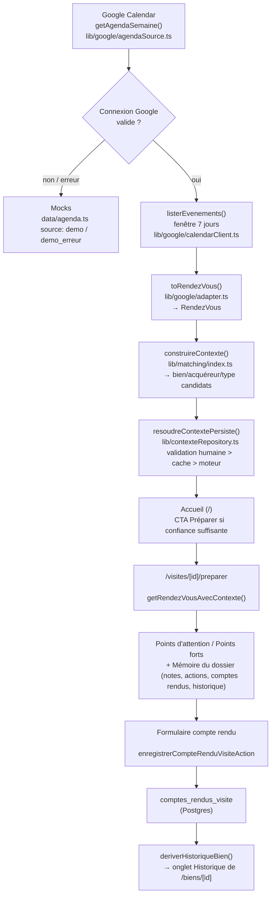
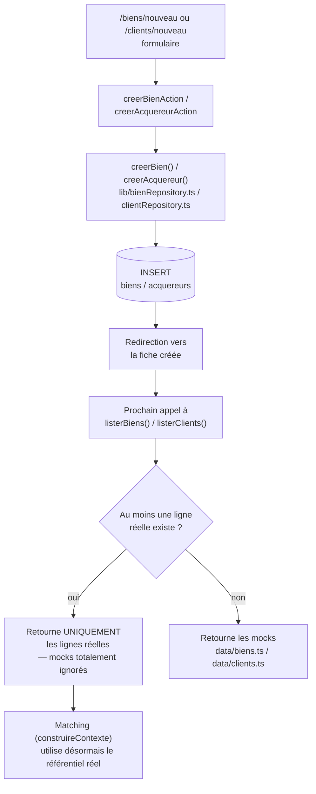
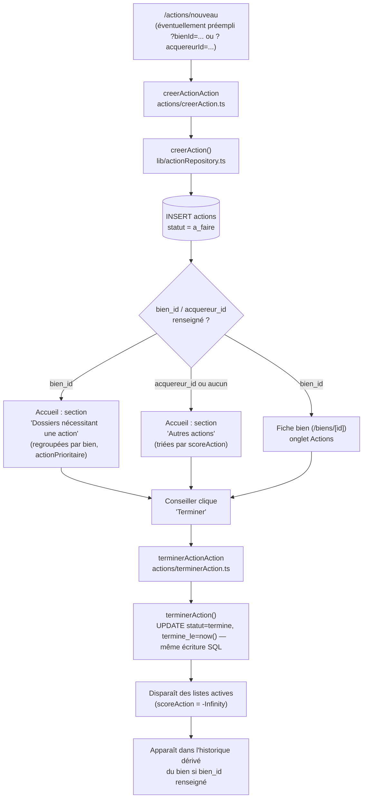

# Parcours principaux — Atlas (`apps/web`)

Trois parcours bout-en-bout, avec les fichiers/fonctions réellement impliqués à chaque étape.
Détail des règles évoquées ici : `docs/BUSINESS_RULES.md`. Détail du schéma : `docs/DATA_MODEL.md`.

## 1. Google Calendar → préparation → compte rendu → historique du bien

### Détail étape par étape

1. **Récupération** — `getAgendaSemaine()` lit d'abord `connexions_google` (Postgres). Sans
   connexion ou en cas d'erreur Google, repli sur les rendez-vous mockés (`data/agenda.ts`),
   avec une source explicitement différenciée (`demo` vs `demo_erreur`) — jamais présentée comme
   du réel.
2. **Matching** — `construireContexte()` calcule un bien, un acquéreur et un type métier
   candidats par des règles déterministes sur le titre/lieu
   (`docs/BUSINESS_RULES.md#matching-rendez-vous-bienacquéreurtype`).
3. **Résolution persistée** — uniquement pour les rendez-vous Google (id `gcal-...`) :
   `resoudreContextePersiste()` applique la priorité validation humaine > cache > recalcul
   (`memoire_contextuelle`). Les rendez-vous mockés portent déjà leur bien/acquéreur en dur et
   n'entrent jamais dans ce mécanisme.
4. **CTA "Préparer"** — affiché sur l'accueil dès que la confiance de résolution est suffisante
   (bien et acquéreur non ambigus).
5. **Préparation** — `/visites/[id]/preparer` réappelle `getRendezVousAvecContexte()`, résout le
   `Bien`/`ProfilAcquereur` réels via les repositories, calcule points d'attention/points forts
   (uniquement sur champs structurés), et assemble la Mémoire du dossier : comptes rendus
   précédents pour ce couple bien+acquéreur, notes récentes du bien, actions ouvertes, historique
   récent.
6. **Compte rendu** — le formulaire en bas de la page de préparation appelle
   `enregistrerCompteRenduVisiteAction`, qui valide `retour` (non vide) et `interet` (une des 4
   valeurs contrôlées) avant d'insérer dans `comptes_rendus_visite`.
7. **Historique** — au prochain chargement de `/biens/[id]`, `deriverHistoriqueBien()` inclut ce
   nouveau compte rendu comme événement `"Visite effectuée — {label}"`, aux côtés des événements
   liés aux actions du bien.

## 2. Création d'un bien/acquéreur → bascule démo → réel

Détail complet de cette bascule (pourquoi elle est stricte, ce qui devient inaccessible côté
mocks) : `docs/DEMO_VS_REAL.md`.

## 3. Création d'une action → priorisation → terminaison

### Détail étape par étape

1. **Création** — `/actions/nouveau` peut être atteint directement, ou préempli depuis la fiche
   bien/acquéreur (`?bienId=`/`?acquereurId=`) via un lien "+ Ajouter une action" — le conseiller
   reste libre de modifier l'association avant de soumettre.
2. **Association** — une action peut concerner un bien, un acquéreur, les deux, ou aucun des
   deux ; jamais de génération automatique depuis un compte rendu de visite ou une note.
3. **Priorisation** — `actionPriority.ts` (`docs/BUSINESS_RULES.md#priorité-des-actions`) trie
   toutes les vues (accueil, fiche bien, Mémoire du dossier) avec le même moteur.
4. **Terminaison** — `terminerAction()` pose `statut` et `termine_le` dans la **même** requête SQL
   (jamais deux écritures séparées, pour ne jamais avoir une action "terminée" sans date ou
   l'inverse). Un id non-UUID (action mockée) est silencieusement ignoré plutôt que de provoquer
   une erreur de cast Postgres.
5. **Historique** — une action terminée liée à un bien apparaît dans l'historique dérivé
   (`"Action terminée : {titre}"`), aux côtés des comptes rendus de visite du même bien.
